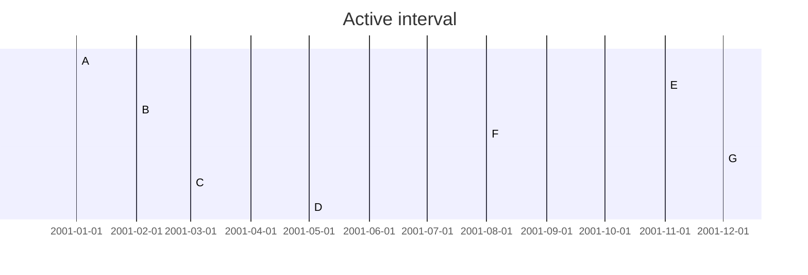

[](https://github.com/i1123581321/NJU-open-resource)

# Graph Traversal

## Warm up

### Graph

图可以表示某集合中的元素之间的二元关系。

给定图 $G = (V, E)$ ，$V$ 是节点集，$E \subseteq V \times V$ 是结点间的某种二元关系。若 $E$ 是对称关系，则称 $G$ 为**无向图**，否则 $G$ 为**有向图** 

用于表示图的数据结构有两种：

* 邻接表：每个节点维护一个链表，存放其邻居
* 邻接矩阵：矩阵 $A_{n \times n}$ 的元素 $A[i,j]$ 是一个布尔值，表示是否存在一条由节点 $i$ 指向节点 $j$ 的边

邻接表和邻接矩阵都只能描述非对称关系，描述无向图时采用对称有向图

### Outline of DFS and BFS

深度优先遍历：递归

```pseudocode
dfs(G, v)
	Mark v as "discovered"
	For each vertex w that edge vw is in G
		if w is undiscovered
			dfs(G, w)
		otherwise
			"Check" vw without visiting w
	Mark v as "finished"
```

广度优先遍历：队列

```pseudocode
bfs(G, s)
	Mark s as "discovered"
	enqueue(pending, s)
	while(pending is nonempty)
		dequeue(pending, v)
		For each vertex that edge vw is in G
			if w is "undiscovered"
				Mark w as "discovered"
				enqueue(pending, w)
		Mark v as "finished"
```

### Finding Connected Components

基于深度优先遍历，找到图中所有连通分支

若图中有 $n$ 个节点和 $m$ 条边，时间复杂度为 $\Theta(m+n)$

## Traversal

### Visits on a vertex

根据图遍历中一个节点被访问的不同状态，可以将其染成三种颜色

* 白色：尚未被遍历到
* 灰色：已经遍历到，但是对其的遍历尚未结束。（正在处理其邻居节点）
* 黑色：遍历结束。（所有邻居节点已经被处理完）

显然节点在遍历过程中颜色变化为 白色 $\to$ 灰色 $\to$ 黑色，且不会回退

遍历开始时节点均是白色。第一次访问时由白变灰，之后的多次访问中保持灰色，在最后一次访问后变为黑色

### Depth-First Search Skeleton

首先为了能够在图不连通时遍历所有节点，需要一个 **wrapper** 以调度算法确保在某个连通分支遍历后能遍历下一个连通分支

DFS-WRAPPER(G)

```pseudocode
Color all nodes WHITE
foreach node v in G do
	if v.color == WHITE then
		DFS(v)
```

DFS(v)

```pseudocode
v.color := GRAY
<Preorder processiong of node v>
foreach neighbor w of v do
	if w.color == WHITE then
		<Exploratory processing of edge vw>
		DFS(w)
		<Backtrack processing of edge vw>
	else
		<Checking edge vw>
<Postorder processing of node v>
v.color := BLACK
```

在算法框架的不同位置（尖括号的语句）可插入不同的处理语句以解决具体问题

* 遍历前处理：当一个节点 $v$ 刚刚从白色变为灰色时
* 遍历中处理：
  * 遍历某邻居节点前
  * 遍历某邻居节点后
  * 处理之前已被遍历的邻居节点
* 遍历后处理：在节点递归遍历完成后，变为黑色前

只要限定这些处理包含常数个简单操作，深度优先的代价即为 $O(m + n)$，$n$ 为图 $G$ 中节点个数，$m$ 为边的条数

对用一个图算法，常常将一个代价为 $O(m+n)$ 的算法称作是**线性时间**的

### Breadth-First Search Skeleton

基于队列可以实现 BFS 的策略，与 DFS 不同，一个节点开始被处理后就会一直处理完成，不会有多次回到其进行处理的情况。wrapper 的作用同 DFS

BFS-WRAPPER(G)

```pseudocode
foreach node v in G do
	v.color := WHITE
	v.parent := NULL
	v.dis := +INFIN
foreach node v in G do
	if v.color = WHITE then
		BFS(v)
```

BFS(v)

```pseudocode
Initialize an empty queue queNode
v.color := GRAY
v.dis := 0;
queNode.ENQUE(v)
while queNode != empty do
	w := queNode.DEQUE();
	foreach neighbor x of w do
		if x.color = WHITE then
			x.color := GRAY
			x.parent := w;
			x.dis := w.dis + 1
			queNode.ENQUE(x)
	<processing of node w>
	w.color := BLACK	
```

上述框架维护了由 BFS 向外推进而产生的父子关系，也维护了从遍历起始节点到每个节点的最短路径信息。可以在遍历中插入对节点进行处理的语句

## Depth-First Search

### Depth-First Search Tree

Depth-First Search 的过程可将图中的边分为四种类型

```mermaid
graph TD;
a[A];b[B];c[C];d[D];e[E];f[F];g[G]
a == T.E ==> b
a == T.E ==> f
a -. D.E .-> c
b == T.E ==> d
b == T.E ==> c
d -. B.E .-> a
d -. C.E .-> c
e -- C.E --> c
e == T.E ==> g
f -. B.E .-> a
f -. C.E .-> c
g -- C.E --> d
g -. B.E .-> e
```

#### Tree Edge

当检查节点 $u$ 的邻居时，若发现白色节点 $v$ ，递归对其 DFS，则将边 $uv$ 标记为 TE。

在对一个连通分支进行 DFS 时，所有 TE 组成的子图连通，无环且包含连通分支中所有点，忽略边的方向，所有 TE 组成当前连通分支的一个生成树，称为**深度优先遍历树**

以遍历开始的节点为根，根指向叶的方向即为遍历推进的方向，由此可定义节点间的祖先与后继的关系

#### Back Edge

当节点 $u$ 的邻居 $v$ 在之前的遍历中已访问过且 $v$ 是 $u$ 在遍历树中的**祖先**时，将边 $uv$ 标记为 BE

#### Descendant Edge

当节点 $u$ 的邻居 $v$ 在之前的遍历中已访问过且 $v$ 是 $u$ 在遍历树中的**后继**时，将边 $uv$ 标记为 DE

#### Cross Edge

不是 TE, BE, DE 的边即为 CE（节点间无祖先后继关系）

### Time Relation on changing color

为了更直接刻画 DFS 遍历时的推进过程，定义”遍历时间“

* time：全局时间，初始为 0，每当一个节点颜色改变时便 +1，最终值为 $2n$ 
* discover time：一个节点变成灰色时的 time
* finish time：一个节点变成黑色时的 time
* **active interval**：区间 $[\text{discover time}, \text{finish time}]$

在 DFS 的框架中插入适当的语句即可实现对时间的记录

DFS-CLOCK(v)

```pseudocode
v.color := GRAY
time := time + 1
v.discoverTime := time
<Preorder processiong of node v>
foreach neighbor w of v do
	if w.color == WHITE then
		<Exploratory processing of edge vw>
		DFS(w)
		<Backtrack processing of edge vw>
	else
		<Checking edge vw>
<Postorder processing of node v>
time := time + 1
v.finishTime := time
v.color := BLACK
```

> **定义 4.1** 活动区间
>
> 在遍历过程中，一个节点的活动区间定义为从该结点被发现到遍历结束的时间区间
> $$
> \text{active}(v) = [\text{discover time}, \text{finish time}]
> $$

以上文的遍历过程为例，标注其活动区间

```mermaid
graph TD;
a[A:1/10];b[B:2/7];c[C:3/4];d[D:5/6];e[E:11/14];f[F:8/9];g[G:12/13]
a == T.E ==> b
a == T.E ==> f
a -. D.E .-> c
b == T.E ==> d
b == T.E ==> c
d -. B.E .-> a
d -. C.E .-> c
e -- C.E --> c
e == T.E ==> g
f -. B.E .-> a
f -. C.E .-> c
g -- C.E --> d
g -. B.E .-> e
```

对于每个节点，其活动区间的关系如下



**节点的活动区间的包含关系反映了节点在遍历树中的祖先后继关系**

> **定理 4.1** 考察深度优先遍历图 $G = (V, E)$ 的过程，对任意顶点 $u,v$ 有
>
> * $v$ 是 $u$ 的后继 $\iff \text{active}(v) \subseteq \text{active}(u)$ ，如果 $v \neq u$ 则 $\text{active}(v) \subset \text{active}(u)$  
> * $u$ 和 $v$ 没有祖先后继关系 $\iff \text{active}(v) , \text{active}(u)$ 互不包含
> * 若 $uv$ 是 $G$ 中的边
>   * $uv$ 是 CE $\iff$ $\text{active}(v)$ 在 $\text{active}(u)$ 前面
>   * $uv$ 是 DE $\iff$ 存在第三个节点 $x, \text{active}(v) \subset \text{active}(x) \subset \text{active}(u)$
>   * $uv$ 是 TE $\iff \text{active}(v) \subset \text{active}(u)$ 且不存在节点 $x, \text{active}(v) \subset \text{active}(x) \subset \text{active}(u)$
>   * $uv$ 是 BE $\iff \text{active}(u) \subset \text{active}(v)$

### White Path Theorem

如何判断遍历树中的祖先后继关系

> **定理 4.2** 白色路径定理
>
> 在深度优先遍历树中，节点 $v$ 是节点 $w$ 的祖先，当且仅当在遍历过程中刚刚发现 $v$ 的时刻，存在一条从 $v$ 到 $w$ 的全部由白色节点组成的路径
>
> 证明：
>
> * $\Rightarrow$ ：若节点 $v$ 是 $w$ 的祖先，考察从 $v$ 到 $w$ 由 TE 组成的路径，在节点 $v$ 刚刚被发现的时刻，这条路径是白色路径
>
> * $\Leftarrow$ ：对白色路径的长度 $k$ 归纳
>
>   * $k = 0$ ，显然
>
>   * 假设对所有长度小于 $k$ 的白色路径，命题成立
>
>   * 考虑长度为 $k$ 的白色路径 $P = v \to x_1 \to \dots \to x_i \to \dots \to w$ ，假设节点 $x_i$ 是白色路径 $P$ 上第一个被遍历过程发现的节点，基于 $x_i$ 将路径分为两部分 $P_1 = v \to \dots \to x_i, P_2 = x_i \to \dots \to w$ 
>
>     $P_2$ 是长度小于 $k$ 的白色路径，基于归纳假设，$x_i$ 是 $w$ 的祖先，显然 $v.discoverTime < x_i.discoverTime, x_i.finishTime < v.finishTime$ ，故根据定理 4.1，有 $v$ 是 $x_i$ 的祖先，祖先后继关系可传递，故 $v$ 是 $w$ 的祖先