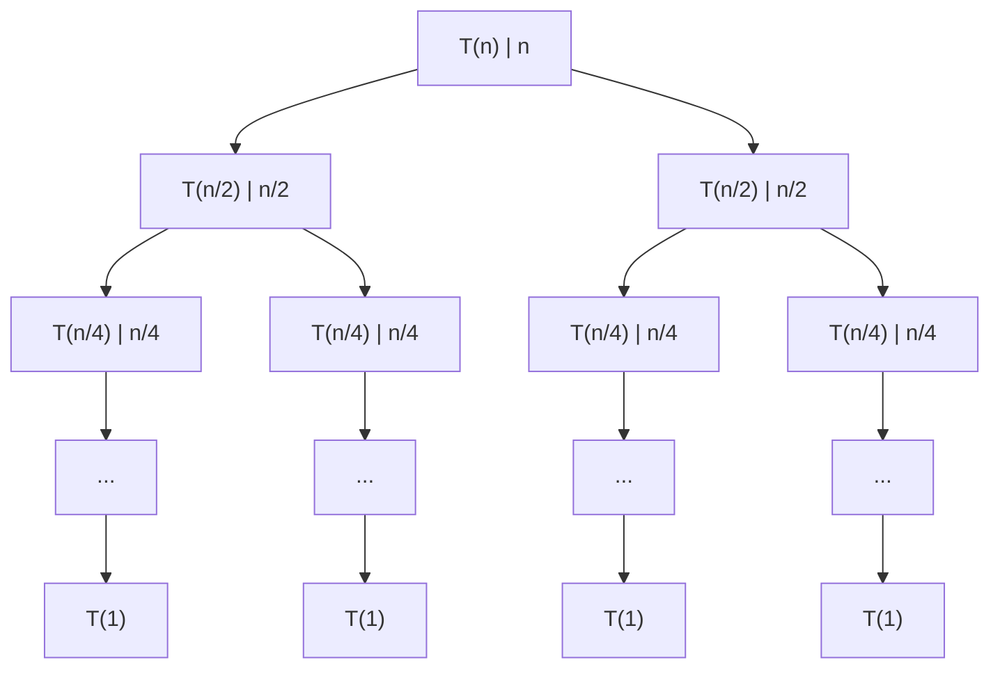

# Recursion

## Recursion algorithm

### Divide Conquer

Divide：将问题划分为规模更小的子问题

Conquer：**递归地**解决子问题

Combine：将子问题的结果结合起来解决原本的问题

相较于 BF recursion（问题规模线性地减小：$n, n-1, n-2 \dots$），D&C recursion 问题规模指数地减小：$n, \dfrac{n}{2}, \dfrac{n}{4}, \dots$

### D&C examples

Max sum subsequence

Frequent element

Multiplication：Integer and Matirx

Nearest point pair

详细内容将在 Tutorial 2 中讲解

### Correctness of recursion

数学归纳法

## Solving recurrence equations

### Elementary techniques

> Smooth functions
>
> $f(n)$ : Nonnegative eventually non-decreasing function defined on the set of natural numbers
>
> $f(n)$ is called **smooth** if $f(2n) = \Theta(f(n))$
>
> Let $f(n)$ be a smooth function, for any fixed integer $b \geqslant 2, f(bn) = \Theta(f(n))$
>
> **Smoothness Rule**
>
> Let $T(n)$ be an eventually non-decreasing functions and $f(n)$ be a smooth function
>
> If $T(n) = \Theta(f(n))$ for values of $n$ that are powers of $b(b\geqslant 2)$ , then $T(n) = \Theta(f(n))$

#### Backward substitutions

e.g.，Bit counting
$$
T(n)=
\begin{cases}
\begin{align}
&0 &n = 1\\
&T(\lfloor \dfrac{n}{2} \rfloor) + 1  &n > 1
\end{align}
\end{cases}
$$
笨展开
$$
\text{Let } n = 2^k \\
T(n) = T\left(\frac{n}{2}\right) + 1 = T\left(\frac{n}{4}\right) + 1 + 1 = \dots\\
T(n) = T\left(\frac{n}{2^k} \right) + \log n = \log n
$$

#### Fibonacci

> linear homogeneous relation of degree $k$ （常系数线性齐次递推关系） :
> $$
> a_n = r_1a_{n-1} +r_2a_{n-2} + \dots + r_ka_{n-k}
> $$
> characteristic equation（特征方程）:
> $$
> x^k = r_1x^{k-1} + r_2x^{k-2} + \dots + r_k
> $$

对于 $k = 2$ 的情况，$a_n = r_1a_{n-1} + r_2a_{n-2}$，特征方程为 $x^2 - r_1x - r_2 = 0$，设其有两个根 $s_1, s_2$，则
$$
a_n = us_1^n + vs_2^n
$$
其中 $u, v$ 取决于初始情况

对于 Fibonacci，特征方程为 $x^2 - x - 1 = 0$ ，则
$$
s_1 = \dfrac{1 + \sqrt{5}}{2}, s_2= \dfrac{1 - \sqrt{5}}{2}\\
f_1 = us_1+vs_2 = 1\\
f_2 = us_1^2 + vs_2^2 = 1 \\
u = \frac{1}{\sqrt{5}}, v = -\frac{1}{\sqrt{5}}\\
f_n = \frac{1}{\sqrt{5}}\left(\dfrac{1 + \sqrt{5}}{2}\right)^n - \frac{1}{\sqrt{5}}\left(\dfrac{1 - \sqrt{5}}{2}\right)^n
$$

#### Guess and Prove

e.g.，假设 $T(n) = O(n)$ ，则需要证明 $T(n) < cn$

证明方法：展开

#### Recursion Tree

对于 D&C recursion，递归方程的形式为 $T(n) = bT(\dfrac{n}{c}) + f(n)$

递归树：
$T(n) = 2T\left(\dfrac{n}{2}\right) + n$

Node:

* Non-leaf
  * Non-recursion cost
  * recursion cost
* Leaf
  * Base case

Edge: recursion

计算时仅需计算 Non-recursion cost，因为 recursion cost 展开后被计入下层结点。最底层的叶结点为递归的 base case，计算时代价为 $O(1)$。

递归代价：**sum of row sums**

对于上图的递归树，递归代价为：
$$
n + (2 \times \frac{n}{2}) + (4 \times \frac{n}{4}) + \dots + (n \times 1) = n \log n
$$

### Master Theorem

对于 D&C recursion 的递归方程
$$
T(n) = bT\left(\frac{n}{c}\right) + f(n)
$$

* 假设 base case 出现在 $D$ 层，则 $\dfrac{n}{c^D} = 1, D = \dfrac{\log n}{\log c}$
* 设 叶结点的数量为 $L$ ，则 $L = b^D, L = b^{\frac{\log n}{\log c}}$
* 令 $L = n^E, E = \log_n L = \log_n b^{\frac{\log n}{\log c}} = \dfrac{\log n}{\log c} \times \dfrac{\log b}{\log n} = \dfrac{\log b}{\log c}$

$E$ 即为 critical exponent

对于一个深度为 $D(D = \log_c n)$ 的 recursion tree，递归代价为 sum of row sums

* 第 0 行非递归代价为 $f(n)$
* 第 $D$ 行 base case 代价为 $b^D = b^{\log_c n} = n^{\log_c b} = n ^ E = \Theta(n^E)$

> **Little Master Theorem** : row sums decide the solution of the equation for D&C
>
> （存疑）
>
> 设 $T(n) = bT\left(\frac{n}{c}\right) + n^d $：
>
> - 第 0 行代价 $n^d$
> - 第 1 行代价 $b \times \left(\dfrac{n}{c} \right)^d = \left(\dfrac{b}{c^d}\right) \times n^d$
> - 第 2 行代价 $b^2 \times  \left(\dfrac{n}{c^2} \right)^d = \left(\dfrac{b}{c^d}\right)^2 \times n^d$
> - 第 k 行代价 $b^k \times  \left(\dfrac{n}{c^k} \right)^d = \left(\dfrac{b}{c^d}\right)^k \times n^d$
>
> 易得 $k = \log_c n$
>
> $T(n) = \text{sum of row sums } = n^d \sum_{i =0}^{\log_c n} \left(\dfrac{b}{c^d}\right)^i$ 
>
> sum of row sums 是几何级数
>
> * 增长，$T(n) = \Theta(n^E)$
> * 常数，$T(n) = \Theta(f(n)\log n)$
> * 减少，$T(n) = \Theta(f(n))$
>
> 数学上不够严谨但便于理解

**Master Theorem**

对于递归方程
$$
T(n) = bT\left(\frac{n}{c}\right) + f(n)
$$
$E = \log_c b = \dfrac{\log b}{\log c}$

* Case 1: $f(n) = O(n^{E - \varepsilon}), (\varepsilon > 0), \text{then: } T(n) = \Theta(n^E)$
* Case 2: $f(n) = \Theta(n^E), \text{then: } T(n) = \Theta(n^E\log n)$
* Case 3: $f(n) = \Omega(n^{E + \varepsilon}), (\varepsilon > 0)$ and if $bf\left(\dfrac{n}{c} \right) < \theta f(n)$ for some constant $\theta < 1$ and all sufficiently large $n$ , then: $T(n) = \Theta(f(n))$

可见 $f(n)$ 和 $n^E$ 中较大的一个决定时间复杂度，且在 Case 1/3 时要注意 $f(n)$ 必须**多项式地小于/大于** $n^E$ ($\varepsilon > 0$)

> CLRS 3rd edition P.94
>
> Beyond this intuition, you need to be aware of some technicalities. In the first
> case, not only must $f(n)$ be smaller than $n^{\log_b a}$, it must be polynomially smaller.

反例：$T(n) = 2T\left(\dfrac{n}{2} \right) + n\log n$

$n \log n = \Omega(n)$ 但是 $n \log n = o(n^{1 + \varepsilon})$