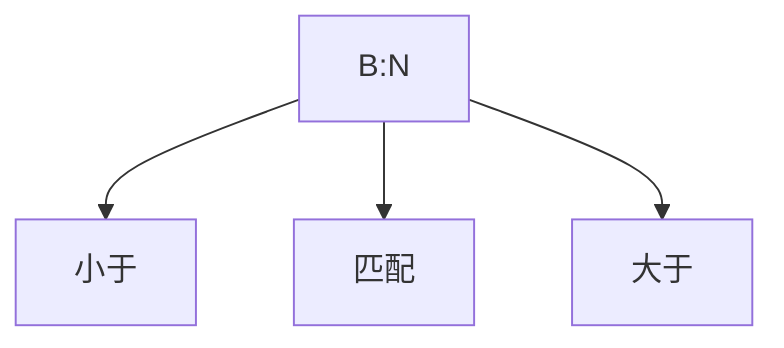

# Lower bound amortized analysis

## The complexity of problems

Problem $P$, Algorithm A
$$
\text { Inputs: } \mathcal{X}_{n} \text { of size } n \\
W_{A}(n)=\max _{x \in \mathcal{X}_{n}} T_{A}(x) \\
B_{A}(n)=\min _{x \in \mathcal{X}_{n}} T_{A}(x)\\
A_{A}(n)=\sum_{x \in \mathcal{X}_{n}} T_{A}(x) \cdot P(x)=\mathbb{E}\left[T_{A}\right]=\sum_{t \in T_{A}\left(\mathcal{X}_{n}\right)} t \cdot P(T=t)\\
T_{P}(n)=\min _{A \text { solves } P} W_{A}(n)=\min _{A \text { solves } P} \max _{x \in \mathcal{X}_{n}} T_{A}(x)
$$
解决方法：

* Decision Tree
* Adversary Argument

## Decision tree

e.g., Lower bound for **Comparison-based** Sorting

非基于比较的排序：如煎饼排序

> Decision tree model
>
> * Nodes: comparisons $a_i:a_j$
> * Edges: two-way decisions
> * Leaves: possible permutations
>
> ```mermaid
> graph TD;
> 1[a_i : a_j] -- YES --> 2[a_i : a_k]
> 1 -- NO --> 3[a_p : a_q]
> 2 -.-> 4[sigma_1]
> 2 -.-> 5[sigma_2]
> 3 -.-> 6[sigma_3]
> 3 -.-> 7[sigma_4]
> ```

Assumption: All the elements are distinct

* 不影响原命题
* 简化证明

任意 Comparison-based Sorting 算法都可由 decision tree 描述

算法 $A$ 的 worst-case 即是决策树的高度

问题的下界是所有决策树高度的最小值

作为排序算法
$$
L=\# \text { of leaves } \geqslant n !
$$
作为二叉树
$$
L=\# \text { of leaves } \leqslant 2^{h}
$$
故
$$
n ! \leqslant L=\# \text { of leaves } \leqslant 2^{h}\\
h \geqslant \log n !=\Omega(n \log n)
$$

### K-sorted Array

QuickSort (with median as pivot) stops after the $\log k$ recursions.

复杂度：$\Theta(n\log k)$

Decision Tree 叶结点个数
$$
L \geqslant \left( \begin{array}{c}{n} \\ {n / k}\end{array}\right) \left( \begin{array}{c}{n-n / k} \\ {n / k}\end{array}\right) \cdots \left( \begin{array}{c}{n / k} \\ {n / k}\end{array}\right)=\left( \begin{array}{c}{n} \\ {n / k, \ldots, n / k}\end{array}\right)=\frac{n !}{\left(\left(\frac{n}{k}\right) !\right)^{k}}
$$
高度下界
$$
H \geqslant \log \left(\frac{n !}{\left(\left(\frac{n}{k}\right) !\right)^{k}}\right)=\Omega(n \log k)
$$
依据：
$$
n ! \sim \sqrt{2 \pi n}\left(\frac{n}{e}\right)^{n} \Longrightarrow \log n ! \sim n \log n
$$

### Bolts and Nuts

变相的 QuickSort
$$
A(n) = O(n \log n)
$$



$$
3^{H} \geqslant L \geqslant n ! \Longrightarrow H \geqslant \log n ! \Longrightarrow H=\Omega(n \log n)
$$

### Repeated Elements

$\Omega(n\log k)$

## Adversary argument

### Searching in matrix

一个 $m$ 行 $n$ 列的矩阵，行从左至右递增，列从上至下递增，$x \in M?$

思路：从左下角开始，每次均可减少一行或一列

复杂度 $m + n - 1$

Assume: $M:n \times n$

已知
$$
W(n) \leqslant 2n - 1
$$
求证
$$
\textcolor{red}{W(n) \geqslant 2n - 1}
$$
Adversary strategy

对角线没有准确的大小关系，至少要比较 $2n-1$ 次
$$
\begin{align*}
\begin{array}{l}{i+j \leqslant n-1 \Longrightarrow x>M_{i j}} \\ {i+j>n-1 \Longrightarrow x<M_{i j}}\end{array}
\end{align*}
$$

## Amortized analysis

> Amortized analysis is an algorithm analysis technique for analyzing a sequence of operations irrespective of the input to show that the average cost per operation is small, even though a single operation within the sequence might be expensive.

* Summation method
* Accounting method
* Potential method

### Array merging dictionary

$$
\begin{align*}
\begin{aligned} \sum_{i=1}^{n} c_{i}=& \sum_{j=0}^{\lfloor\log n\rfloor}\left\lfloor\frac{n}{2^{j}}\right\rfloor 2^{j} \leq n(\lfloor\log n\rfloor+ 1) \\ & \forall i, \hat{c}_{i}=1+\lfloor\log n\rfloor \end{aligned}
\end{align*}
$$

