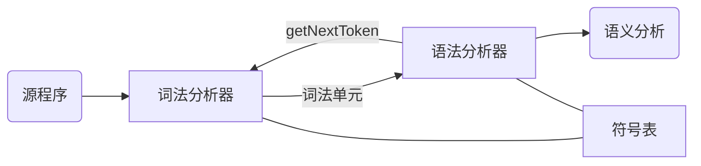

# 词法分析

## 词法分析的作用

### 词法分析

词法分析器的作用是读入**源程序的输入字符**，将其组成词素，生成并输出**词法单元序列**，每个词法单元对应一个词素

词法分析器不是单独工作，通常与语法分析器和符号表共同工作，具体体现在语法分析器调用词法分析器

除了识别词素以外，词法分析还要完成一些别的任务

* 过滤程序中的注释和空白
* 将编译器生成的错误信息和源程序联系起来（记录换行符以获得行号）

将词法分析和语法分析划分开基于如下考虑

* 简化编译器设计
* 提高编译器效率
* 增强编译器可移植性，可以将输入相关的特殊性限制在词法分析部分

### 词法单元，模式与词素

讨论词法分析时主要涉及到的术语

* 词法单元（Token）：由词法单元名和可选的属性组成，是表示某种词法单位的**抽象符号**。词法单元名是语法分析器处理的输入
* 模式（pattern）：描述一个词法单元的词素可能具有的形式，模式可以匹配（match）一个或多个符号串
* 词素（lexeme）：**源程序中的字符序列**，与某个词法单元的模式匹配，是词法单元的实例

词法单元的属性用于之后的语法分析，如在之后的编译阶段确定具体的词素，如标识符的词法单元，往往包括了词素，类型，出现位置等属性

## 词法分析的规约——正则表达式

正则表达式是一种描述词素模式的重要表示方法

### 串和语言及其运算

字母表（alphabet）：一个**有限**的符号集合，一般用 $\Sigma$ 表示

串（string）：某个字母表上的串是该字母表中符号的一个有穷序列

* 长度：串的长度（length）是串中符号的个数，表示为 $|s|$
* **空串**：长度为 0 的串，用 $\epsilon$ 表示
* 前缀（prefix）：从串的尾部删去 0 个或多个符号得到的串
* 后缀（suffix）：从串的开始处删去 0 个或多个符号得到的串
* 子串（substring）：删去串的某个前缀和后缀后得到的串
* 真（true）前缀、后缀和子串：不等于 $\epsilon$ 或串本身
* 子序列（subsequence）：从串中删去 0 个或多个符号后得到的串

对于串，有两种主要的运算

* 连接（concatenation）：对于串 $x, y$ ，其连接为 $xy$ ，即将串 $y$ 附加到 $x$ 后。空串是连接的单位元，有 $\epsilon x = x \epsilon$
* 幂运算：$s^{0} = \epsilon, s^{i} = s^{i-1}s, i > 0$

语言（language）：给定字母表上的任意的可数的串的集合

词法分析中，语言上最重要的运算是**并，连接和闭包**，设 $L, M$ 为语言，则这些运算可定义为

* 并（union）：$L \cup M = \{s \mid s \in L \text{ or } s \in M\}$
* 连接（concatenation）：$LM = \{st \mid s \in L \text{ and } t \in M \}$
* 幂：$L^{0} = \{\epsilon\}, L^{i} = L^{i-1}L, i > 0$
* Kleene 闭包（closure）：$L^{*} = \bigcup_{i = 0}^{\infin} L^{i}$
* 正闭包：$L^{+} = \bigcup_{i = 1}^{\infin} L^{i} = L^{*} \setminus \{\epsilon\}$

### 正则表达式（regular expression）

正则表达式由字母表上的符号和语言的运算操作组成，可描述所有通过对某个字母表上的符号应用并，连接和闭包运算得到的语言。若正则表达式为 $r$ ，则其定义的语言为 $L(r)$ ，其定义可通过如下递归过程得到

Basis. 

1. $\epsilon$ 是一个正则表达式，$L(\epsilon) = \{\epsilon\}$
2. 若 $a$ 是 $\Sigma$ 上的符号，则 $\bold{a}$ 是正则表达式，$L(\bold{a}) = \{a\}$

Ind.Step. 假定 $r, s$ 都是正则表达式

1. $(r) \mid (s)$ 是正则表达式，表示语言 $L(r) \cup L(s)$
2. $(r)(s)$ 是正则表达式，表示语言 $L(r)L(s)$
3. $(r)^{*}$ 是正则表达式，表示语言 $L(r)^{*}$
4. $(r)$ 是正则表达式，表示语言 $L(r)$ ，即正则表达式两边加上括号不改变其表示的语言

正则表达式的运算优先级由高到低为 $*$ ，连接，$\mid$

可用一个正则表达式定义的语言叫做正则集合，若两个正则表达式表示同样的语言，称其等价（equivalence），用 $=$ 表示。对于正则表达式的运算，有以下定律

* $\mid$ 可交换：$r \mid s = s \mid r$
* $\mid$ 可结合：$(s \mid r) \mid t = s \mid (r \mid t)$
* 连接可结合：$(rs)t = r(st)$
* 连接对 $\mid$ 可分配：$r(s \mid t) = rs \mid rt, (s \mid t) r = sr \mid tr$
* 闭包一定包含 $\epsilon$ ：$r^{*} = (r \mid \epsilon)^{*}$
* 闭包的幂等性：$r^{**} = r^{*}$

扩展的正则表达式可见 [regular expression](https://en.wikipedia.org/wiki/Regular_expression)

### 正则定义

一个正则定义（regular definition）是有如下形式的定义序列（假设字母表为 $\Sigma$）
$$
d_1 \to r_1 \\
d_2 \to r_2 \\
\cdots\\
d_n \to r_n
$$
其中每个 $d_i$ 都是一个新符号，不在 $\Sigma$ 中且各不相同，而每个 $r_i$ 是 $\Sigma \cup \{d_1, d_2, \dots ,d_{i-1} \}$ 上的正则表达式（为了避免递归定义）

每个 $d_i$ 都可替换为等价的仅由 $\Sigma$ 中符号组成的正则表达式

## 词法单元的识别——有穷自动机

词法分析器检查输入的字符串，在其**前缀**中找出与某个模式匹配的词素

### 状态转换图

状态转换图（transition diagram）是词法分析器的重要组件之一，可以将正则表达式转换为状态转移图，其中节点为状态（state），表示识别过程中可能出现的状况，而边（edge）即状态之间的转换，转换依据是输入的字符，根据边上的标号决定下一个状态

对于程序设计语言中的保留字，一般其也符合标识符的模式，对于区分保留字和标识符，可以在符号表中预先填写保留字，并显式指明其不是标识符

### 有穷自动机

词法单元的识别需要借助有穷自动机（finite automata），有穷自动机是一种识别器（recognizer），对于每个输入的 string，回答“是”或“否”。有穷自动机可分为两类

* 不确定有穷自动机（Nondeterministic Finite Automata, NFA）
* 确定有穷自动机（Deterministic Finite Automata, DFA）

NFA 与 DFA 所能识别的语言集合是相同的，这些语言正好是能用正则表达式描述的语言的集合，这个集合中的语言称为正则语言（regular language）

### 不确定有穷自动机

> An NFA is represented formally by a 5-tuple, $(Q, \Sigma, \delta, q_{0}, F)$ ，consisting of
>
> * a finite set of states $Q$
> * a finite set of input symbols $\Sigma$
> * a transition function $\delta: Q \times \Sigma \to P(Q)$
> * an initial state $q_0 \in Q$
> * a set of states $F$ distinguished as final states $F \in Q$

NFA 的状态图中，同一个符号可标记从同一状态出发到多个状态的多条边，因此 transition function 的输出为一个状态的集合，而其值域为状态集合 $Q$ 的幂集

NFA 除了可通过状态转换图的方式表示，也可表示为转换表（transition table），表的各行对应状态，各列对应输入，用 $\to$ 表示开始状态，用 $*$ 表示结束状态

一个 NFA 接受（accept）一个输入 string $x$ 当且仅当对应的转换图中存在一条从开始状态到某个接受状态的路径，使得该路径上各边的标号组成 $x$ 。NFA 的接受不要求所有能组成 $x$ 的路径最终都停在接受状态，只要**存在**一条满足条件的路径即可

由一个 NFA 定义的语言是其接受的所有 string 的集合

### 确定有穷自动机

> A DFA is represented formally by a 5-tuple, $(Q, \Sigma, \delta, q_{0}, F)$ ，consisting of
>
> - a finite set of states $Q$
> - a finite set of input symbols $\Sigma$
> - a transition function $\delta: Q \times \Sigma \to Q$
> - an initial state $q_0 \in Q$
> - a set of states $F$ distinguished as final states $F \in Q$

与 NFA 不同的是，DFA 对于每个状态 $s$ 和每个输入符号 $a$ ，有且仅有一条从 $s$ 离开且标号为 $a$ 的边，且 DFA 要求每次状态转换都必须有输入的符号（即空串 $\epsilon$ 不能作为标号）。

构造词法分析器时，真正实现的是 DFA

## 从正则表达式到自动机

### 子集构造（subset construction）算法

子集构造算法可以将一个 NFA 转换为等价的 DFA

具体而言，子集构造法为新的 DFA 构造一个转换表，其中每个状态是 NFA 的状态集合，假设 $s$ 表示 NFA 的某个状态，$T$ 为 NFA 的一个状态集合，有以下几种操作

* $\epsilon-closure(s)$ ：从 $s$ 开始只通过 $\epsilon$ 转换到达的状态集合
* $\epsilon-closure(T)$ ：即 $\bigcup_{s \in T}\epsilon-closure(s)$
* $move(T, a)$ ：能从 $T$ 中某个状态 $s$ 出发通过标号为 $a$ 的边到达的状态的集合

假设新 DFA 的状态集合为 $Dstates$，转换函数为 $Dtran$，初始状态为 $s_0$ ，子集构造法的过程为

> 初始时 $Dstates$ 中只有一个状态 $\epsilon-closure(s_0)$ ，且未标记
>
> `while` ($Dstates$ 中还有未标记状态 $T$){
>
> ​	标记 $T$
>
> ​	`for` (每个输入符号 $a$){
>
> ​		$U = \epsilon-closure(move(T, a))$
>
> ​		`if` ($U \notin Dstates$ )
>
> ​			将 $U$ 加入 $Dstates$，且不标记
>
> ​		$Dtran[T, a] = U$
>
> ​	}
>
> } 

而 $\epsilon-closure(T)$ 的计算过程类似于图遍历检查可达性的算法

由于 DFA 的状态为 NFA 的状态的集合，最坏情况下 DFA 的状态数量可达到 NFA 状态数量的指数级别（$|P(Q)| = 2^{|Q|}$），但一般情况 DFA 状态个数与 NFA 状态个数在同一量级

子集构造法同样可以用于模拟 NFA 的运行，即每一步的状态转换替换为 $\epsilon-closure(move(T, a))$ ，最终检查状态集合与 $F$ 是否有交集即可

### 正则表达式到 NFA

从正则表达式构造 NFA 的过程类似正则表达式的递归定义，分为基本规则和递归构造的部分

表达式 $\epsilon$ 

表达式 $a$

根据基本规则，可定义如何根据正则表达式的运算构造 NFA，假设正则表达式 $s, t$ 的 NFA 为 $N(s), N(t)$ 

运算 $s \mid t$ 

运算 $st$

运算 $s^*$

由于每次构造最多引入两个新的状态，最终 NFA 的状态数上界为正则表达式中运算分量和运算符的个数的两倍

### DFA 的优化——状态数最小化

等价的 DFA 可能有不同的状态数，而任何正则语言都有一个唯一的状态最少的 DFA

状态最小化的原理是将 DFA 的状态集合划分为多个组，每个组的状态之间**不可区分**，这样的每个组都对应最简 DFA 中的一个状态

> 不可区分：若分别从状态 $s$ 和状态 $t$ 出发，沿标号为 $x$ 的路径到达的两个路径只有一个接受状态，则称 $x$ 区分 $s$ 和 $t$ ，只要存在一个满足条件的串即可区分两个状态。不可区分即不存在这样的串

具体而言，在划分起始时，将状态分为接受状态和非接受状态，即 $\Pi = \{Q \setminus F, F\}$

对于 $\Pi$ 中的每个元素 $G$ ，对其划分。$G$ 中的状态 $s, t$ 划分后仍属于同一组 $\iff$ 对任意输入字符 $a$ ，$s, t$ 都到达 $\Pi$ 中的**同一组**，用划分后的组替换原本的 $G$

最终若划分前后 $\Pi$ 没有发生变化，则算法结束，每个组中的状态彼此不可区分（最坏情况下每组只有一个状态）

划分完成后，在每组中选择一个状态作为代表，最终 DFA 中的开始/终止状态是包含了开始/终止状态的组。

状态转换时，若代表 $s$ 在输入为 $a$ 时转换到 $t$ ，而 $t$ 所在组的代表为 $r$ ，则在最终 DFA 中有从 $s$ 到 $r$ 的标号为 $a$ 的转换

## 词法分析器生成工具及设计

实现词法分析器时，可以选择基于词法单元的词法结构图，手工编写代码扫描并返回词素，也可以选择词法分析器生成工具：lex/flex

### 多个模式集成

词法分析过程中，多种词法单元会对应多种模式，识别时的处理策略有

* 词法分析器中有多个状态转换图，顺序尝试各个词法单元的状态转换图，若 halt 则回退，启动下一个。这种设计模式要考虑到不同模式的尝试次序问题，即不同词法单元匹配的优先级
* 并行运行各个状态转换图，取与某个模式匹配的前缀中最长的
* 将状态转换图合并为一个图

### 词法分析器生成工具的体系

使用 lex 之类的工具时，lex 程序被 lex 编译器转换为自动机

将 lex 程序中的正则转换成对应的 NFA，并且将每个模式对应的 NFA 合并成一个 NFA，即引入一个新的开始状态，从这个状态到每个 NFA 的开始状态有个 $\epsilon$ 转换

识别时，词法分析器模拟 NFA 的运行过程，直到到达没有后续状态的点（$\varnothing$），此时向回找，直到找到一个包含至少一个接受状态的集合，若有多个接收状态，选择在 lex 程序中最靠前的

若字符串的多个前缀都匹配一个或多个模式，选择最长的前缀，长度相同时选择在 lex 程序中最靠前的

使用 DFA 时同理，需确认哪些模式的接收状态出现在了 DFA 的接收状态中

词法分析器状态最小化时，划分需变化为：所有非接受状态集合 + 对应于各个模式的接受状态集合