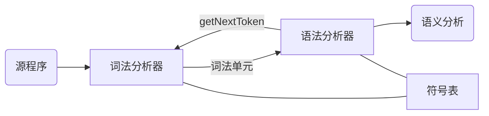

# 词法分析

## 词法分析的作用

### 词法分析

词法分析器的作用是读入**源程序的输入字符**，将其组成词素，生成并输出**词法单元序列**，每个词法单元对应一个词素

词法分析器不是单独工作，通常与语法分析器和符号表共同工作，具体体现在语法分析器调用词法分析器

除了识别词素以外，词法分析还要完成一些别的任务

* 过滤程序中的注释和空白
* 将编译器生成的错误信息和源程序联系起来（记录换行符以获得行号）

将词法分析和语法分析划分开基于如下考虑

* 简化编译器设计
* 提高编译器效率
* 增强编译器可移植性，可以将输入相关的特殊性限制在词法分析部分

### 词法单元，模式与词素

讨论词法分析时主要涉及到的术语

* 词法单元（Token）：由词法单元名和可选的属性组成，是表示某种词法单位的**抽象符号**。词法单元名是语法分析器处理的输入
* 模式（pattern）：描述一个词法单元的词素可能具有的形式，模式可以匹配（match）一个或多个符号串
* 词素（lexeme）：**源程序中的字符序列**，与某个词法单元的模式匹配，是词法单元的实例

词法单元的属性用于之后的语法分析，如在之后的编译阶段确定具体的词素，如标识符的词法单元，往往包括了词素，类型，出现位置等属性

## 词法分析的规约——正则表达式

正则表达式是一种描述词素模式的重要表示方法

### 串和语言及其运算

字母表（alphabet）：一个**有限**的符号集合，一般用 $\Sigma$ 表示

串（string）：某个字母表上的串是该字母表中符号的一个有穷序列

* 长度：串的长度（length）是串中符号的个数，表示为 $|s|$
* **空串**：长度为 0 的串，用 $\epsilon$ 表示
* 前缀（prefix）：从串的尾部删去 0 个或多个符号得到的串
* 后缀（suffix）：从串的开始处删去 0 个或多个符号得到的串
* 子串（substring）：删去串的某个前缀和后缀后得到的串
* 真（true）前缀、后缀和子串：不等于 $\epsilon$ 或串本身
* 子序列（subsequence）：从串中删去 0 个或多个符号后得到的串

对于串，有两种主要的运算

* 连接（concatenation）：对于串 $x, y$ ，其连接为 $xy$ ，即将串 $y$ 附加到 $x$ 后。空串是连接的单位元，有 $\epsilon x = x \epsilon$
* 幂运算：$s^{0} = \epsilon, s^{i} = s^{i-1}s, i > 0$

语言（language）：给定字母表上的任意的可数的串的集合

词法分析中，语言上最重要的运算是**并，连接和闭包**，设 $L, M$ 为语言，则这些运算可定义为

* 并（union）：$L \cup M = \{s \mid s \in L \text{ or } s \in M\}$
* 连接（concatenation）：$LM = \{st \mid s \in L \text{ and } t \in M \}$
* 幂：$L^{0} = \{\epsilon\}, L^{i} = L^{i-1}L, i > 0$
* Kleene 闭包（closure）：$L^{*} = \bigcup_{i = 0}^{\infin} L^{i}$
* 正闭包：$L^{+} = \bigcup_{i = 1}^{\infin} L^{i} = L^{*} \setminus \{\epsilon\}$

### 正则表达式（regular expression）

正则表达式由字母表上的符号和语言的运算操作组成，可描述所有通过对某个字母表上的符号应用并，连接和闭包运算得到的语言。若正则表达式为 $r$ ，则其定义的语言为 $L(r)$ ，其定义可通过如下递归过程得到

Basis. 

1. $\epsilon$ 是一个正则表达式，$L(\epsilon) = \{\epsilon\}$
2. 若 $a$ 是 $\Sigma$ 上的符号，则 $\bold{a}$ 是正则表达式，$L(\bold{a}) = \{a\}$

Ind.Step. 假定 $r, s$ 都是正则表达式

1. $(r) \mid (s)$ 是正则表达式，表示语言 $L(r) \cup L(s)$
2. $(r)(s)$ 是正则表达式，表示语言 $L(r)L(s)$
3. $(r)^{*}$ 是正则表达式，表示语言 $L(r)^{*}$
4. $(r)$ 是正则表达式，表示语言 $L(r)$ ，即正则表达式两边加上括号不改变其表示的语言

正则表达式的运算优先级由高到低为 $*$ ，连接，$\mid$

可用一个正则表达式定义的语言叫做正则集合，若两个正则表达式表示同样的语言，称其等价（equivalence），用 $=$ 表示。对于正则表达式的运算，有以下定律

* $\mid$ 可交换：$r \mid s = s \mid r$
* $\mid$ 可结合：$(s \mid r) \mid t = s \mid (r \mid t)$
* 连接可结合：$(rs)t = r(st)$
* 连接对 $\mid$ 可分配：$r(s \mid t) = rs \mid rt, (s \mid t) r = sr \mid tr$
* 闭包一定包含 $\epsilon$ ：$r^{*} = (r \mid \epsilon)^{*}$
* 闭包的幂等性：$r^{**} = r^{*}$

