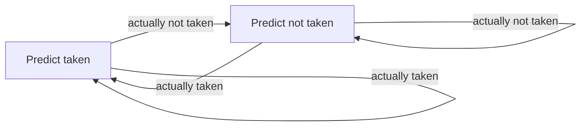
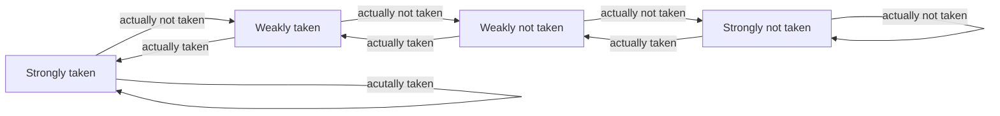

# Branch Prediction

## Control Hazards

Control hazard 即决定下一条要 fetch 的指令

程序执行时每一条指令都依赖于前一条指令

* 如果 fetch 的是一条非控制语句，则下一条语句是程序顺序的下一条
* 如果 fetch 的是一条控制语句，则下一条需要考虑是否跳转

重要的是保证流水线**正确**地被填满，一般来说方法有

* 在知道下一条指令的地址前将流水线 stall
* branch prediction，预测下一条指令的地址
* predicated execution，消除控制流指令
* branch delay slot
* fine-grained multithreading
* multipath execution，执行多种可能的路径

### stall

每条指令等待上条指令解码完成后再 fetch，这样每条指令需要两周期执行

### branch prediction

简单的预测即总是认为下一条指令在当前 PC + 4

一般来说简单的预测错误率在 14%

如果预测错误需要冲刷掉错误的指令并且将 PC 指到正确的位置

冲刷指令的条数取决与何时发现错误，对于 MIPS 来说 j/jal 等指令冲刷一条，br/jr 等指令需要两条

### making codes sequential

第一种方法是确保序列中下一条指令是下一条要执行的指令的概率最大

* 软件的方法：控制流图或是 profile
* 硬件的方法：缓存执行指令的路径

第二种方法是减少控制流指令，包括 combine predicate 或是 predicated execution

#### predicate combining

将谓词操作合并，只有一个分支语句而不是一个操作一个分支语句

好处是减少代码中的 branch 语句，坏处是不能通过短路操作减少不必要的判断

#### predicated execution

将控制依赖转换为数据依赖，需要 ISA 提供支持

如 cmov 指令

如果条件不符合，则 cmov 指令相当于 nop

predicated execution 可以减少 branch 指令，带来更大的基本块

* 优点
  * 对于总是不跳转的 branch （如错误处理）来说效果更好
  * 编译器有更大空间优化代码，因为只有数据依赖，控制流不会影响指令重新排序的优化
* 缺点
  * 会产生无效的指令
  * 需要 ISA 支持该功能

### delayed branch

延迟 branch 的执行，branch 之后的 N 条指令将无视 branch 的跳转结果总是执行

问题在于

* 如何找到填充 delay slot 的指令
* branch 必须与填充的指令无关
  * 无条件跳转可以找到合适的指令
  * 有条件跳转必须确保填充的指令不影响条件的计算

有多种填充模式

* from before：对于向后跳转的 branch，将 branch 之前的语句填充至 slot，这种填充是安全的
* from target：对于向前跳转的 branch，将跳转目标的指令填充到 slot，如果 branch 没有跳转则需要修复
* from fall-through：对于向后跳转的 branch，将 branch 与目标之间的指令填充到 slot，如果 branch 跳转了则需要修复

还有一种 delayed branch with squashing，即如果 branch 不跳转，不执行 slot 中的指令

delayed branch 优缺点在于

* 优点：可以让流水线满载运行
* 缺点：不容易找到能填充 slot 的语句，且将 ISA 语义和流水线的实现绑定

### fine-grained multithreading

硬件保存多个线程上下文，每个周期从不同线程 fetch 指令执行

在当前线程的 branch 结果明确前，不会 fetch 指令

一般需要多个 PC 和多个寄存器堆

线程调度有多种策略

* 固定区间：N 个线程每 N 个周期执行一条指令，如当前线程未就绪则插入 nop
* 软件控制：由 OS 分配，为 N 个线程分配到 S 个 slot，硬件为每个 slot 采用固定区间，执行 slot 内的线程
* 硬件控制：硬件追踪准备好执行的线程，并根据优先级策略调度

优缺点在于

* 优点
  * 不需要指令间的依赖检测，流水线中每个线程只有一条指令在运行
  * 不需要 branch prediction 的逻辑
  * 提高系统吞吐率
* 缺点
  * 硬件更复杂，需要保存多个线程的上下文，以及线程选择的逻辑
  * 降低了单线程的性能
  * 多线程会有资源争抢（cache，内存）
  * 线程间的依赖仍然需要解决

### multipath execution

在条件语句后执行两种路径（跳转和不跳转）

根据 branch 数量不同，路径数会成指数型增长，故一般和 branch prediction 配合使用，只对难以预测的 branch 进行执行

* 优点
  * 如果预测错误的代价大于无效的执行，则会提升性能
  * 不需要改变 ISA
* 缺点
  * 路径以指数型增加
  * 每条路径需要自己的上下文
  * 需要 path merge

## Branch Prediction

基本思路：根据程序行为预测 branch 的跳转结果

需要预测三种信息

* 指令是否是 branch
* branch 是否跳转
* 跳转目标

### Types of branches

| type          | inst | direction at fetch | possible pc | when get next pc |
| ------------- | ---- | ------------------ | ----------- | ---------------- |
| conditional   | beq  | unknown            | 2           | EXE              |
| unconditional | j    | always taken       | 1           | ID               |
| call          | jal  | always taken       | 1           | ID               |
| return        | jr   | always taken       | many        | EXE              |
| indirect      | jr   | always taken       | many        | EXE              |

其中 beq 和 jr 等指令需要寄存器支持

### Performance

branch prediction 的基本步骤就是

* 当 fetch 到 branch 的时候预测下一条指令的位置
* 根据预测结果填充流水线
* 当 branch 目标确定时验证预测结果，如果不正确则冲刷流水线

预测错误的代价根据 branch 解决的阶段而定，如果在 EXE 解决则需要浪费两个周期，如果在 ID 解决则浪费一个周期

考虑一个总是预测下一条指令在 PC + 4 的预测方法，如果有 20% 的控制流指令，且其中 70% 的指令都会 taken，则正确预测的指令大约是 86%，如果错误的代价是 2 周期，则 CPI 为 1.28（设每条指令 CPI 为 1）

有两种方法可以提高性能

* 减少错误预测时的代价
* 降低错误预测的概率

减少预测错误的代价可以将解码 PC 的步骤放在 ID 阶段（对于 beq 和 jr 这种需要寄存器和比较的指令），添加额外的比较部件和寄存器读取

这样会拉长 ID 阶段的长度，且需要为 ID 增加 data forwarding

### Prediction in the Fetch Stage

思路：在 fetch 阶段仅根据 PC 预测下一条指令

需要预测三种信息

* 指令是否为 branch
* branch 是否跳转
* 如果跳转，跳转目标

对于条件跳转的 branch 来说，跳转目标是固定的，可以将其存放起来，通过 PC 访问，一般称为 BTB (Branch Target Buffer) 或是 Branch Target Address Buffer

BTB 结构类似 cache，用 PC 低位做 index，高位做 tag，使用有效位标记信息是否有效，保存跳转目标和 BP state

BTB 可以解决第一种和第三种信息

* 指令是否为 branch：如果 BTB 中有该指令，则一定是 branch
* 指令跳转目标：保存在 BTB 中

接下来只需要解决如何预测 branch 是否跳转

* 静态（编译时）
  * 总是不跳转：不需要 BTB，不需要预测，但是准确度低
  * 总是跳转：不需要预测，准确度稍高（约 60-70%）
  * BTFN (Backward taken, forward not taken)：向回的一般是循环，故预测 taken
  * 基于 profiling：编译器进行 profiling，将预测结果放在指令的 hint 位
  * 基于 program analysis：使用启发式方法进行分析，需要编译器分析和 ISA 支持，正确率一般在 80%。e. g. 预测 BLEZ 不跳转，因为一般这是错误处理的模式（返回码小于 0），预测循环跳转，预测指针比较或浮点数比较的结果是不相等
  * 基于 programmer：程序员编写程序时使用宏来指明该跳转的倾向。需要程序语言支持
* 动态（运行时）
  * last time prediction (single bit)
  * two-bit counter based prediction
  * two-level prediction (global vs. local)
  * hybrid

### dynamic branch prediction

根据运行时信息预测 branch 结果

* 优点：适应动态的跳转模式，不需要静态 profiling
* 缺点：硬件更复杂了

#### last time predictor

在 BTB 中存放一个 1-bit 信息，指示上一次是否跳转

对于大型的循环效果好，但是对于 TNTNTNTN 的模式只有 0 的准确率

FSM 为

当 branch 结果确定时更新 BTB

问题是状态转换地太快了，当结果一发生变化预测随之发生变化

解决方法：使用 2-bit 的 counter (Saturating Counter)，对于跳转或不跳转都由两个状态表示

大部分程序采用 2-bit 的计数器都能达到 85-90% 的准确率

现在的 CPU 采用超标量技术和较深的流水线，如果 branch 要延迟 N 个周期获得结果，而处理器每周期发射 W 条指令，则预测错误的代价会达到 NW 个指令被冲刷

#### global branch correlation

思路：最近执行的 branch 的跳转结果与当前 branch 的跳转结果相关，如一系列相关的 if-else 判断

实现思路为

* 使用一个寄存器 GHR (Global History Register) 追踪当前全局的跳转历史
* 使用 GHR 中的 pattern 索引一个表（Pattern History Table），表中条目是一个 2-bit 计数器

 全局的 branch prediction 可以解决形如 TNTNTN 的模式

为了提升准确度，还可以添加更多上下文信息辅助预测，如 Gshare predictor 的思路就是将 GHR 的内容和当前 PC 做 hash，结果用来索引，这种方式可以提供更多上下文信息（当前模式的 PC），但是会增加访问的延迟

#### local branch correlation

思路：为每个 branch 维护一个历史跳转的寄存器，将预测结果和历史记录关联起来

实现思路为

* 使用 PC 索引 LHR (Local History Register)，其中保存当前 PC 的 branch 跳转历史
* 使用 LHR 中的 pattern 索引 PHT，表中条目是一个 2-bit 计数器

本质是一个二级索引

#### hybrid branch predictor

使用多种预测方法，从中选择

* 优点
  * 更精确：不同的 branch 适用于不同的预测方法
  * 更短的 warm up 时间：在较慢的预测器 warm up 时可以先用快的
* 缺点
  * 需要一个选择器
  * 更大的延时

如 Tournament Branch Prediction，使用 global 和 local 的 predictor，然后用一个 2-bit 计数器从中选择

#### biased branches

有些 branch 跳转很明显地偏向一方，这种 branch 加入 branch prediction 会污染结果，一般处理方式是检测这样的 branch，然后用一个简单的 predictor 来预测

### Predicated Execution and BP

条件转移指令只有在条件为真时才真的提交，否则就当作 NOP 处理

* 条件转移总是会浪费一些周期
* BP 如果预测正确则无影响，如果预测错误则造成大量的周期浪费

predicated execution 的 tradeoff 在于

* 优点
  * 可以减少难以预测的 branch 的错误预测
  * 使得代码优化不需要考虑控制流
* 缺点
  * 对于易于预测的 branch，会带来无用工作
  * 需要硬件和 ISA 支持
  * 不能消除所有的 branch，如循环的 branch

最好的情况是对难以预测的 branch 采用条件转移语句

### Call and Return Prediction

直接跳转是比较容易预测的：总是跳转，单一目的。使用 BTB 即可

返回的跳转是间接跳转，由于一个过程可以在任何地方被调用，返回地址也可以是各种地方

显然一个 return 与一个 call 对应，可以采用栈（Return Address Stack）来预测

* fetch call 时将下一条指令的地址压入栈
* fetch return 时将栈中地址弹出作为预测目标
* 如果采用 8-entry 的栈可以达到 95% 的准确率

### Indirect Branch Prediction

间接跳转有多个目标地址，一般用于实现 switch-case，跳转表等

一般有两种解决方法

* 将上一次跳转的地址作为预测的结果，可以使用 BTB 实现，但是准确度低
* 使用基于历史的预测，如使用 Gshare，但是会导致一条间接跳转指令占据多个 BTB 条目，或许会产生 conflict