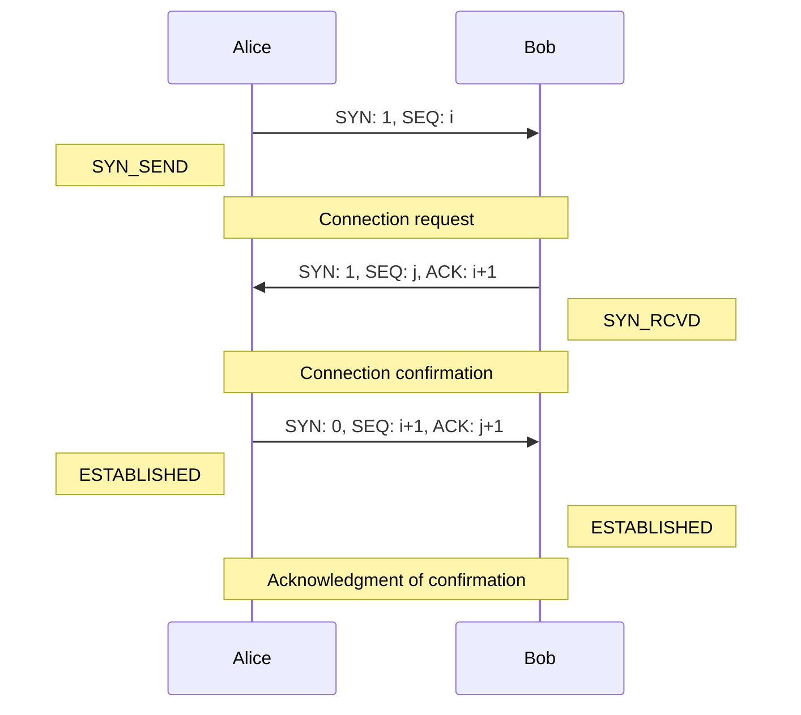
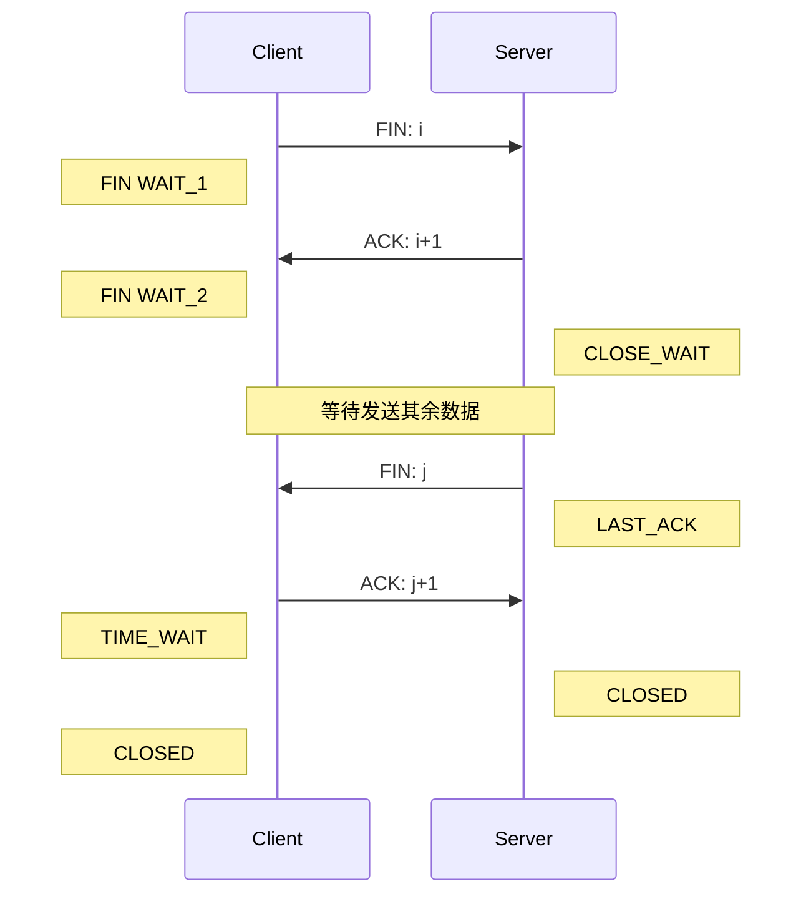
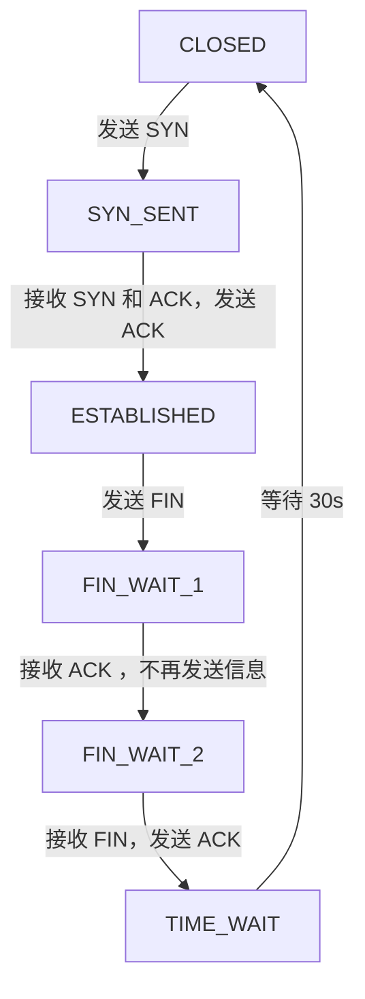
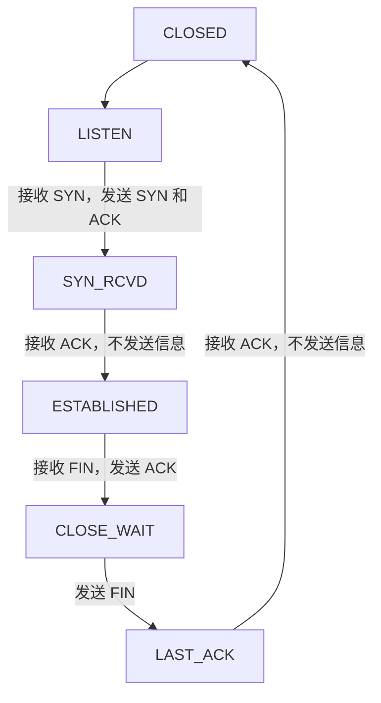

# End-to-End Protocol

## Transport Services and Mechanisms

### Transport Service

不同于网络层实现了主机到主机的逻辑通信，传输层实现了不同主机上进程间的逻辑通信

传输层的协议运行于端系统，发送方将应用的信息分为 segment 传给网络层，而接收方将接受到的 segment 重组整合为信息传输到应用层

传输层的协议可分为

* 可靠，有序的送达（TCP）：面向连接，有流控制和拥塞控制
* 不可靠，无序地送达（UDP）：无连接，和 IP 一样的尽力而为服务

传输层的协议不能保证送达的延时和带宽

### Transport Mechanisms

#### Addressing and multiplexing

##### Addressing

应用进程有三级地址

* 进程标识，即传输层服务的使用者，对于 TCP/UDP 来说就是端口号
* 传输层实体标识，一个主机只有一个，一般不需要
* 主机地址，即 IP 地址

对于 TCP/UDP 来说，寻址只需要一个二元组 <主机 IP，端口>，即 socket，一个 socket 唯一标识了网络上一个主机之上的一个进程

##### Multiplexing/Demultiplexing

多路复用（multiplexing）：即在源主机从不同 socket 中收集数据，并且为每个数据块封装头部信息，生成报文段（segment），再将其传递到网络层

多路分解（demultiplexing）：即在目的主机将 segment 中的数据正确交付到对应的 socket

如何进行分解和复用？socket 由一个二元组唯一标识，主机根据 IP 报文中的**源地址**，**目的地址**和传输层报文中的**源端口**，**目的端口**即可定位要交付的 socket

* 无连接的复用和分解：UDP 的 socket 由一二元组唯一标识，即 <目的 IP，目的端口>，即使发送方的源 IP 和源端口不同，只要目的 IP 和目的端口相同，就会被交付到相同的目的进程
* 面向连接的复用和分解：TCP socket 由一个四元组唯一标识，包含了源/目的 IP 和源/目的端口，分解时用到了接受到的所有四个值

如果服务器使用线程编程，可以被视为另一种复用/分解，即不同的 TCP 连接被定位到同一进程的不同线程

#### Flow control

流控制的目的在于协调通信双方，使得发送方不至于发送过快以导致接收方的 buffer 溢出。

在不同的层都需要流控制，若一个传输层服务用户不能处理接收到的数据，它的缓冲就会溢出，而一个传输层实体（主机）不能处理到接受的数据会导致网络层的缓冲溢出

流控制的目的就在于使得发送方的发送速率与接收方的处理速率匹配

传输层服务的接收方会维护一个 receive buffer。

可以使用固定大小的滑动窗口（类似链路层的流控制），但是不能通过没有 ACK 来指示流量控制，比如当接收方缓冲满时会停止发送 ACK 使得发送方停止发送，但丢包后也会导致接收方不再发送 ACK

**Credit Scheme**：在接收方的 buffer 中维护剩余空间的大小，即接收窗口
$$
RcvWindow = RcvBuffer - (LastByteRcvd - LastByteRead)
$$
然后接收方将接收窗口的值放入报文段中发给发送方，发送方保证自己未 ACK 的数据不会超过接收窗口的大小。

Credit Scheme 将流控制与 ACK 解耦。将数据的每个 octet 编号，每个传输层报文段包含序列号，ACK 号和窗口大小。当发送一个  segment 时，序列号 seq 是数据中首个 octet 的编号，设 ACK 号为 $i$ ，窗口大小为 $j$ ，则表示序列号直到 $i-1$ 的 octet 都已被确认，下一个等待的 octet 的编号应当是 $i$ ，而最多只能发送 $j$ 个 octet，即之后最多发送的 octet 编号为 $i+j-1$ 

在发送方和接收方的滑动窗口大小是可变的，会随着包的接受/发送而减小，随着 ACK 而增大

#### Connection-oriented mechanism

##### Connection Establishment and Termination

对于面向连接的服务，需要有连接的建立和消亡。连接的建立包括通信双方确认彼此，协商可选的参数（初始 seq，MSS，最大窗口大小等），并且为连接分配资源。

##### Reliable sequencing communication

对于 reliable sequencing network service，任意长度的信息均会被按序送达，并且可认为百分百可靠交付。

这样的网络上的连接建立很容易，如下图

双方发送 SYN 后连接即建立。若 SYN 信息到达时接收方没有在 listening，可以使用 RST 拒绝，或是将连接请求加入队列等待，或者主动用信号告知接收方处理等待中的请求

当连接结束时，双方或其中一方提出结束连接，达成一致后连接断开。可分为

* abrupt termination：等待中的报文可能会丢失
* graceful termination：所有未完成的传输均已完成，双方同意结束连接

连接的结束即上图下半部分的状态机，发送 FIN 的一方表示没有更多数据要发送了，进入 FIN WAIT 状态等待对方的剩余数据，而接受到 FIN 一方得知对方没有数据要传输了，进入 CLOSE WAIT 状态，将剩余数据发送完后发送 FIN，关闭，处于 FIN WAIT 的一方收到对方的 FIN 后则同样关闭。这样的即为 graceful termination

### Unreliable Network Service

对于 unreliable network service，报文段有丢失和失序的可能性，此时连接的建立和消亡有以下问题

- ordered delivery：按序交付
- retransmission strategy：重传策略
- duplication detection：副本检测
- traffic control：流量控制
- connection establishment：连接建立
- connection termination：连接终止
- crash recovery：崩溃恢复

#### ordered delivery

报文段到达时会失序。

解决方案：为每个 segment 编号（TCP 为每个 octet 编号），segment 使用数据中第一个 octet 的编号作为 segment 的编号。根据编号可在上层应用将报文重新组装

#### retransmission strategy

报文段可能会在传输过程中内容受损，或是丢包，而发送方无法了解这一情况

解决方案：接收方对于收到的数据发送 ACK，可使用 cumulative ACK，即一次 ACK 到目前为止确认的所有包（ACK $i$ 表示 $i$ 之前的都已收到），而发送方维护一个 ACK 计时器，若超时后还未收到 ACK 则触发重传。

重传的计时器应当根据网络情况改变而改变，过小会导致多次不必要的重传，而过大会导致对丢包的反应时间增长。一般都设置为比 RTT 稍长一些，且根据网络拥塞情况而改变

#### duplication detection

当重传触发时，如果仅仅是时延导致接收方没有及时接收到报文发出 ACK，则接收方必须能够分辨报文和其因为重传产生的副本。接收方也会认为是否因为 ACK 丢失而导致了对方重传，因此再次发送 ACK，发送方必须能够分辨重复的 ACK。同时序列号的空间也要足够大以避免重用

#### traffic control

使用上文提到的 credit allocation flow control mechanism

有可能会发生死锁，即 B 向 A 发送 ACK = $i$ ，W = $0$ ，关闭了接收窗口，而当 B 发送 ACK = $i$ ，W = $j$  时丢失了，则会进入死锁，B 等待 A 的数据，A 等待 B 打开窗口

解决方法为设置一个窗口计时器，当超时后若未收到报文，则发送一些报文，一般是重传之前发送过的报文

#### connection establishment

两次握手，即一方发送 SYN，另一方回复 SYN，若 SYN 丢包则重传，连接建立后忽视重复的 SYN。问题在于不能区分从之前的旧连接滑落的 SYN，或是滞后的 SYN

**三次握手**，描述如下

可以有效解决滞后 SYN  的问题

#### connection termination

不同于可靠连接的结束连接，当一方在等待 FIN 时，若对方的 FIN 先于最后的数据到达，则最后的数据丢失

解决方案：FIN 中附带序列号，接收方等待所有报文收到后再 ACK FIN，即四次挥手（graceful close），如下图

其中 TIME Wait 状态为等待若 Server 未收到 ACK 则重传 ACK 的时间，若在这段时间内没有收到回复则说明 Server 正常关闭，Client 也可关闭

客户端的一个典型的状态机如下

服务器的一个典型的状态机如下

#### crash recovery

当连接一方重启后，所有状态信息都丢失了，此时连接是半开的。

解决方案：设置计时器，当超时过长后断开连接并通知上层应用。重启一方对于收到的任意报文 $i$ 回复 RST $i$ ，收到 RST 的一方关闭连接，然后重启一方可立即重建连接

## User Datagram Protocol (UDP)

UDP 对于应用层来说提供**无连接**的服务，同 IP 网络一样尽力而为，每个 UDP 的报文独立处理，不保证送达和副本控制

UDP 只做了传输层最基本的工作，除了复用/分解和少量的差错检测以外，UDP 几乎没有对 IP 增加更多东西，这也导致其非常轻量化，不需要连接的建立和终止，也不需要在发送方和接收方维护连接状态，并且 UDP 报文头也很小，只有 8 字节（TCP 有 20 字节）

UDP 常常用于传感器的信息传递，实时应用，以及 Request-Response（RPC，通常需要在应用层添加可靠性的保证）。DNS 和 SNMP 均基于 UDP

### UDP segment

UDP 的报文头包括四个字段，共 8 字节

* 源端口：2 字节
* 目的端口：2 字节
* 长度：2 字节（包含头部和数据，单位是 octet）
* 校验和：2 字节，校验数据包含头部+数据+伪头（伪头：源 IP，目的 IP，填充，协议，总长度（与报文头中的长度字段相同））

UDP 的校验和对报文段中所有 16bit 的字求和，若有溢出则回卷，最后将和取反。接收方将所有 16bit 字和校验和相加，若无错则结果是 16 个 1

## Transmission Control Protocol (TCP)

TCP 为进程提供可靠的通信，TCP 是**面向连接的**，通信双方在发送数据前必须先进行”握手“，确保数据传输的某些参数

TCP 连接是全双工，点对点的。

TCP 放入 segment 的数据受 **MSS** (Maximum Segment Size) 限制，而 MSS 根据最大链路层帧长度（即 **MTU**, Maximum Transmission Unit）设置。MSS 要保证单个报文加上 TCP/IP 首部（通常为 40 字节）小于 MTU，而以太网和 PPP 协议都具有 1500 字节的 MTU，故 MSS 典型值为 1460 字节，**MSS 是指应用层数据的最大长度，不包括首部**

### TCP segment

TCP 的报文头有 20 个字节，包括

* 源端口：2 字节
* 目的端口：2 字节
* 序列号（Seq）：4 字节，是数据中第一个 octet 的序列号（TCP 为每个 octet 编号），若 SYN bit 被设置，则 Seq 为 ISN (Initial Sequence Number)，第一个 octet 序列号从 ISN + 1 开始
* ACK：4 字节，和数据一起捎带（没有专门的 ACK 报文），*"A 填充进报文段的确认号是 A 期望从 B 收到的下一字节的序号"*
* Window：2 字节，接收窗口大小，Credit allocation 中的 credit，以 octet 为单位
* Data-offset：4 bit，数据相对于报文头的偏移量，单位是 32 bit（即报文头最长 60 字节）
* 校验和：2 字节，校验数据为头+数据+伪头（源 IP，目的 IP，协议，总长）
* 保留位：6 bit
* 选项：如 MSS，最大窗口，窗口调节因子等
* FLAG：6 bit
  * URG: urgent pointer 有意义，指向报文段里被上层置为紧急的数据
  * ACK: ACK 字段有意义
  * PSH: 应当立即将数据交给上层
  * RST: 重置连接
  * SYN: 同步序列号（用于建立连接）
  * FIN: 没有更多要传输的数据了
* Urgent Pointer：2 字节，指向紧急数据

TCP 将 QoS 参数传递至 IP 层，即 IPv4 中的 ToS 字段或 IPv6 中的 traffic class 字段

### TCP mechanism

#### connection establishment and termination

TCP 连接建立时经过**三次握手**，具体可见上文 [connection establishment](#connection establishment) ，一个端口可以与许多端口建立不同的 TCP 连接

TCP 连接结束可分为

* graceful termination：CLOSE+FIN， 见 [connection termination](#connection termination)
* abrupt termination：ABORT+RST，见 [crash recovery](#crash recovery)

#### data transfer

TCP 将数据看作是无结构且有序的**字节流**，并为每个字节编号，使用基于字节的 credit allocation 进行流控制。

TCP 的发送方和接收方均维护一个 buffer，将数据缓存在其中，并不时将数据从其中取出传递给网络层（发送方）或上层应用（接收方）。

发送时，若没有 PUSH 或 CLOSE，TCP 按照自己的节奏发送数据，TCP 实体将数据分割成段，有时候会等数据量到达一定数量后再传输

交付时，若没有 PUSH，TCP 按照自己的节奏向上层交付数据，或是每次收到便交付，或是缓存多个 segment 后一次性交付

接受数据时，segment 可能乱序到达，TCP 仅接受按序的 segment，乱序的将其丢弃。接受时接受窗口内所有的 segment，减少重传次数

重传时，TCP 维护一个发送了但是没有 ACK 的 segment 的队列，对其中的 segment，若在一定的时间内没有收到 ACK，则重传，一般可将重传的方式分为三种

* first only：每个队列一个 timer，在第一个 segment 重传后重置
* batch：每个队列一个 timer，在所有 segment 重传之后重置
* individual：每个 segment 一个 timer，重传后重置

等待计时器超时再重传时间过长，所以有**快重传**机制，当收到冗余的 ACK 后即认为丢包，一般收到三次冗余的 ACK 就不等待超时直接重传

## TCP Congestion Control

拥塞控制是为了避免多个源主机发送太多数据导致网络无法处理的情况。

拥塞控制要区分于流控制

* 流控制仅针对发送方和接收方两个主机，目的在于协调发送方的发送速率不超过接收方的处理速率
* 拥塞控制针对网络中所有主机，目的在于防止所有发送方发送速率超过网络的承载量导致拥塞

拥塞控制在端主机控制，主要包括重传计时器和窗口管理

### retransmission timer management

TCP 采用超时/重传机制来处理丢包问题，但在实现时如何设置超时重传间隔便成为了问题。一般的策略为设置为略大于 RTT (Round Trip Time) ，问题转移为如何估计 RTT

#### Estimate RTT

分为两种方法，simple average 与 exponential average

##### simple average

设 $RTT(i)$ 为观测到的第 $i$ 个 segment 的 RTT，$ARTT(k)$ 为前 $k$ 个 segment 的平均 RTT，则有
$$
A R T T(k+1)=\frac{1}{k+1} \sum_{i=1}^{k+1} R T T(i)
$$
或表示为
$$
ARTT(k+1) = \frac{k}{k+1} A R T T(k)+\frac{1}{k+1} R T T(k+1)
$$

##### exponential average

设 $SRTT(k)$ 为前 $k$ 个 segment 的平滑 RTT，有
$$
SRTT(k+1)=\alpha \times SRTT(k)+(1-\alpha) \times R T T(k+1)
$$
事实上这叫做指数加权移动平均 (EWMA)，距离当前时间越近的 RTT 对 SRTT 的影响越大，且权值随着时间成指数级下降

#### Retransmission timeout

RTO (retransmission timeout) 即为超时重传时间，根据之前估计的 RTT 值即可计算出 RTO。有两种计算 RTO 的方法，RFC 793 和 Jacobson 算法

设 $RTO(k)$ 为前 $k$ 个 segment 后 RTO 的值，则根据 RFC 793 ，有
$$
RTO(k+1) = \min \{\text{UBOUND}, \max \{\text{LBOUND}, \beta \times SRTT(k+1)\}\}
$$
可以看出 RTO 的范围为 $[\text{LBOUND},\text{UBOUND}]$ ，SRTT 中 $\alpha$ 推荐值为 0.8~0.9，$\beta$ 推荐值为 1.3~2.0

RFC 793 的问题在于没有考虑到网络的波动与变化，故提出了 Jacobson 算法：

定义 $SRTT(k)$ 为前 $k$ 段的平滑 RTT，有
$$
SRTT(k+1) = (1-g)\times SRTT(k) + g \times RTT(k+1)
$$
定义 $SERR(k)$ 为第 $k$ 个 segment 的 RTT 与当前 SRTT 的差，有
$$
SERR(k+1) = RTT(k+1) - SRTT(k)
$$
定义 $SDEV(k)$ 为前 $k$ 个 segment 的标准差，有
$$
SDEV(k+1) = (1-h) \times SEDV(k) + h \times |SERR(k+1)|
$$
则 RTO 为 SRTT 加上某个余量，即
$$
RTO(k+1) = SRTT(k+1) + f \times SDEV(k+1)
$$
根据 RFC，上述公式中各因子的推荐值为
$$
g = \frac{1}{8} \quad h = \frac{1}{4} \quad f = 2 \text{ or } 4
$$

#### set RTO after retransmission

若发生超时，一般是因为网络拥塞导致的丢包或是过长的 RTT，此时应当减缓端主机的发送速度，并且改变 RTO

改变 RTO 的思路类似以太网中的指数退避，即每当发生重传，便将 RTO 倍增，即
$$
RTO = 2 \times RTO
$$
RTO 过大最终会导致连接超时断开

考虑在重传后计算 RTT ，若重传，无法确认到来的 ACK 究竟对应之前丢掉的包还是之后重传的包。故根据 Karn 算法，对于重传的 segment，不计算其 RTT，同时倍增 RTO，直到非重传的 ACK 到来，开始计算 RTT ，同时停止 RTO 的指数退避

### Window management

拥塞控制时，除了本身用于流控制的接收窗口，还要维护一个**拥塞窗口**，拥塞窗口和接收窗口共同决定了当前可用的窗口，即
$$
awnd = \min \{cwnd, rwnd\}
$$
故可得发送速率为
$$
rate = awnd \times \frac{MSS}{RTT}
$$
以下主要介绍 TCP reno 算法，分为三个部分

* slow start：慢启动
* congestion avoidance：拥塞避免
* fast retransmit and fast recovery：快重传&快恢复

#### Slow start

连接开始时，cwnd 设置为 1 MSS。每当收到对 $k$ 个 segment 的 ACK 就将 cwnd 增加 $k$ MSS，即每个 RTT 将 cwnd 翻倍，则 cwnd 将按照指数级增长，直到遇到第一次丢包。有三种可能的情况会导致慢启动状态改变。首先系统会维护一个慢启动阈值 ssthresh

* 若发生了超时导致的丢包，系统会将 cwnd 设为 1，ssthresh 设为 cwnd 的一半，重新从慢启动开始
* 若发生了三次冗余 ACK 导致的丢包，系统会进行快重传以及快恢复，再进入拥塞避免
* 若 cwnd 达到或超过了 ssthresh，结束慢启动并进入拥塞避免模式

#### Congestion control

此阶段表示已经发生了丢包，cwnd 大约为上次的 ssthresh 的一半，此时继续按照慢启动的方式以指数增加 cwnd 的值太过鲁莽，因此采用一种加性增，乘性减（AIMD）的策略，即每个 RTT 将 cwnd + 1，若发生丢包（假定是由冗余 ACK 引起）则将 cwnd 减半

* 若发生一次丢包（3 次冗余 ACK），则进入快重传状态。
* 若丢包由超时引起，则同慢启动一样，将 ssthresh 设为 cwnd 的一半，cwnd 设为 1，从慢启动开始

#### Fast retransmit and fast recovery

快重传是对于 3 次冗余 ACK 的处理方案，即检测到 3 次冗余 ACK 便认为是丢包，不再等待计时器超时，直接重传，此时将 ssthresh 设为 cwnd 的一半，但不同于超时重传，仅令 cwnd 为新的 ssthresh + 3（即 cwnd 也减半，加 3 是因为每当收到一个冗余 ACK 发送方便认为对方已经收到了之后发送的一个包，网络中便空出了一个 MSS 的位置）

重传后便进入快恢复状态，快恢复阶段对收到每个冗余的 ACK，将 cwnd 增加一个 MSS （理由同上），直到收到对丢失的 segment 的 ACK，然后将 cwnd 恢复为 ssthresh，进入拥塞避免状态，继续按照加性增乘性减控制 cwnd，若在快重传或快恢复状态遇到了超时丢包，同样按照慢启动的处理原则处理。

上述三个过程的状态机如下

### New Window Management Algorithm

对于网络带宽很大的情况，进入拥塞避免后的线性增长可能不能很好地利用网络带宽，当一个 10Gbps 的线路发生丢包后，需要 1.4 小时才能恢复到满速。有以下解决方案

* BIC：Binary Increase Congestion control，由 Linux 内核 2.6.8 默认使用
* CUBIC：窗口大小是从上次丢包到现在的时间的一个三次函数，由 Linux 内核 2.6.19 及之后的版本默认使用

## Multimedia networking

### Multimedia

音频：通过采样将模拟信号转化为数字信号，CD 采样率一般为 44.1 kHz

视频：压缩同一帧内的像素或是帧之间的像素

一般可分为三类

* Streaming, stored audio, video
* Conversational voice/video over IP
* Streaming live audio, video

Streaming, stored audio, video

一般发送速率 = 视频码率

可通过延迟播放和客户端缓存消除网络抖动产生的影响。若使用 UDP 需要应用层完成错误检测与恢复。也可以使用 HTTP 实现，即通过 TCP 发送，比起 UDP 更易跨过防火墙

现代实现：**DASH** (Dynamic, Adaptive Streaming over HTTP)

服务器将视频文件分割成 chunks，且不同的 chunks 码率和存储地址不同（为同一 chunk 提供多个可选码率版本），提供一个 manifest file 提供指向这些 chunks 的 url

客户端根据自己与 server 之间的带宽选择合适的 chunks，并且尽可能选择更大码率的 chunk。客户端可以决定

* 何时请求 chunk，防止缓存空或溢出
* 请求什么码率，根据带宽选择当前可用最大的
* 到哪里请求，根据 manifest 文件

### Protocol

#### Real-time Transport Protocol (RTP)

RFC 3550，基于 UDP，是用于承载音视频数据的结构，功能包括标识数据类型，为数据编号以及添加时间戳

其中时间戳对于实时应用来说是最重要的信息，接收方通过时间戳来重新排序收到的内容，也用于同步音视频流

RTP 不提供及时交付的机制，RTP 的结构只能由接收到的端系统所见，途中的路由器不会分辨也不会专门处理（封装在 UDP 内）

#### RTP Control Protocol (RTCP)

用于 RTP 通信双方间进行控制的交流，如关于丢包率，抖动，时间戳，同步问题等。被应用层使用来修改发送速率以及分析网络情况等

RTCP 可以监控反馈 QoS 的情况以及进行拥塞控制，使得发送方能够调整发送速率，接收方能够得知拥塞是局部的还是全局的

#### Real Time Streaming Protocol (RTSP)

应用层协议，用于建立和控制媒体 session。提供 VCR 命令，如暂停，回放，快进等。与 RTP，RTCP 共同工作。

RTSP 可基于 UDP 或 TCP，其指令是以 ASCII 码传输的。流频道与控制频道分离

e.g.，通过 HTTP 获得 metafile，与其中的 url 建立 RTSP 连接，数据通过 RTP 传递，流控制通过 RTSP 完成

使用 TCP 实现时只需发送信息，使用 UDP 实现时若未收到 ACK 则需要重传，重传不增加序列号，通过不同的时间戳进行副本检测

#### Session Initiation Protocol (SIP)

应用层协议，用于建立音视频会话

根据 SIP address 确定 IP address 和端口，使用 URL 或邮箱