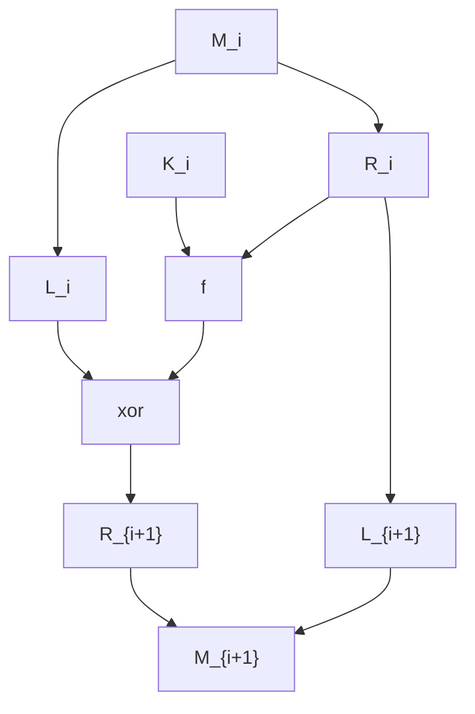

# Network Security

## Network Attacks

网络环境中的攻击大致可分为四种

* interruption：阻断正常的流
* interception：嗅探信息，导致内容泄漏或是分析流
* modification：修改内容
* fabrication：伪装或是重放攻击

按照特性可分为被动攻击和主动攻击。被动攻击包括窃听信道或是监控包以分析流的特性，这样的攻击难以被检测，但是可以被预防；主动攻击包括伪装和重放攻击，或是修改报文内容，这样的攻击难以被预防，但是可以被检测到

对于上述四种攻击，分别对应了四种网络安全的要求

* availability：可用性，不被阻断
* confidentiality：机密性，内容不被泄漏，仅有发送方和接收方可以理解内容
* integrity：完整性，内容不被修改，如有改变也能检测到
* authenticity：可认证，接收方和发送方可以确认收到的信息都是由彼此发出而非伪造

在讨论网络安全的模型中，往往认为发送方和接收方之间的信道是不安全的，即攻击者可以窃听信道，也可以修改，插入或删除报文

## Cryptographic Technologies

现在主要有两种加密系统：symmetric key system 和 public key system

在 symmetric key system ，即对称密钥加密系统中，发送方和接收方使用的密钥是相同的

而在 public key system，即公钥加密系统中，使用一对密钥，其中一个密钥被所有人所知（称为公钥），而另一个只被发送方和接收方所知（称为私钥）

### Symmetric Key Cryptography

一个对称加密往往包括以下部分

* 明文
* 加密算法
* 密钥
* 密文
* 解密算法

对于加密过程有两个要求

1. 强加密算法：即使已知明文-密文对，也不能解出加密用的 key
2. Key distribution：发送方和接收方必须安全且秘密的持有 key，一旦 key 泄漏则通信不再安全

通常根据攻击者对于信息的掌握程度，可以将其攻击分为三种不同的情况

* 唯密文攻击（ciphertext-only attack）：攻击者仅得到截获的密文
* 已知明文攻击（known-plaintext attack）：攻击者掌握一些明文-密文对
* 选择明文攻击（chosen-plaintext attack）：攻击者能够选择某些明文并得到其对应的密文

#### Traditional Encryption Techniques

传统的加密方法可大致分为替换型和转置型。

* 替换型：将密文中的字符替换成其他字符/数字/符号
  * Caesar Cipher：将字母表移位以替换，BF 即可破解
  * Mono-alphabet Cipher：用字母的某种排列替换，由于每个字母对应的替换固定，可通过统计学和语言学的知识解密
  * Vigenere Cipher：26 个字母代表 26 中 Caesar 中的替换，用一个单词指示当前应该使用哪一种替换。由于同样的字母不一定替换为相同的字母，破解难度大大上升
* 转置型：重新组织密文，但不改变密文字母
  * Rail Fence Cipher：明文竖写，横向读出，BF 即可破解
  * Row-Column Cipher：明文写成矩形，按照特定顺序排列行得到密文

#### Modern Encryption Algorithms

现代加密算法主要关注块加密，即待加密的报文被分成定长的块，每一块被独立加密，并且生成定长的密文。常用的加密算法有 DES，3-DES，AES 等

##### Feistel Cipher

Feistel Cipher 是一种构造块加密算法的方案，优点在于加密过程和解密过程极为相似，实现加密和解密只需要差不多一半的软件/硬件

设加密函数为 $F$ ，运行 $n$ 轮，且每轮的子密钥为 $K_1, K_2, \dots, K_n$

加密过程为将明文拆为两个等长的块 $L_0, R_0$

在每轮中，计算
$$
\begin{align*}
\begin{aligned} L_{i+1} &=R_{i} \\ R_{i+1} &=L_{i} \oplus \mathrm{F}\left(R_{i}, K_{i}\right) \end{aligned}
\end{align*}
$$
其中 $i = 0,1, 2, \dots, n$ ，最终得到密文为 $L_{n+1}, R_{n+1}$

而解密时则只用计算
$$
\begin{align*}
\begin{aligned} R_{i} &=L_{i+1} \\ L_{i} &=R_{i+1} \oplus \mathrm{F}\left(L_{i+1}, K_{i}\right) \end{aligned}
\end{align*}
$$
其中 $i = n, n-1, \dots, 1, 0$ ，最终得到明文 $L_0, R_0$

用流程图表示即为

##### DES (Data Encryption Standard)

DES 中块大小为 64 bit，key 大小为 56 bit，在开始时将输入进行一次初始置换（IP, Initial Permutation），然后进行十六轮迭代，每次迭代将一个 48 bit 的迭代 key（由 56 bit 的 key 生成）与 64 bit 的块结合，得到一个 64 bit 的输出。迭代结束后再进行一次逆置换（FP, Final Permutation, IP 的逆运算），得到密文

DES 的每轮迭代即是使用 Feistel 结构

DES 的搜索空间大约在 $O(2^{56}) = O(10^{17})$ 级别，现在的计算机可轻易破解

##### Triple DES

分为两种模式：EEE 和 EDE

EEE 模式使用三个 Key，运行三次 DES 得到密文，搜索空间大小约为 $O(2^{110})$ ，且不兼容一般的 DES

EDE 模式使用两个 Key，即先用 $K_1$ 加密一次，得到密文后使用 $K_2$ 解密，然后再将结果用 $K_1$ 加密，在 $K_1 = K_2$ 时即是一般的 DES，也可使用三个 Key 分别进行 EDE 过程，更安全

##### AES (Advanced Encryption Standard)

同样是一种对称块加密算法，安全性和 3-DES 相当甚至更好，在 AES 中定义

* $B$ ：块大小，单位为 32-bit
* $K$ ：Key 大小，单位为 32-bit
* $r$ ：迭代轮次，计算方法为 $6 + \max\{B, K\}$

每轮迭代中都包含了 S-box 替换，rotating rows，Mix-Column，与密钥异或四步

参见 [Advanced Encryption Standard](https://en.wikipedia.org/wiki/Advanced_Encryption_Standard)

### Public Key Cryptography

对称加密需要通信双方共享一个共同秘密作为加密的密钥，而这样做的前提就是能进行安全的通信。公钥加密体系的概念相当简单，即一对密钥，其中一个所有人都知道（公钥），而另一个只有接收方知道（私钥），公钥加密体系不要求双方共享一个共同秘密，发送方使用公钥加密，将密文发送给接收方，而接收方使用自己的私钥即可解密

公钥加密系统包括以下部分

* 明文
* 加密算法
* 公钥与私钥
* 密文
* 解密算法

假设公钥为 $PUB_A$ ，私钥为 $PRV_A$ ，且加密算法为 $Encrypt$ ，解密算法为 $Decrypt$ ，则有
$$
Decrypt(Encrypt(M, PUB_A), PRV_A) = M\\
Decrypt(Encrypt(M, PRV_A), PUB_A) = M
$$
即在加密和解密中公钥和私钥可替换，这也使得公钥加密体系不仅可用于加密，也可以用于鉴别和数字签名

公钥加密系统需要满足

* 加密和解密算法均为公开
* 已知公钥和算法的情况下难以得到私钥
* 使用公钥和公钥加密的密文，很难得到明文
* 在已知明文-密文对的情况下很难找出私钥

#### RSA

RSA 是一种公钥加密算法，原理基于数论中的欧拉定理，其过程可描述为

* 首先选择两个大质数 $p, q$
* 计算 $N =  p \times q$
* 计算 $\Phi(N) = (p-1) \times (q- 1)$ ，其中 $\Phi(N)$ 为欧拉函数，计算小于 $N$ 且与 $N$ 互质的整数个数
* 选择一个与 $\Phi(N)$ 互质的整数 $e$ ，即 $\gcd(e, \Phi(N)) = 1$
* 计算出一个 $e$ 的模反元素 $d$ ，满足 $e \times d \bmod \Phi(N) = 1$
* 得到公钥 $(e, N)$ 和私钥 $(d, N)$

RSA 的加密过程为，对于一段满足 $M < N$ 的明文 $M$ ，密文 $C = M^e \bmod N$

解密过程为 $M = C^d \bmod N$

RSA 算法能够解密的原理依赖于欧拉定理，即若 $\gcd(n, a) = 1$ 则
$$
\begin{align*}
a^{\varphi(n)} \equiv 1 \quad(\bmod n)
\end{align*}
$$
考虑 RSA 算法的解密过程，
$$
C^d = (M^{e} \bmod N)^d \bmod N = M^{ed} \bmod N
$$
而由于 $e \times d \bmod \Phi(N) = 1$ ，可认为 $e \times d = 1 + h\Phi(N)$ ，故
$$
M^{ed} = M^{1 + h \Phi(N)} = M(M^{\Phi(N)})^{h} \equiv M(1)^h (\bmod N) \equiv M (\bmod N)
$$
 即
$$
M^{ed} \bmod N = M
$$
可正确解密

在使用 RSA 时要求加密的明文长度不超过选择的整数 $N$ ，一般可将明文分段分别加密，或是使用对称加密算法加密明文（DES/AES）再使用 RSA 加密密钥

RSA 的安全性基于现在还没有一个高效的算法能够将大整数因式分解（一般实用的 RSA 中的 $N$ 为 1024 位或 2048 位）

一般使用时要求

* $p, q$ 长度相近，约为 $N$ 的一半，且两个素数不相关
* $e$ 可选择较小的数，避免加密代价过大
* $d$ 需要尽可能大，防止搜索空间过小，被暴力破解

## Message Integrity and Authentication

从 Alice 处收到信息的 Bob 希望确认以下两个事实

* 信息确实是由 Alice 发送的（Authentication）
* 信息自 Alice 发送后没有更改（Message Integrity）

### Authentication by MAC

MAC (Message Authentication Code) 用于确保信息完整性，其机制为

* 发送方和接收方共享一个共同秘密 $s$
* 发送方将报文 $m$ 和共享秘密 $s$ 连接起来形成 $m + s$
* 使用一个函数 $H(\cdot)$ 计算 MAC： $H(m + s)$
* 发送方将 MAC 附在报文后发出
* 接收方接受后使用收到的报文 $m$ 和共同秘密 $s$ 计算出 MAC： $H(m+s)$ 并与报文后附加的 MAC 比较是否相同

生成 MAC 的函数可接受任意长度的输入同时输出定长的结果，并且要易于计算，且满足

* 单向：已知 $Y$ ，很难找出 $X$ 使得 $Y = MAC(X)$
* 弱碰撞抵抗：已知 $X_1$ ，很难找到 $X_2$ 使得 $MAC(X_1) = MAX(X_2)$
* 强碰撞抵抗：很难找到任意 $X_1, X_2$ 使得 $MAC(X_1) = MAX(X_2)$

一般有两种方法选择生成 MAC 的函数

* 通过加密算法，如：CBC-MAC
* 通过 Hash 算法，如：MD5，SHA-1

#### CBC-MAC

Cipher Block Chaining Message Authentication Code

流程为

* 将报文 $M$ 分为 $L$ 块长度为 $n$ bit 的块 $M_1, M_2, \dots, M_L$
* 设加密算法 $E$ 的密钥为 $K$
* 令 $C_0$ 是一个随机的 $n$ bit 块（初始向量 $IV$）
* 则 $C_i = E_k(M_i \oplus C_{i-1}), CBC-MAC_K(M) = C_L$
* 最终令 $MAC_K(M) = (C_0, C_L) = (IV, CBC-MAC_K(M))$

#### MD5 and SHA-1

通用流程都是将输入划分为长 512 bit 的 block 分别处理，最后不足的一块填充至 448 bit ，然后将输入长度按照小端序存放在最后 64 bit （输入长度最多为 $2^{64}$）

MD5 输出的长度为 128 bit

SHA-1 输出的长度为 160 bit

### Digital Signature

数字签名应用了公钥加密体系，用于确认内容确实由其发布者发布，在使用时将要签署的文档使用私钥加密，当一个人想要验证其发布者时，只要用发布者的公钥将其解密即可，只要能正确解密，就能证明该文档由其发布，因为将文档加密需要私钥，而私钥在原则上只由发布者一人拥有。同时，若被发布的文档被修改过，则通过原文档的签名也可验证其完整性，因为使用公钥解密后得到的是修改前的文档。数字签名技术可以满足完整性和可认证的要求

使用公钥加密进行数字签名的缺点在于，公钥加密算法的加密和解密代价高昂，故实际使用中一般都是结合 Hash 使用，具体流程如下

* 内容发布者 Bob 发布内容 $m$ ，使用一个 Hash 函数计算出文档的 Hash 值 $H(m)$
* Bob 将 $H(m)$ 用其私钥加密，这比加密整个文档代价小得多，然后将其和 $m$ 一起发布
* 内容接受者 Alice 得到文档 $m$ 和 Bob 的签名，Alice 使用同样的 Hash 函数计算文档的 Hash 值 $H'(m)$ ，并且用 Bob 的公钥解密签名得到 $H(m)$
* Alice 只需要比较 $H'(m), H(m)$ 是否相同即可确认内容是否由 Bob 发布以及发布后有没有被修改

## Key Distribution

不论是在对称加密体系和公钥加密体系中，都存在着分发密钥的问题。对称加密中，需要确保通信双方共享同一个共同秘密，而在公钥加密体系中，也需要确保公钥确实来自通信双方

如果不确保适当的 Key Distribution，则无法防止记录回放攻击（e.g.，Alice 向 Bob 订了一瓶香水，而若不加以防御，中间人可以重放 Alice 的订单报文造成财产损失）

回放攻击的防御需要合理利用时间戳和不重数

同理还有中间人攻击，中间人 Trudy 分别和 Bob 以及 Alice 交换公钥，在 Bob 及 Alice 的视角看来他们确实在与对方交流，但是中间人截取了所有报文的明文

### Diffie-Hellman Key Exchange

DH 算法用于确保通信双方间能共享一个共同秘密，同时避免其他人获得该秘密。算法的流程如下

* 有一个所有人都知道的大质数 $p$
* 有一个生成器 $g \in Z^*_p, Z^*_p = \{1 \leqslant a \leqslant p-1 \mid \gcd(a, p) = 1\}$ （事实上 $g$ 是 $p$ 的整数模 $n$ 乘法群的原根，参见 [Diffie-Hellman](https://zh.wikipedia.org/wiki/%E8%BF%AA%E8%8F%B2-%E8%B5%AB%E7%88%BE%E6%9B%BC%E5%AF%86%E9%91%B0%E4%BA%A4%E6%8F%9B)）
* Alice 任选一个小于 $p$ 的随机值 $X$ ，然后将 $g^X \pmod p$ 发送给 Bob
* Bob 同样选一个小于 $p$ 的随机值 $Y$ ，然后将 $g^Y \pmod p$ 发送给 Alice
* Alice 计算 $(g^Y \pmod p)^X\pmod p = g^{XY} \pmod p$
* Bob 计算 $(g^X \pmod p)^Y\pmod p = g^{XY} \pmod p$
* Alice 和 Bob 有了共有秘密 $g^{XY} \pmod p$

### Trusted Certification Authority

在不安全的网络环境下，可基于可信的第三方 CA (Certification Authority) 来验证通信双方的身份。CA 的可信度由政府机构等来保证。

在基于 CA 进行 Key Distribution 时，大致过程如下，假设客户端 $C$ 和服务器 $S$ 之间需要通信，借助于 CA 的服务器 $AS$ 。

1. 客户端告诉 $AS$ 他想要与服务器 $S$ 通信，他同时发送一个自己生成的不重数 $N_C$ ，即向 $AS$ 发送 $(C, S, N_C)$
2. $AS$ 生成一个临时的会话 Key $K_{CS}$ 用于 $C$ 和 $S$ 之间的通信，然后将其和一个 Ticket 发送给 $C$ ，其中 Ticket 为 $K_{S-AS}(K_{CS}, C)$ ，用 $S$ 和 $AS$ 之间的共享密钥加密，$AS$ 向 $C$ 发送 $K_{C-AS}(N_C, S, K_{CS}, K_{S-AS}(K_{CS}, C))$
3. $C$ 向 $S$ 发送 Ticket，$S$ 可用其密钥 $K_{S-AS}$ 解密
4. $S$ 向 $C$ 发送一个 $K_{CS}$ 加密的不重数 $K_{CS}(N_S)$
5. $C$ 向 $S$ 发送 $N_S - 1$ 并用 $K_{CS}$ 加密，以防止回放攻击，并确保通信正常

由于非对称加密不适合大规模信息的加密，故双方通信时将信息用临时的共享密钥 $K_{CS}$ 加密，然后将密钥用对方的公钥加密，将加密后的密钥和信息发送给对方，接收方使用自己的私钥解密密钥后再解密信息即可

### Public Key Certification

如何确保获得的公钥确实是来自对应的实体，而非由某个中间人伪装？基于数字签名技术的公钥证书可以解决这个问题。公钥证书同样需要可信的第三方 CA

CA 一旦认证一个实体，便会生成一个将该实体身份与其公钥绑定的证书（certificate），证书包括了该实体的公钥和标记公钥所有者全局唯一的身份标识信息，如 IP 地址或名字，然后可信的 CA 将其内容和一个标识有效期的时间戳一同生成一个数字签名。这样做确保了该证书中的公钥确实由该证书中的实体所持有，若有人想要修改其中的公钥，由 Hash 函数生成的 Hash 值就会与使用 CA 公钥解密数字签名得到的 Hash 值不同，而由于 CA 的私钥仅由 CA 持有，CA 的可行度由政府等机构保证，故可确认该证书内容受到篡改，修改时间戳或身份标识也会基于同样的理由被检测到。

## Firewalls

防火墙用于将内部网络与互联网分开，进行出入的管理，防止内部网络受到外部攻击者攻击，防火墙的功能主要有防止 DoS 攻击（如 SYN flooding），仅允许认证后访问内网，防止外界的非法访问等。可大致分为三类

* stateless packet filters
* stateful packet filters
* application gateways

### stateless packet filters

无状态的防火墙逐包过滤，根据

* 源/目的 IP 地址
* TCP/UDP 源/目的端口号
* ICMP 信息种类
* TCP 的 SYN 与 ACK 位

来决定是否转发或丢弃一个包

如屏蔽 IP 报文中协议为 17 的即可阻断所有 UDP 流，屏蔽端口号为 23 的可阻断 Telnet，屏蔽 ACK 为 0 的 TCP 包可以防止外部向内部建立 TCP 连接

路由器可以采用访问控制列表（ACL, Access Control List）实现防火墙

### stateful packet filters

无状态的防火墙比较简单粗暴，而有状态的防火墙会记录每一个 TCP 流，从连接建立（SYN）到连接断开（FIN），确定是否转发该流。如过长时间未活跃的流不再转发

有状态的防火墙需要维护一个有状态的 ACL，追踪每一个流，在转发前确认流的状态

### application gateways

在应用层上对网络的访问进行控制，如仅限定某些用户可以建立 Telnet 连接。认证需要在应用层完成。在实现时会有一个 gateway server，所有向外的 TCP 流都要经过该 server 并经过应用层的认证，router 会阻断所有不是来自 gateway server 的 TCP 连接

不同于前两种防火墙，应用层网关对于用户来说是不透明的，需要显式设置代理。且防火墙对于 UDP 流没有较好的控制方法。设置防火墙规则具有滞后性。

入侵检测系统（IDS, Intrusion Detection System）：包含了 Deep packet inspection 和 examine correlation

## Transport Layer Security

传输层的安全主要考虑 TCP 连接的安全性，包括 SSL (Secure Sockets Layer) 和基于 SSL3 的 TLS (Transport Layer Security)，SSL/TLS 可以保护应用层的安全通信（应用必须支持 SSL），如 HTTP/HTTPS，IMAP，LDAP，802.1x，VPN 等底层均使用了 SSL

SSL/TLS 中 server 的证书认证是必要的，而 client 的证书认证可选，一般不使用

### SSL

SSL 基于 TCP 提供端到端的安全连接，其中 SSL record protocol 基于 TCP 协议，为上层的 SSL 协议提供基本服务，而高层三个 SSL 协议用于 SSL 过程，一般在浏览器中实现，包括 Handshake Protocol，Change Cipher Protocol，Alert Protocol

#### SSL conception

SSL session 是 client 和 server 之间的关联，通过 Handshake Protocol 建立，一次 session 定义了一个加密参数集，包括

* 双方（服务器）的证书，用于公钥
* 一个 48 octet 的主秘密，用于共享密钥
* 使用的压缩/加密/MAC 算法

在一次 SSL session 中可能建立起多次 TCP 连接，session 可以避免为每个连接商定一套参数。同一对端之间多个 session 是支持的，但一般不使用

SSL connection 是用于在 session 中传输数据的机制，一次 connection 需要

* 共享秘密，用于加密/计算 MAC
* IV，如果需要的话
* 序列号

每个 connection 都与一个 session 相关联

#### SSL protocol

SSL record protocol 用于支持 SSL 服务，其将来自应用层的数据分段（一般是分成 $2^{14}$ 个 octet 或更少）然后将压缩后的信息和 MAC 一起使用对称加密算法加密，然后加入 SSL record 头，放入 TCP 包中传输

SSL change cipher protocol 用于告知对方改变加密参数

SSL alert protocol 用于告知通信双方出现了异常，根据异常严重程度可分为 fatal 和 warning，若发生 fatal 的错误，则立即终止 connection，其他活动中的 connection 或许将继续，但不会再有新的 connection 建立。发生 warning 的错误则双方记录并处理，不会导致连接的终止

SSL handshake protocol 用于建立一次 session，使得 client 和 server 认证对方，并且协商 session 中所使用的加密算法，MAC 算法，共享密钥等，一般分为四轮

* 建立 client 和 server 之间的 SSL connection
* server 认证自身并交换密钥
* client 认证 server 并交换密钥
* 确认

#### Handshake

##### Round 1

第一轮 client 向 server 发送 client hello，包含了 client 支持的最高版本 SSL，一个不重数 $N_C$ ，当前 session id，client 支持的加密算法和压缩算法列表

server 向 client 发送 server hello，包含了 server 和 client 共同支持的最高版本 SSL，一个不重数 $N_S$ ，当前 session id，本次 session 使用的加密算法，本次 session 使用的压缩算法

Round 1 之后 client 知道了所用 SSL 的版本以及用于密钥交换，消息认证，加密信息的算法，压缩算法，以及用于生成密钥的**两个不重数**

##### Round 2

第二轮的交互基于底层的加密方案

server 向 client 发送其证书

因为加密算法的不同，根据需要选择 server 向 client 发送 server key change

若需要则 server 向 client 发送 certificate request，验证 client 身份

server 向 client 发送 hello done

##### Round 3

client 根据需要决定是否发送自己的证书

client 向 server 发送 client key exchange，包含一个 48 byte 的前主密钥（PMS, Pre-Master Secret），并使用 server 的公钥加密

如果 client 发送了证书，还需要发送 certificate verify 证实自己确实有证书对应的私钥

##### Round 4

client 发送 change cipher spec

client 和 server 独自使用 PMS 和两个不重数导出主密钥（MS, Master secret），然后从 MS 生成两个对称加密所用密钥和两个 MAC 所用秘密。

client 将之前所有报文的 MAC 使用新获得的密钥加密后发给 server

server 发送 change cipher spec

server 同样将之前所有报文的 MAC 使用新获得的密钥加密后发给 client

发送 MAC 是为了验证握手过程的完整性，防止中间人冒充 server

## IPSec

IPSec 用于在 IP 层加密流量，对于传输层来说（TCP/UDP），IPSec 是透明的。IPSec 在 IPv4 中是可选，在 IPv6 中是必选。

IPSec 提供：数据完整性，源可认证，防止回放攻击，数据保密

IPSec 可分为 end-to-end 与 site-to-site，对应 transport mode 与 tunnel mode

### transport and tunnel

#### Transport mode

transport mode 提供端到端的加密，往往用于远程访问，端设备必须实现 IPSec，端到端的流量全部经过加密

在 transport mode 中真实的 IP 地址是可见的，将 IP 报文中的数据加密后添加上 IPSec 的头，然后再添加上原本的 IP 头发出

#### Tunnel mode

tunnel mode 用于跨越防火墙，往往用于搭建 VPN，端设备连接到 IPSec server，由 IPSec server 发往另一个实现 IPSec 的 server，再由其转发到目的端设备，途中的传输是安全的，而从 IPSec server 到端设备的流量未经加密

在 tunnel mode 中，将整个 IP 报文加密后添加上 IPSec 的头，然后再添上新的 IP 头，其中的 IP 地址是 IPSec server 的 IP 地址，端设备的 IP 地址被保护

### IPSec protocol

分为 Authentication protocol，Combined authentication/encryption protocol，Internet Key exchange protocol

* Authentication protocol 添加 Authentication Header (AH) ，不加密信息，仅可认
* Combined authentication/encryption protocol 提供 Encapsulating Security Payload (ESP) ，提供信息加密和认证
* Internet Key exchange protocol (IKE) 提供协商安全的功能

目前最为常用的是 Tunnel mode 配合 ESP 使用

ESP 中将数据和一个 ESP trailer 一同加密，然后添加 ESP header，将 ESP header 和后续加密部分一同认证生成一个 MAC，作为 ESP auth 附在最后

### Security Associations

IP 虽然是无连接的，但 IPSec 是面向连接的，在发送数据前，需要建立从发送方到接收方的 SA (Security Associations)，SA 是一种从发送方到接收方的单向关系，一般对于全双工的通信（TCP）需要建立两个 SA

Security Parameters Index (SPI) 标记处理接受到的包的 SA，每个端有一个 SA 的表，SPI 即是表中 SA 的索引，仅仅对于通信双方有意义，不是全局的

### Internet Key exchange protocol

早期的 SA 参数需要手动配置，如 SPI，源/目的地址，协议类型，加密算法和 MAC 算法等。IKE 协议即是用于建立，修改和删除 SA

IKE 的任务是商定使用的加密/MAC 算法，进行认证，以及交换对称会话密钥。IKE 的第一阶段有如下两步

* PSK (pre-shared secret)：双方从一个预先共享秘密开始（如使用 DH 算法），使用 IKE 建立双向的 IKE SA，生成包括用于 IKE SA 加密和 MAC 的密钥和用于生成后续 IPSec SA 使用的密钥的主密钥
* PKI：在安全的 IKE SA 上基于证书互相认证身份，并建立 IPSec SA，协商使用的加密和 MAC 算法

认证身份后即可使用生成的密钥建立 IPSec SA 并进行信息交换。IKE 能以较低的成本在两个实体间生成大量 SA

## Securing Wireless LANs

无线网中同样需要信息的加密与可认证，最开始的尝试是 Wired Equivalent Privacy (WEP) ，但是失败了。目前正在使用的是 802.11i

### Wired Equivalent Privacy

WEP 使用一个 40 bit 的 master key 和一个 24 bit 的 IV，不使用 Key Distribution 机制，Key 手动设置。WEP 的认证流程如下

* 移动设备向 AP 要求认证
* AP 发送一个 128 bit 的不重数（防止回放攻击）
* 端设备用共享的 master key 加密不重数
* AP 解密不重数，认证端设备

WEP 的加密过程使用 40 bit 的 master key （端和 AP 都知道）和 24 bit IV 生成一系列 Key，Key 与明文和 CRC 进行异或以生成密文

* 对于每个明文的字节 $d_{i} : c_{i}=k_{i} \oplus d_{i}$ 
* 对于每个校验和的字节 $c r c_{j} : c_{n+j}=k_{n+j} \oplus c r c_{j}$

在解密时便有
$$
d_i = c_i \oplus k_i
$$
WEP 的漏洞在于 IV 只有 24 bit 并且以明文传输，因此 IV 会出现重用，并且可以被检测到，考虑到一个攻击者使用选择明文攻击，得到一系列明文 $d_1, d_2, \dots, d_n$ 对应的密文 $c_1, c_2, \dots, c_n$ ，于是便有
$$
d_i \oplus c_i = k_i
$$
得到一系列密钥序列，而当下一次检测到与本次相同的 IV 时便可以知道此时生成的密钥序列也与本次相同

### 802.11i

802.11i 相比于 WEP，使用一个独立的 authentication server 而不是由 AP 认证，并且提供了 Key Distribution 的机制。

在 802.11i 中，authentication server 与 AP 相连，一个 server 可以服务多个 AP，802.11i 的运行可分为四个阶段

1. 发现：发现阶段 AP 告知其存在以及 AP 能够提供的加密和 MAC 算法，端用户向 AP 发送所希望的加密与 MAC 算法
2. 相互验证与 MK (Master Key) 生成：这个阶段的认证发生在端用户和 server 之间，AP 仅起到中继功能。此阶段的报文格式由 EAP (Extensible Authentication Protocol) 定义，EAP 报文由 EAPoL (EAP over LAN) 封装后经由 802.11 发送到 AP，在 AP 解封后使用 RADIUS 封装经过 UDP 发送至 authentication server。之后使用公钥技术验证彼此的身份以及生成 MK
3. PMK (Pairwise Master Key) 生成：端用户和 server 均使用 MK 生成一个 PMK，然后 server 将其发给 AP，这样 AP 和端用户之间就有共享密钥了
4. TK (Temporal Key) 生成：使用 PMK，端用户和 AP 生成用于通信的临时密钥 TK，TK 用于链路级的加密