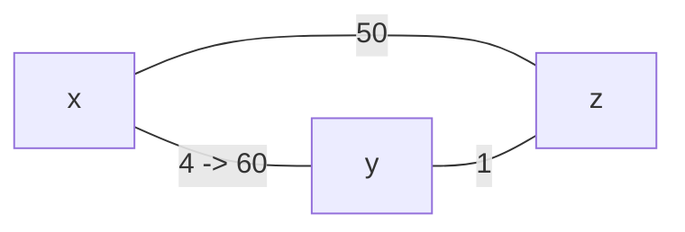

[](https://github.com/i1123581321/NJU-open-resource)

# Packet Switching Networks

## Network layer

### Network service

网络层提供端到端的数据传输，在每个 host 和路由中均有网络层。网络层的两个主要功能是**路由**和**转发**

* 路由：确定从源到目的地的数据报经何路径转发，使用路由算法确定最短的路径
* 转发：将到来的包转发到正确的出链路（根据路由信息），包括错误处理，排队和调度

除此之外网络层还提供**建立连接**的功能（在某些网络中，如 ATM，frame relay，X.25），在传输数据之前先在两个端主机和中继路由之间建立虚拟的连接

网络层提供**端到端**的传输，区别于传输层提供的**进程到进程**的传输

### Router/Switch

Router 的关键功能是

* 运行路由算法（软硬件结合）
* 将包从入链路转发到出链路（硬件完成）

#### Input port

链路层进行解包和验错后，交给路由器的处理器，路由器根据**转发表**确定出链路，若包到达的速率超过进入交换结构的速度，会在入链路发生排队

#### Switching Fabric

交换结构有三种类型

switching via memory：首代路由器使用，如传统 PC 一样在 CPU 的控制下交换，将包复制进内存后再传输到出链路，转发速率取决于内存的带宽

switching via a bus：使用共享的总线进行交换，速率受总线带宽限制

switching via a mesh：使用网状结构进行交换，将每个包切成定长的 fragments 后进入网状结构交换

#### Output port

当包从交换结构到达的速率超过传输速率时，需要在出链路排队并缓存，当缓存不足时就会发生丢包。出链路还要决定调度的原则：转发时选择什么包，以及丢包时丢弃什么包，以提供优先级不同的服务

buffer 的大小一般为
$$
\frac{RTT \cdot C}{\sqrt{N}}
$$
其中 $C$ 为链路带宽，$N$ 为流的数量

## Virtual Circuit and Datagram Networks

### Circuit Switch & Packet Switch

Circuit Switch，即电路交换

* 对每个 call 保留端到端之间的资源
* 资源独占而非共享
* 保证性能
* 需要连接的建立与消亡

Packet Switch，即分组交换

* 端到端的数据被分割为 packet
* packet 共用网络资源
* packet 在交换机存储并转发
* packet 之间会发生资源争用
* 大量 packet 进入网络会发生拥塞

而 Virtual Circuit 和 Datagram Networks 是**两种不同的 Packet Switch Network**

VC 对于数据包的流提供网络服务，是网络层的**面向连接的服务**（ATM，X.25，frame relay）

Datagram 对单个包提供服务，是网络层的**无连接的服务**（IP network）

### Virtual Circuit Networks

VC network 中，对于每个数据报的 flow，都要进行连接的建立和消亡。每个包有一个 VC identifier，用于标识其所属的流

源到目的地中途的路由要为每个经过其的连接维持状态信息，然后分配链路和交换的资源。连接的建立在 VC network 中很重要，通信的端设备和中途的路由器建立一条虚拟电路，使用路由算法寻找一条最短路径。

VC 包含

* 从源到目的设备的路径
* VC 号，可能在路径上的每条链路都有其 VC 号
* 转发表中的表项

VC 网络中的 packet 不携带目的地址，而是携带 VC 号。在每条链路上的 VC 号可以不相同，由转发表中的表项决定（e.g.，在入链路的 VC 号为 $n_1$ ，转发后可以变为 $n_2$ ，只要保证同一链路两端的路由器能辨识属于同一 VC 连接即可）

VC networks 中，使用信令协议（Signaling Protocols）进行连接的建立和消亡，在今天的互联网中已经不再使用

VC networks 有：ATM（面向连接，信元：固定长度的分组，支持 CBR，VBR，ABR，UBR），X.25（面向连接，流控制和错误检测）, 帧中继（面向连接，无错误控制，无流控制）

### Datagram Networks

datagram networks 中没有连接的建立，也没有“连接”的概念。交换机不维护端到端连接的状态

datagram networks 中的包使用目的地址进行转发（VC networks 中使用 VC 号），有着同样端-目的地址的包可能经由不同的路径到达目的地。

datagram networks 中的转发表又叫做路由表，使用**目的地址的前缀**进行路由。使用**最长前缀匹配原则**

最长前缀匹配原则即在路由表中寻找给定地址的表项时，选择匹配的前缀中最长的那一个

IP network 即是典型的 datagram networks

### Datagram vs. Virtual Circuit

Datagram：

* 在计算机间传递数据，服务质量是弹性的，没有严格的限制
* smart 端系统，能够进行控制和错误检测与恢复，网络中很简单，在边缘路由较复杂
* 有许多链路种类，每种都有不同的特性，这也导致难以提供统一标准的服务

Virtual Circuit：

* 从电话系统进化而来，类似人类之间的交流（需要可靠与时效的保证）
* dumb 端系统，在网络中复杂，需要维护连接信息
* 标准化的链路种类

## Routing

路由的目的在于

* datagram networks：在路由器上建立路由表
* VC networks：在建立连接时选择虚电路路径，以及生成转发表

路由需要

* 高效：选择最短路径
* 有弹性：能应对高峰流量或是线路失效
* 稳定：避免波动

### Routing Elements

路由的要素包括

#### Performance criteria

在路由选择最短路径时，不同的性能标准会产生不同的结果，一般的性能标准有

* 最少跳数：经过的路由器数量最少
* 最小代价：当链路的代价不同时，要求路径的代价最小，一般原则有
  * 最小延时，以路由器的队列长度作为代价
  * 最大吞吐量，以传输速率的倒数作为代价

#### Decision Time and Place

对于路由的时机，datagram networks 中每个包都进行路由，而 VC networks 中只在 VC 建立时进行路由，之后该 VC 的包使用转发表转发即可

根据路由的位置的不同，可以分为

* 中心化：由一个中心设备确定路由并分发至各路由器
* 源路由：发送方进行路由
* 分布式：每个路由器各自决定路由

#### Network Info Source and Update Timing

根据路由信息的来源可分为

* 仅使用本地信息
* 使用相邻路由器的信息
* 使用网络中所有路由器的信息

根据路由信息更新的时间也可分为

* 定时更新
* 路由器或链路发生重大变化时更新
* 固定（手动配置）

### Routing Strategies

#### Central

集中式路由使用最短路径算法为网络中每个源-目的对生成路由，在网络拓扑发生重大变化时更新

#### Distributed

分布式路由策略可分为三类

##### flooding

不需要网络信息，每个路由向所有邻居 flooding 包，收到包的路由器做同样的处理，最终会有一个包到达目的主机。问题在于在网络中生成了同一个包的过多副本，也会产生环路问题，即一个包无限在网络中循环

flooding 遍历所有可能的路径，至少会有一个包到达目的主机（可以用于虚电路的建立），同时也遍历了所有的路由器（可以用于分发路由信息）

##### random

路由器选择一个出链路将包转发，出链路的选择可以基于

* 随机选择
* 轮流选择
* 基于概率选择

random 同样不需要网络信息，对于连通性强的网络适用，但是采用的路由可能不是最优的

可以使用概率决定转发的链路
$$
P_i = \frac{R_i}{\sum R_j}
$$
其中 $R_i$ 为第 $i$ 条链路的代价（越大说明越好）

##### :star:adaptive

几乎被所有 packet switching networks 采用。路由根据网络状况的改变而改变

需要额外的网络信息，同时也可以协作进行拥塞控制

### Least cost algorithm

用于在路由时选择最短路径

#### Dijkstra algorithm

用于寻找给定源点到其余节点的路径（SSSP）

```pseudocode
DIJKSTRA(G, w, s)
	INITIALIZE-SINGLE-SOURCE(G, s)
	S = empty
	Q = G.V
	while Q != empty
		u = EXTRACT-MIN(Q)
		S = S + u
		foreach neighbor v of u
			RELAX(u, v, w)
```

细节可见算法笔记:thumbsup:

代价为 $O((m+n) \log n)$

Dijkstra 算法运行时可能会产生震荡，解决方法：非同步运行路由算法，随机更新链路代价

#### Bellman-Ford algorithm

用于寻找给定源点到其余节点的路径（SSSP）

```pseudocode
BELLMAN-FORD(G, w, s)
	INITIALIZE-SINGLE-SOURCE(G, s)
	for i = 1 to |G.V| - 1
		for each edge (u, v) in G.E
			RELAX(u, v, w)
	for each edge (u, v) in G.E
		if v.d > u.d + w(u, v)
			return false
	return true
```

算法可描述为，设 $h$ 为当前路径上允许的最大链路数量，$L_h(n)$ 为从 $s$ 到 $n$ 的最小代价，满足路径上链路数量不超过 $h$

初始化：
$$
L_0(v) = \infin , \forall v \in V \setminus \{s\}\\
L_1(v) = w(s, v)\\
L_h(s) = 0
$$
之后对每个 $h$ 
$$
L_{h+1}(v) = \min \{L_{h}(u) + w(u, v) \} \quad \forall (u, v) \in E 
$$
即每轮迭代对每条边 RELAX。由于简单路径长度不超过 $|V| - 1$ ，故迭代进行 $|V| - 1$ 轮,代价为 $O(mn)$

### Link State and Distance Vector

#### Link State

集中式路由算法使用全局的网络信息计算源到目的地的最短路径，因此也被称为链路状态（Link State）算法

LS 计算最短路径基于 Dijkstra 算法，每个路由器使用 flooding 向邻居发送链路信息，这样 flooding 结束后每个路由器都有了完整的网络拓扑，使用 Dijkstra 计算出最短路径后建立路由表

#### Distance Vector

分布式路由算法中，路由器以迭代，分布式的方式计算出最短路径，每个节点只有与其直接连接的链路的信息。因为每个节点维护其到所有其他节点最短距离的信息（距离向量，Distance Vector），因此被称为距离向量算法

DV 计算最短路径基于 Bellman-Ford 算法，迭代计算最短路径。节点初始时根据直接相连的链路生成 DV 并传递给邻居，同时根据邻居传来的 DV 逐个 RELAX，当最短路径发生变化时，再将新的 DV 发送给邻居，如此重复直到最短路径不再变化

当链路信息发生变化时，与其相连的节点检测到变化，并且升级路由信息，重新计算 DV。当链路代价减小时，*"good news travels fast"* 

当链路代价增大时，*"bad news travels slow"* ，考虑下图拓扑



当 $w(x, y)$ 增大到 60 时，会产生无穷计数（count to infinity）问题，即在变化之前
$$
D_y(x) = 4 \quad y \to x\\
D_z(x) = 5 \quad z \to y \to x
$$
而变化后，相邻的链路检测到变化
$$
D_y(x) = \min \{60, w(y,z) + D_z(x)\} = 6
$$
但这是错误的，因为 $D_z(x)$ 的路径经过了 $xy$ ，但这条路径上的 $xy$ 的权值没有更新。当 $y$ 的 DV 更新后传递给 $z$ 
$$
D_z(x) = \min\{50, w(z, y) + D_y(x)\} = 7
$$
迭代超过 44 次才能得到正确的结果。解决无穷计数的问题，可以使用毒性逆转（poisoned reverse），即如果从 $z$ 到 $x$ 的路径经过了 $y$ ，则令 $D_y(z) = \infin$  ，使得从 $y$ 到 $x$ 的路由不会经过该路径。然而毒性逆转也不能完全解决无穷计数，超过三个节点时仍会有无穷计数问题

#### LS vs. DV

信息复杂度方面，LS 要向全网 flooding 链路状态，总信息的量级为 $O(VE)$ ，而 DV 的信息量级取决于收敛的时间

收敛速度方面，LS 收敛迅速，只需要 $O((m+n)\log n)$ 的时间，而 DV 较慢，当链路代价发生改变时甚至会产生无穷计数问题

鲁棒性方面，LS 的节点如果传递了错误的链路信息，由于使用全局信息，错误会被限制在一定范围内（仅仅与故障节点相连的部分），而 DV 由于分布式计算，错误信息在节点间交换，可能会波及到整个网络

### Determine Link Cost

首代 ARPANET，使用**出链路队列长度**作为链路代价，使用 DV 算法进行路由

第二代，使用测量的延时作为链路代价，延时包含了排队延时，传输延时和传播延时，使用 LS 算法进行路由

使用 **Link utilization** 标识链路状态，使用跳数来计算链路代价

link utilization 计算为
$$
\rho = \frac{2(T_s - T)}{(T_s - 2T)}
$$
其中 $T$ 为当前的延时，$T_s$ 为平均包长度除以链路的传输速率

使用指数加权移动平均
$$
U_n = \alpha \times \rho_n + (1-\alpha)U_{n-1}
$$
