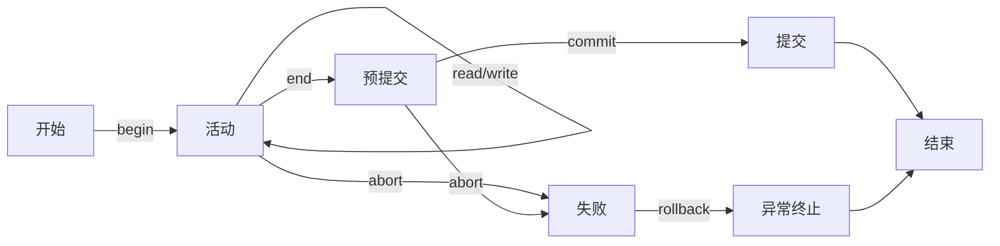

# 事务处理，并发控制与故障恢复

## 事务处理

### 事务

事务（transaction）是由用户执行的不能被打断的对数据库的操作序列，是应用程序访问数据库的基本工作单位

事务由一组对数据库的访问操作构成，是串行执行的，将数据库从一个旧的一致性状态转移到新的一致性状态，事务执行结束后系统保证数据库的一致性

### 事务的特性

事务有四个特性，简称为 ACID

* 原子性（atomicity）：一个事务中数据库访问操作构成一个不可分割的序列，这些操作要么全都执行要么全都不执行。原子性由数据库管理系统维护
* 一致性（consistency）：事务的成功执行将数据库从一个一致性状态转换到另一个一致性状态。一致即数据库中所有数据都满足约束
* 隔离性（isolation）：事务的执行和其他并发的事务执行之间是相互独立的，互不干扰，隔离性要求多个事务并发执行的最终结果和某个串行执行的结果相等
* 持久性（durability）：事务完成操作后对数据库的更新应当是永久的，即使发生了故障也能恢复这个事务执行的结果

DBMS 通过事务管理子系统，恢复管理子系统和数据完整性保护子系统来实现事务的 ACID

### 事务活动

* 活动：事务开始后立即进入活动状态，执行对数据库的访问（读/写）
* 预提交：事务的最后一条访问语句结束后进入预提交状态，访问结束但修改可能还在缓冲区，需要真正写入磁盘，写入磁盘的过程结束后进入提交状态，如果写磁盘的过程失败则进入失败状态
* 失败：活动/预提交的事务终止执行则进入失败状态，失败有可能是因为应用程序主动放弃（abort），并发控制，系统故障等
* 异常终止：失败的事务可能已经修改了磁盘，为了保证原子性，需要撤销（undo）事务对数据库的修改，撤销也被称为回滚（rollback），回滚完成后事务进入异常终止状态，此时系统可以选择取消事务或是作为新事务重新启动
* 提交：预提交的事务将检查其与并发执行的其他事务之间是否干扰，检查通过后系统将提交，把对数据库的修改写在磁盘上，并且通知系统事务结束

### 事务语句

#### 事务控制语句

事务除了对数据库的访问以外还有事务控制语句，主要是三条

* 事务开始（begin transaction）：事务的开始是隐式的，有三种方式触发
  * 数据定义命令（DDL）：每个 DDL 命令被当作一个单独事务执行，在此之前的事务将被自动提交
  * 将系统设为自动提交，每一条数据库访问都是一个单独事务，独立提交/回滚
  * 数据操作命令（DML）：当前事务执行结束后，下一个数据库操作会自动启动新事务
* 事务提交（commit transaction）：将事务的修改操作永久反映到数据库中，不可取消，提交可能失败，如系统故障或未通过一致性检查，提交失败可以回滚
* 事务回退（rollback transaction）：取消事务执行过程中的所有操作，然后可以放弃或重新执行。事务执行过程中可以设置检查点并回滚到某个检查点，如果不选择检查点则回滚到事务起点

除此之外还会有一些与事务相关的控制语句，如设置是否自动提交，设置事务类型（只读/读写），设置事务隔离级别等。

#### 事务隔离级别

事务隔离级别是为了处理并发时产生的一致性错误，常见并发错误有三种

* 丢失修改：一个事务的修改破坏了另一个事务的修改
* 脏读：一个事务读取了另一个事务未提交的修改结果
* 不可重复读：两次读操作间插入了另一事务的写

有四种不同的事务隔离级别

* 未提交读（READUNCOMMITTED）：当前事务不需要任何形式的封锁，可能会读到未提交的修改。不能写，以避免写冲突
* 提交读（READCOMMITTED）：读数据对象 A 之前需要先申请对 A 的共享性封锁，读之后释放该封锁，避免读到未提交的修改
* 可重复读（READREPEATABLE）：读数据对象 A 之前先申请对 A 的共享性封锁，并且维持到事务结束，可以避免其他并发事务对当前事务使用的对象进行修改
* 可序列化（SERIALIZABLE）：用可串行的调度策略实现并发执行

但是不论使用何种隔离级别，写数据对象 A 之前需要申请对 A 的排他性封锁，并且维持到事务结束，以避免丢失修改。

不可重复读还有一种特殊情况，即同一查询在事务中进行多次，如果有其他事务进行插入，则可能返回不同的结果集，称为幻读。对于不同的隔离级别，可能发生的错误也是不同的

|          | 脏读   | 不可重复读 | 幻读   |
| -------- | :----- | :--------- | ------ |
| 未提交读 | 可能   | 可能       | 可能   |
| 提交读   | 不可能 | 可能       | 可能   |
| 可重复读 | 不可能 | 不可能     | 可能   |
| 可序列化 | 不可能 | 不可能     | 不可能 |

### 事务的组成

数据对象：可能是属性，元组，元组的集合，数据库，磁盘

数据对象有三种地址空间

* 保存数据对象的磁盘
* DBMS 的缓冲区
* 事务的局部地址空间

操作：事务控制，数据访问

* 事务控制：事务的开始/提交/回滚
* 数据访问：磁盘读写（INPUT/OUTPUT），内存读写（READ/WRITE）

## 并发控制技术

### 事务并发执行

#### 调度

数据库是多用户共享的，每个用户以事务为单位访问数据库，多用户多事务的并发通过并发控制实现

事务的执行可以是串行或者并发的，如果一组事务的并发执行结果等价于其某种串行执行结果，则称为可串行化调度，可串行化调度是并发控制的目标

调度即调度不同事务对数据对象的交叉读写顺序

* 串行调度：按照每个事务内部操作顺序串行执行，执行完成一个事务再开始下一个，如果事务 X 在事务 Y 之前，则 X 所有访问操作都在 Y 之前。串行调度不破坏一致性
* 可串行化调度：对数据库影响和某个串行调度相同的调度

事务记为 $T_{1}, T_{2}, \dots$，则调度是读写的序列，$r_{i}(A)$ 表示事务 $T_{i}$ 对数据对象 A 读，$w_{i}(A)$ 表示事务 $T_{i}$ 对数据对象 A 写

#### 冲突可串行化调度

冲突是指调度中一对连续操作满足：交换两者执行顺序，则涉及的事务中至少有一个行为会改变

* 不同事务中，两个读操作不是冲突，如果两个操作的数据对象不同，则也不是冲突
* 同一事务任意两个相邻操作都是冲突
* 不同事务对同一数据对象的写冲突
* 不同事物对同一数据对象的读写冲突

简而言之同一事务中操作不可交换，不同事务如果两个操作对象相同且至少有一个是写操作，也不能交换

冲突等价：一个调度能通过交换非冲突操作转换为另一个调度

冲突可串行化：调度冲突等价于一个串行调度

显然冲突可串行 $\implies$ 可串行

#### 优先图

不可交换的操作反映了事务的执行顺序要求

考虑两个调度 S 中的事务 $T_{1}, T_{2}$，其中有操作 $A_{1}, A_{2}$，如果在 S 中 $A_{1}$ 在 $A_{2}$ 之前，且其涉及同一数据对象，且其中至少有一个写操作，则称 $T_{1}$ 优先于 $T_{2}$，记为 $T_{1} <_{s} T_{2}$

显然上述情况里两个动作不能交换，如果有和 S 冲突等价的串行调度，则在该调度内 $T_{1}$ 在 $T_{2}$ 之前。以事务作为节点，优先关系作为有向边，可以构造出一个事务优先图，如果该图无环，则调度是冲突可串行化的

### 封锁

不合理的调度会带来脏读，丢失修改，不可重复读等错误。合理调度并发操作，避免数据不一致的操作称为并发控制，并发控制是通过封锁实现的

封锁保证了操作的正确和数据一致

* 封锁可以在一段时间内禁止其他事务对被封锁数据对象的某些操作
* 封锁可以表明持有该锁的事务要执行何类操作

常用封锁可以分为

* 排它锁（exclusive lock），简称 X 锁
* 共享锁（sharing lock），简称 S 锁

X 锁的特性是：只有数据对象没有被其他事务封锁时才能加锁，加锁后任何其他事务都不能再加锁。加锁后只有加锁的事务能对该数据对象读写，其他事务禁止访问

X 锁必须维持到事务结束

S 锁的特性是：如果数据对象没有被封锁或是只是被加了 S 锁，则可以加锁，加锁后可以读但不能写，不同事务的 S 锁可以同时存在，在所有 S 锁被释放前数据对象不能写。

S 锁不必维持到事务结束

一个事务被称为良构（well formed）代表其按要求加锁并释放锁。良构事务是并发事务正确执行的基本条件

管理锁需要管理每个数据对象当前加锁情况以及如果是 S 锁的话加锁数量。DBMS 的封锁管理器维护一张锁表，记录当前锁的持有情况和申请情况，一个数据访问操作的流程是

* 访问操作被发送给调度器
* 调度器根据当前协议决定是否需要锁以及需要哪种锁，将申请发给封锁管理器
* 如果能满足则封锁，封锁管理器将满足情况返回
* 如果满足则交给执行引擎执行，否则该操作被放入等待队列

### 封锁协议

封锁提供了基本的并发支持，但是真正保证正确性需要有封锁的协议指明

* 何时申请锁
* 申请何种锁
* 何时释放锁

不同级别的封锁协议可以避免不同的并发错误

* 一级封锁协议：写数据对象前必须申请 X 锁并且维持到事务结束
* 二级封锁协议：除一级封锁协议以外还需要在读数据对象前申请 S 锁，读操作完成后可以释放
* 三级封锁协议：除一级封锁协议以外还需要在读数据对象前申请 S 锁，并且维持到事务结束

一级封锁协议可以防止丢失修改，二级封锁协议可以防止丢失修改和脏读，三级封锁协议可以防止丢失修改、脏读和不可重复读

### 两阶段封锁协议

事务执行中锁的申请和释放分为两个阶段

* 扩展阶段：申请并获得锁
* 收缩阶段：释放所有申请的锁，一旦开始释放锁就不能申请任何封锁

这种设置锁的方法称为两阶段封锁协议（two-phase locking protocol, 2PL）

如果一个事务所有封锁请求都先于所有解锁请求，称该事务为 2PL 事务

则封锁协议可以总结为

* 事务正确
  * 读之前必须持有（申请成功且未释放） S 锁或 X 锁
  * 写之前必须持有（申请成功且未释放） X 锁
  * 持有的锁必须被释放
* 两阶段封锁
  * 在申请锁之前不能有释放操作
* 正确处理重复申请锁
  * 如果事务已经持有锁，则不处理申请 S 锁
  * 如果事务持有 S 锁且是唯一持有 S 锁的事务，申请 X 锁时直接将 S 锁转换为 X 锁
  * 如果事务持有 X 锁，不处理申请 X 锁
* 调度合法
  * 一个事务加 X 锁后，其他事务在释放前不能申请 X 锁或 S 锁
  * 一个事务加 S 锁后，其他事务在释放前不能加 X 锁

这样的规定确保了一个事务在一个对象上只有一把锁，多次申请之后有且仅有一个释放操作，如果一个调度以及其每个事务都满足上述要求，称该调度是合法调度

则有：2PL 事务构成的任意合法调度 S 都是冲突可串行的

封锁调度器实现为两个部分

* part 1 在操作请求前决定是否需要申请锁
* part 2 接受访问请求或者封锁请求
  * 如果是访问请求，交给数据库执行引擎
  * 如果是封锁请求，查询锁表确定锁能否申请，如果能则修改锁表，否则记录该锁已被申请，然后将发出申请的事务推迟直到申请满足
* 事务结束时通知 part 1，释放其持有的所有锁，如果有事务在等待，则通知 part 2
* 当 part 2 被告知时，满足锁的申请，然后接着执行被推迟的请求

上述的执行可以确保每个事务都满足 2PL

### 封锁粒度

封锁粒度决定了锁可以封锁的数据对象大小，可以是逻辑数据单元或物理数据单元

* 逻辑数据单元：属性，元组，关系，索引
* 物理数据单元：页，块

封锁粒度大则并发度低，并发开销小，反之亦然

多粒度封锁即系统支持多种粒度的封锁，可以构造一个多粒度树（数据库-关系-元组），当对树中的节点加锁时，其后裔节点被隐式地加上了同类的锁

意向锁（intension lock）：对节点加意向锁表示其子节点正在被加锁，对任意节点加锁时必须先对父节点加意向锁

* 意向共享锁 IS：对 N 加 IS 锁表示对 N 的某些子节点加 S 锁
* 意向排它锁 IX：对 N 加 IX 锁表示对 N 的某些子节点加 X 锁
* 共享意向排它锁 SIX：对 N 加 SIX 锁表示对 N 加 S 锁，对其某些子节点加 X 锁

故锁相容矩阵可以总结为

| 当前申请 | S    | X    | IS   | IX   | SIX  |
| -------- | ---- | ---- | ---- | ---- | ---- |
| S        | Y    | N    | Y    | N    | N    |
| X        | N    | N    | N    | N    | N    |
| IS       | Y    | N    | Y    | Y    | Y    |
| IX       | N    | N    | Y    | Y    | N    |
| SIX      | N    | N    | Y    | N    | N    |

多粒度的封锁协议即由上而下加锁，由下而上释放

### 活锁与死锁

死锁（deadlock）：事务可以拥有一部分锁同时等待其他事务的锁，如果产生了循环等待，则称为死锁

死锁的解决可以分为

* 预防法：采用锁申请操作避免死锁
  * 顺序申请法
  * 一次申请法
* 解除法：允许产生死锁，产生死锁时解除（用超时检测死锁）
  * 等待图法
  * 时间戳死锁检测

> 时间戳死锁检测：每个事务有一个时间戳，反映当前事务的新老，如果事务 T 等待事务 U 的锁
>
> * 等待-死亡方案
>   * 如果 T 比 U 老，T 等待 U 的锁
>   * 如果 U 比 T 老，T 被回滚
> * 伤害-等待方案
>   * 如果 T 比 U 老，回滚 U
>   * 如果 U 比 T 老，T 等待 U 的锁

活锁（livelock）：部分事务陷入死锁，但其他事务仍能继续运行，活锁可以用 FCFS 解决

## 数据库恢复技术

数据库恢复：在数据库遭到破坏后进行恢复，采用数据冗余的原理

### 数据库故障分类

* 小型故障：事务内部故障，不影响系统
* 中型故障：系统可能停止工作，但磁盘数据不受影响，可通过日志恢复
  * 系统故障
  * 外部影响
* 大型故障：可导致磁盘数据被破坏
  * 磁盘故障
  * 计算机病毒
  * 黑客入侵

### 数据库故障恢复技术

#### 转储

转储（dump）：定期将数据库的内容复制到其他存储设备

转储可以分为静态和动态，以及海量转储和增量转储

动态转储的恢复需要借助日志记载

* 转储的开始点和结束点
* 转储过程中的事务执行动作（事务标识，更新对象，旧值，新值）
* 转储过程中事务的结束状态（是否提交）

#### 日志

DBMS 创建并维护的记载数据库修改型操作的文件

日志记录的内容包括

* 每次更新的事务标识，更新对象，旧值，新值
* 事务的开始和结束
* 其他信息

日志可以确保事务的原子性，也可以实现增量转储与故障恢复

引入新的操作 Flush Log：将内存中的日志记录写入磁盘

在发生故障时，可能需要重做（redo）某些事务，以及撤销（undo）某些事务

* commit 的事务将被重做
* abort 的事务将被撤销

如果有尚未结束的事务，故障恢复时看作 abort

日志的修改原则是先写日志再修改数据库，日志分为 redo 日志和 undo 日志

undo 日志的内容包括

* 事务开始
* 事务提交
* 事务放弃
* 更新记录（事务，对象，旧值）

如果发生了修改，更新记录要先于磁盘修改被写入磁盘，如果发生了提交，提交日志要后于提交的磁盘改动写入磁盘

使用 undo 日志进行恢复时，将事务划分为已提交和未提交的，然后从后向前扫描，对每一条更新事务，如果该事务已提交，则忽略，否则按照更新记录恢复旧值，结束后为每个未结束日志加上事务放弃的条目，然后将日志写回磁盘

为了避免扫描整个 undo 日志，可以加入检查点

* 系统停止启动新事务
* 等到所有活跃事务被提交或终止，日志中写入事务提交/事务放弃条目
* flush log
* 写入检查点，并再次 flush log
* 重新开始启动新事务

这样扫描到检查点即可停止

也可以写入非静止的检查点，需要在检查点中记录当前活跃的事务（开始记录检查点），然后等待其中的事务提交/放弃，再写入结束记录检查点。此时恢复分为两个情况

* 先遇到结束检查点：向前扫描至开始记录检查点，然后即可结束
* 先遇到开始检查点：需要撤销开始检查点中记录的且未完成的事务，继续扫描直至所有操作被撤销

undo 日志的不足在于事务修改的数据被写入磁盘前不能提交事务，这导致了频繁的写磁盘。可以将修改结果暂存在内存中，统一写回磁盘

redo 日志和 undo 日志记录格式相同，唯一区别是更新记录里是新值而非旧值。需要在新数据写磁盘前先将更新记录和提交记录写回磁盘

使用 redo 日志进行恢复时，确定所有已提交的事务，然后从头向后扫描，对每条更新记录，如果事务未提交则忽略，否则将磁盘更新为新值，然后为每个未完成事务加上放弃事务的条目，将日志写回磁盘

redo 和 undo 的区别主要在于提交事务的记录写入时机不一样，以及更新记录中存的值不同

redo 日志的非静止检查点还需要确保提交事务的修改均被写入磁盘。在开始记录检查点记录当前活跃的事务，同时获取所有已提交事务的集合，然后确保已提交事务的修改全部被写入磁盘，然后即可写入结束记录检查点，不需要等待活跃的事务结束。恢复时

* 先遇到开始记录检查点：继续扫描直至遇到结束记录检查点
* 遇到结束记录检查点：找到其对应的开始检查点，并且找到活跃事务中最早开始的事务，然后从该处开始根据 redo 日志恢复

undo 日志会增加磁盘 io 次数，而 redo 日志要求较大的缓冲区，可以通过 undo/redo 日志解决

undo/redo 日志的更新记录同时记录旧值和新值，需要确保数据对象修改写入磁盘前更新记录先被写入磁盘，以及每次记录事务提交后 flush log

恢复时只需从后向前撤销未提交事务，再从前向后重做已提交事务

记录非静止检查点时，开始记录检查点记录当前活跃事务，然后确保缓冲区内容被写入磁盘，然后再写入结束记录检查点

### 故障恢复策略

* 小型故障：利用未结束事务的 undo 恢复
* 中型故障：撤销未提交事务，重做已提交事务
* 大型故障：先用转储的副本恢复，再结合日志恢复

### 数据库镜像

将整个数据库实时复制到另一个磁盘，系统保证两个数据库里的数据一致，其中一个受损后可以用另一个的数据修补