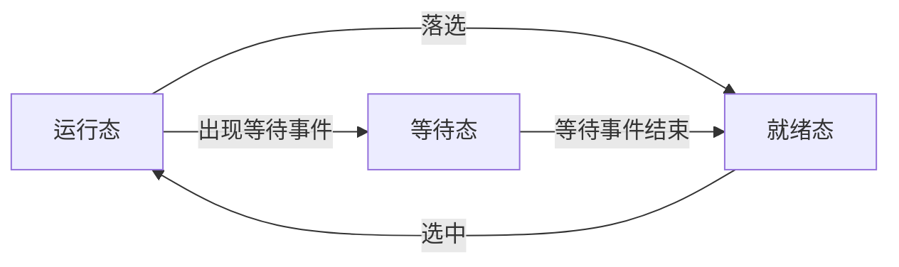
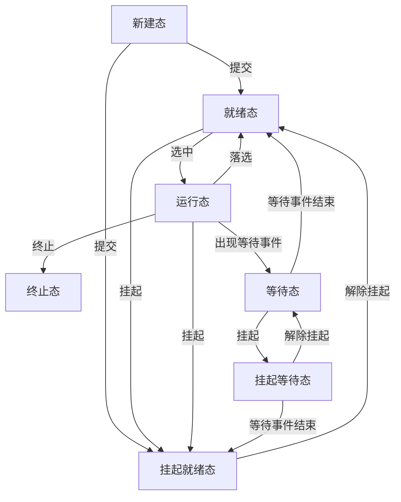
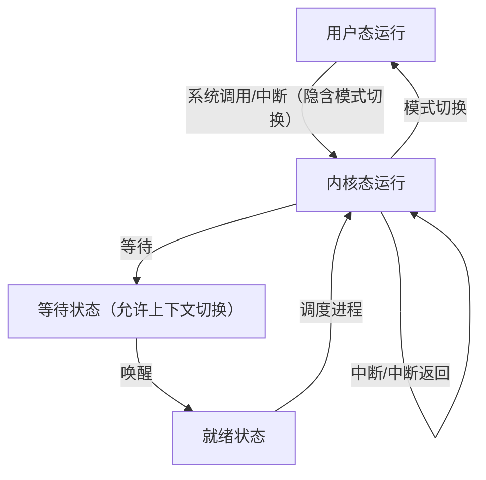

[](https://github.com/i1123581321/NJU-open-resource)

# 处理器管理

## 处理器

什么是处理器管理？处理器管理是操作系统的重要组成部分，负责**管理、调度和分派**计算机系统的重要资源——处理器，并**控制程序执行**。

处理器管理最重要的是进程调度，即控制、协调进程对处理器的竞争

### 机器指令

指令是指示计算机执行某些操作的命令，一台计算机的所有指令的集合，称为指令系统，反映机器的功能和能力

指令系统可分为 CISC 和 RISC

* 特权指令：只能在内核态使用，涉及改变机器状态，修改寄存器内容，启动 IO 等
* 非特权指令：内核态和用户态都能使用

操作系统可以使用全部指令，应用程序只能使用非特权指令，应用程序使用特权指令会触发中断

### 处理器状态

根据当前执行的程序限定资源和机器指令的使用权限，至少需要将处理器划分为两种不同的状态：内核态和用户态

* 内核态：操作系统程序运行的状态，允许执行全部指令，可以访问全部内存单元和系统资源，允许改变处理器状态
* 用户态：非可信程序运行的状态，只能执行非特权指令，只能访问当前执行程序的地址空间

用户态向内核态转换一般由下列情况导致：

* 程序请求系统服务，执行系统调用
* 程序运行时产生中断（如 IO 操作完成），转向中断处理程序
* 程序运行时产生异常（程序性中断），转向异常处理程序

**中断和异常是用户态到内核态的唯一途径**

如何从内核态返回用户态：计算机提供加载程序状态字的特殊指令（iret）

### 用户栈与核心栈

用户栈位于用户地址空间，用于用户程序的调用、返回、临时变量等

核心栈位于内核地址空间，用途包括保存中断现场和保存操作系统程序相互调用时的参数返回值和临时变量等。每个进程在创建时绑定一个核心栈，可读可写不可执行。

进程有两个栈，随处理器状态改变而修改栈指针的值

### 程序状态字（PSW）

程序状态字是程序运行时的一组动态信息，用于区别不同的处理器工作状态。主要内容包括程序计数器（PC），条件码，状态位（OF, SF, ZF, AF 等），中断码，中断屏蔽位等。

i386 体系中 PSW 由 EFLAGS 和 EIP 组成

每个正在运行的程序都有一个与其当前运行状态有关的 PSW，每个处理器都设有 PSW 寄存器，当前占有处理器的程序其 PSW 占有 PSW 寄存器

## 中断技术

最初中断技术仅作为设备向 CPU 报告 IO 情况的一种手段，避免 CPU 不断轮询，解决了主机和设备的并行问题。为了请求系统服务、实现并行工作、处理突发事件、满足实时要求，需要**打断处理器正常工作流**，为此提出中断概念

> 中断（interrupt）指在程序执行过程中遇到急需处理的事件时，暂时中止现行程序在 CPU 上的运行，转而执行相应的事件处理程序，待处理完成后再返回断点或调度其他程序执行的过程

中断是现代操作系统实现并行性的基础之一。中断事件处理需要**硬件**（中断装置）和**软件**（中断处理程序）配合完成

### 中断源分类

由硬件发出/产生的中断称为硬中断，按照中断事件的来源可分为外中断和内中断

外中断称为**中断（interruption）**或异步中断，是来自**处理器之外**的中断信号。包括时钟中断，键盘中断，设备中断等。外部中断分为可屏蔽和不可屏蔽，不同中断有不同优先级，优先级较高中断处理时往往会部分或全部屏蔽低级中断。中断与现行指令无关，发生时间与 CPU 状态无关，在指令执行之间才能响应中断。外中断可嵌套。

内中断又称**异常（exception）**或同步中断，是来自**处理器内部**的中断信号。通常发生在程序执行过程中，可细分为

* 访管中断：执行系统调用引起（如 int 0x80）
* 硬件故障中断：电源失效，奇偶校验错，总线超时等
* 程序性异常：非法操作，地址越界，页面故障，调试指令，除 0，浮点溢出等

内中断不能被屏蔽，不可嵌套，一旦出现需要立即响应并处理。内中断由现行指令的执行引起，在用户态发生，对于故障（fault），处理完之后回到当前指令，对于陷入（trap），处理完后执行下条指令。

异常处理中可以发生中断，但中断处理中不会被异常打断

### 中断装置（硬件）

中断装置是发现中断源并产生中断的硬件，通常包括逻辑电路和中断寄存器，主要功能有

* 在中断未被屏蔽的情况下，发现中断/异常，由 CPU 响应中断请求
* 保护现场，暂停当前程序，将中断点的 PSW 保存到进程核心栈
* 转向中断/异常处理程序，此时 CPU 切换到内核态

### 中断处理程序（软件）

中断处理程序是处理中断事件的程序，主要功能有

* 保护一些未被硬件保护的现场信息：通用寄存器，段寄存器等
* 识别中断源，分析中断产生原因
* 处理中断
  * 硬件故障中断：需要人工干预，中断程序保护现场，停止设备和处理器运行
  * 程序性中断：借助于信号机制，操作程序可以将此类中断交给应用程序自行处理
  * IO 中断
    * 正常结束：将等待 IO 的下个进程置为就绪态
    * 发生故障：向设备索取状态字，分析原因，再次执行或请求人工干预
    * 发生异常：分析情况请求人工干预
    * 设备报道或设备结束：修改系统数据。
  * 访管中断：处理系统调用
  * 时钟中断：维护系统时间，时间片轮转，调度进程等
* 恢复正常执行

中断处理程序的实现为中断向量表（实模式）和中断描述符表（保护模式）

### 中断优先级与多重中断

基于严重程度划分中断的优先级，同时有多个中断源时按优先级顺序响应，只有优先级更高的中断才能打断当前执行的中断处理例程。对于同一优先级的中断，一般由同一中断处理程序依次处理，对于不同优先级的中断，有如下处理策略

* 串行处理：中断处理时关中断
* 嵌套处理：开中断，保存当前中断处理程序的现场，转向新的中断处理程序。操作系统允许优先级较高的中断打断优先级较低的中断处理程序，同时限定最大中断嵌套层数
* 及时处理：中断处理程序执行时发生程序性中断，必须立即响应解决

快中断和慢中断的区别

* 慢中断处理前需要保存所有寄存器的值，而快中断仅需保存会被内核使用的寄存器的值

* 慢中断处理时，不关中断，快中断处理时，关中断

* 慢中断处理完成后，通常不立即返回被中断进程，而是转而执行调度程序。快中断处理完成后，通常返回被中断进程继续执行

## 进程

### 基本概念

进程是现代操作系统最基本、最重要的概念，是在多道程序系统出现后，为了刻画**系统内部动态状况**、**描述运行程序活动规律**而引进的新概念。

* 从原理角度看，进程是对正在运行的程序活动规律的抽象
* 从实现角度看，进程是一种刻画程序运行状态和系统动态变化的**数据结构**

引入进程的两个主要目的：

* 刻画系统动态性，发挥系统并发性，提高资源的利用率
* 解决资源共享性，正确描述程序执行状态

> 程序共享性
>
> * 可再入程序，只有代码部分，调用方提供工作区，可同时被多个程序调用
> * 可再用程序，调用过程中可以有自身修改，一次只能被一个程序调用，串行

进程（process）：一个**可并发执行**的具有独立功能的**程序**关于某个**数据集合**的一次**执行过程**，也是操作系统进行**资源分配和保护的基本单位**。

进程有如下性质

* 动态性：进程是动态概念，有生命周期，区分静态概念程序。
* 共享性：多个进程可执行相同程序，进程和程序不是一一对应的
* 独立性：每个进程是操作系统的一个独立实体，有自己的地址空间，程序计数器和内部状态
* 制约性：进程因共享资源或协同工作产生相互制约的关系，必须对此加以协调
* 并发性：多个进程的执行在时间上可以重叠。单处理器系统可以并发执行，多处理器系统可以并行执行

### 进程状态

#### 三态模型

按进程在执行过程中的状态至少要定义三种进程状态

* 运行态（running）：进程占有处理器，正在运行
* 就绪态（ready）：进程具备运行条件，等待系统分配处理器运行
* 等待态（wait）：进程不具备运行条件，等待某事件完成

运行态的进程个数不能大于处理器个数，进程创建时处于就绪态，进程状态的转换如下图示意



#### 七态模型

引入新建态（new）和终止态（exit），更好刻画进程管理。

新建态对应进程被创建，尚未进入就绪队列的状态。有时创建进程后，根据系统性能需求或内存容量限制推迟新建进程被调度执行。

终止态指进程完成任务正常结束或出现无法解决的错误异常终止时所处的状态。处于终止态的进程不再被调度执行，等待系统善后处理，然后回收资源消亡

同时还引入了进程挂起（suspend）的概念，即将进程对换到外部存储器上，释放其占有的系统资源，排除其在进程调度之外。挂起的原因有很多种，如

* 提高系统资源利用率
* 减轻系统的负载
* 调试程序

引入挂起就绪态（ready suspend）和挂起等待态（wait suspend）。概念同就绪态和等待态，唯一不同在于此时进程处于外存之中，且不参与调度。注意被挂起等待的进程即使等待的事件完成也不能其具备执行状态，需要挂起其的进程结束它的挂起状态。



### 进程描述

#### 进程映像

程序和数据是进程的静态特征，进程控制块（Process Control Block, PCB）刻画进程的动态特征，包括进程状态，占有资源，调度信息等。

某一时刻进程的内容及其状态集合称为进程映像（process image），包含

* 进程控制块，与进程绑定，存储进程的标志信息、现场信息和控制信息
* 进程程序块，被进程执行的程序
* 进程核心栈，每个进程捆绑一个，用于进程在内核态工作，保存中断/异常现场，保存函数调用的参数、局部变量和返回点
* 进程数据块，进程私有的地址空间，存放私有数据和用户栈

进程在系统中活动除了本身的映像以外，还需要环境支持。进程的物理实体和支持进程运行的环境合称为**进程上下文**，进程在其上下文中运行，调度时上下文同时发生切换。进程上下文由三部分组成

* 用户级上下文：由程序块，数据块，共享内存区，用户栈组成
* 寄存器上下文：由处理器状态寄存器，指令计数器，栈指针，通用寄存器等组成
* 系统级上下文：由 PCB，内存管理信息（页表/段表），核心栈等组成

#### PCB

每个进程有且仅有一个 PCB，是进程的唯一标识。一般来说 PCB 应包含以下三类信息

* 标识信息，用于唯一标识一个进程，分为用户使用的外部标识号和系统使用的内部标识号
* 现场信息，包括通用寄存器，PSW，控制寄存器等
* 控制信息，包括调度信息，组成信息，通信信息，资源清单，内存信息等

PCB 是操作系统中最重要的数据结构，包含管理进程所需的全部信息，使用权和修改权均属于操作系统。单个 PCB 刻画了一个进程的运行状态，PCB 的集合刻画了操作系统的当前状态。

#### 进程队列

将处于同一状态的所有 PCB 链接在一起的数据结构，称为进程队列。

进程队列可通过链接方式实现或索引方式实现。链接方式即使用单向链表或双向链表将处于同一状态的 PCB 连接在一起。索引方式即使用索引表记录处于不同状态的 PCB

### 进程上下文切换与处理器状态切换

进程上下文切换即进程切换，进程切换必定在内核态发生

处理器切换又称模式切换，即处理器在内核态和用户态之间的转换



模式切换由中断驱动，而进程切换只能在内核态发生，故进程切换一定产生模式切换，而模式切换不一定导致进程切换

### 进程控制

#### 进程创建

原语：fork，clone

包括申请 PCB，分配进程映像空间，分配资源，装入内容，初始化 PCB，加入就绪队列，通知操作系统等步骤

#### 进程阻塞/唤醒

原语：sleep，wait

阻塞包括保存现场，修改 PCB 状态，将 PCB 加入等待队列，转入调度程序

唤醒包括从等待队列中取出 PCB，修改 PCB 状态， PCB 加入就绪队列

#### 进程撤销

原语：exit

分为进程完成的正常退出和发生不可逆错误的异常退出

包括归还资源，释放 PCB，撤销其所有子进程等

#### 进程挂起/激活

挂起进程时将被挂起进程状态由就绪态/等待态修改为挂起就绪态/挂起等待态，将进程非常驻部分交换到外存

激活进程时将进程的非常驻内容从外存移入内存，挂起就绪态/挂起等待态修改为就绪态/等待态

进程的挂起可由进程自身或其他进程调用，但进程的激活只能由其他进程调用

## 线程

### 基本概念

引入线程的动机：以进程为单位的并发程序效率不高

* 进程时空开销大
* 进程通信代价高
* 进程并发粒度大

于是将进程的两项功能：**独立分配资源，独立分派调度**分离

在多线程环境下

* 进程是操作系统中进行**保护和资源分配的基本单位**
* 线程是操作系统中能够独立执行的实体，是**处理器调度和分配的基本单位**

线程也被称为轻量级的进程（Light Weight Process, LWP），同一进程的所有线程共享进程的内存空间和资源。线程有其唯一标识符和运行状态。线程是一条执行路径，**有独立的程序计数器和栈**。线程的信息存储在线程控制块（Thread Control Block, TCB）中

线程状态与进程的三态模型类似，可以在运行态，就绪态，等待态之间转换，线程没有挂起的概念，进程被挂起后其所有线程因为共享内存空间也被对换到外存，故挂起状态是进程级的状态。

线程有多种组织方式：

* 调度员-工作者模式：一个线程担任调度员，接受和处理工作请求，其他线程是工作者，由调度员线程分配任务并唤醒运行
* 组模式：进程中每个线程均可取得并处理工作请求，有时每个线程被设计为处理特定任务，并建立对应的任务队列
* 流水线模式：线程排成某个次序，前一个线程的结果传递给下个线程处理

### 线程的实现

多线程实现分为三类

* 内核级线程（Kernel Level Thread, KLT）
* 用户级线程（User Level Thread, ULT）
* 混合式线程，同时支持 KLT 和 ULT

#### 内核级线程

内核级线程即线程管理工作由内核完成，内核提供原语用于使用线程，进程创建时同时创建基线程。在内核空间内建立和维护 PCB, TCB。内核调度以线程为单位，不考虑线程所属进程

内核级线程的优点在于

* 多处理器上能调度多个线程并行执行
* 进程的一个线程被阻塞可调用其他线程执行
* 内核级线程只有很小的堆栈，切换速度块
* 内核自身可使用多线程技术实现，提高效率

内核级线程的缺点在于线程间的切换调度代价较高，需要进行两次模式切换

#### 用户级线程

用户级线程即线程管理工作由应用程序实现，在用户空间完成，内核不知道线程的存在。内核调度仍以进程为单位

用户级线程的优点在于

* 线程调度代价小，不涉及模式切换
* 线程调度算法的选择较灵活

用户级线程的缺点在于

* 同一进程的多个线程不能同时在多处理器运行
* 线程的阻塞将导致进程阻塞
* 线程只能非抢占式调度

## 处理器调度

### 处理器调度层次

处理器调度可分为三层

高级调度（high level scheduling），又称任务调度，长程调度，高级调度选择哪些作业要进入内存，判断是否应当接纳作业

中级调度（medium level scheduling），又称平衡调度，中程调度，中级调度决定内存中能容纳的进程数，保证在合理数目的进程间竞争处理器及相关资源。中级调度需要操作系统支持挂起功能，完成内存和外存的进程对换工作，挂起的进程不参与低级调度

**低级调度**（low level scheduling），又称进程/线程调度，短程调度，低级调度决定哪个进程/线程获得处理器，是**操作系统最核心的部分**，执行最频繁，其调度策略的优劣将直接影响系统性能。低级调度可分为抢占式和非抢占式，一般抢占式的开销大于非抢占式，但可以避免进程长时间独占处理器

> 批处理作业的管理与调度
>
> 提交 $\to$ 收容 $\to$ 执行  $\to$ 完成
>
> ```mermaid
> graph LR
> 输入状态 --> 后备状态 
> 后备状态 -- 高级调度 --> 执行状态:中级调度/低级调度
> 执行状态:中级调度/低级调度 --> 完成状态
> ```

### 调度算法选择原则
面向系统：

* 资源利用率，主要指 CPU 利用率，即 CPU 有效运行时间 / CPU 总运行时间。一般来说在 IO 时间占比一定的情况下运行程序道数越多 CPU 利用率越高
* 吞吐率：单位时间处理作业的个数
* 公平性：确保每个进程都能获得合理的 CPU 和资源份额

面向用户：

* 响应时间：从作业提交到收到回应的时间
* 周转时间：批处理系统从作业提交到作业完成的时间。
  * 平均周转时间：$T = \left(\sum_{i = 1}^{n}t_i\right) / n$
  * 平均带权周转时间：定义作业周转时间为 $t_i$，运行时间为 $t_k$，则 $w_i = \dfrac{t_i}{t_k}$ 称为作业的带权周转时间，平均带权周转时间为：$W = \left(\sum_{i = 1}^{n}w_i\right) / n$
  * 平均作业周转时间用来衡量不同调度算法对同一作业流的调度性能。平均带权周转时间用来衡量同一调度算法对不同作业流的调度性能

