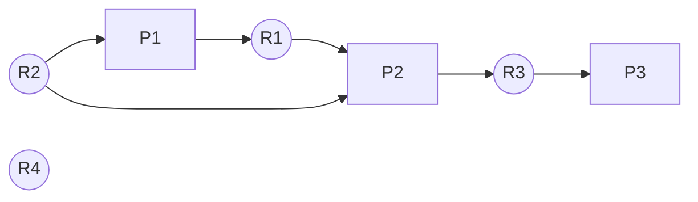

[](https://github.com/i1123581321/NJU-open-resource)

# 并发进程

## 概述

### 顺序程序与并发程序

顺序程序的执行是严格有序的，只有前一个操作结束后才能开始后续操作。传统的程序设计将程序设计为**顺序执行**的程序模块，不同的程序也按**顺序执行**。顺序程序有以下特性

* 执行顺序
  * 内部顺序性：操作按序执行
  * 外部顺序性：不同程序按调用次序执行
* 环境封闭：运行程序独占全机资源，资源状态只由程序本身决定和改变，不受外界影响
* 结果确定：中断不会对程序结果产生影响
* 过程可再现：程序对同一个数据结构的执行过程在下次执行时会重现

程序的并发执行是指一组程序的执行在时间上重叠

* 宏观上：一个时间段内多个程序都在运行种
* 微观上：任意时刻只有一个程序的一个操作在处理器上执行（**区分并行**）

并发的实质是处理器在多个程序间的多路复用

### 并发进程的特性

并发进程可能是无关的，也可能是交互的，当并发的进程间共享某些变量，一个进程的执行会影响其他进程的执行结果，需要对进程的交互进行控制

> 并发进程无关性的判断：
>
> 假设：
>
> $R\left(P_{i}\right)=\left\{a_{1}, a_{2}, \dots, a_{n}\right\}$ 是进程 $P_i$ 执行期间**引用**的变量集
>
> $W(P i)=\left\{b_{1}, b_{2}, \dots, b_{m}\right\}$ 是进程 $P_i$ 执行期间**修改**的变量集
>
> 若两个进程满足
> $$
> \begin{align*}
> \left(R\left(P_{1}\right)\cap W\left(P_{2}\right)\right) \cup\left(R\left(P_{2}\right) \cap W\left(P_{1}\right)\right) \cup\left(W\left(P_{1}\right) \cap W\left(P_{2}\right)\right)=\varnothing
> \end{align*}
> $$
> 则并发进程的执行与时间无关

### 并发进程的竞争与协作

交互的并发进程之间的关系分为竞争和协作

* 竞争关系：

  即多个交互进程共享资源带来的制约关系，解决手段为**互斥访问**：若干个进程要访问同一共享资源时，任何时刻最多允许一个进程访问，其他进程必须等待，直到占有资源的进程释放该资源

* 协作关系：

  即多个进程完成共同任务而分工协作，由于进程推进速度不可知，故对其执行先后次序的制约关系。解决手段为**进程同步**：两个以上的进程基于某个条件来协调它们的活动。一个进程的执行依赖于其协作进程的消息或信号，当没有得到该消息或信号时需要等待，直到消息或信号到达时被唤醒

互斥是一种特殊的同步关系

## 临界区管理

### 临界区

> **临界区**：并发进程中与共享变量有关的程序段，称为临界区 (Critical
> Section)
>
> 描述：`region 变量名 do 语句/复合语句`
>
> **临界资源**：共享变量代表的资源，称为临界资源 (Critical
> Resource)
>
> 描述：`shared 变量名`

临界区管理即是保证一个进程在临界区执行时不让另一进程进入临界区（**实现对共享变量的互斥访问**）

Dijkstra 提出了临界区管理的三个原则：

* 一次至多有一个进程进入临界区执行
* 如果有进程在临界区，试图进入临界区的进程应等待
* 进入临界区的进程应在有限时间内退出，以便让等待的进程进入

### 临界区管理

#### 错误尝试

基本思想：由标志指示进入临界区的进程

错误尝试1：先测试，后置位

```pseudocode
inside1,inside2:Boolean
inside1 := false;    /* P1不在其临界区内 */
inside2 := false;    /* P2不在其临界区内 */
cobegin
	process P1
		Begin
			while inside2 do begin end;
		  	inside1 := true;
			临界区;
 		  	inside1 := false;
    	end;
   process P2
     	Begin
            while inside1 do begin end;
 		  	inside2 = true;
 		  	临界区;
   	  		inside2 := false;
     	end;
coend
```

错误情况：P1 尚未将 inside1 置为 true 时切换至 P2 执行，P2 进入临界区的同时 P1 也进入了临界区

错误尝试2：先置位，后测试

```pseudocode
inside1,inside2:Boolean
inside1 := false;    /* P1不在其临界区内 */
inside2 := false;    /* P2不在其临界区内 */
cobegin
	process P1
		Begin
		  	inside1 := true;
		  	while inside2 do begin end;
			临界区;
 		  	inside1 := false;
    	end;
   process P2
     	Begin
 		  	inside2 = true;
 		  	while inside1 do begin end;
 		  	临界区;
   	  		inside2 := false;
     	end;
coend
```

错误情况：在 P1 将 inside1 置为 true 后切换至 P2 执行，P2 将 inside2 置为 true 后两个进程均处于等待状态

#### 软件实现

Dekker 算法：采用指示器变量 turn 指示由哪个进程进入临界区

* 进程进入自己临界区时将自己标志置为 true 同时检查对方标志位
* 若对方不在且不想进入临界区，进程可立即进入临界区，否则若对方也想进入临界区，检查 turn，根据 turn 的结果确定哪个进程进入临界区

```c
bool inside[2];
inside[0] = false;
inside[1] = false;
enum {0, 1} turn;
cobegin
	process P0(){
		inside[0] = true;				// P0 想进入临界区
		while(inside[1]){				// 对方想进入临界区
			if(turn == 1){				// turn 指示对方进入
				inside[0] = false;		// 修改自己的 inside 使对方进入
				while(turn == 1);		// 等待
				inside[0] = true;		// 修改自己的 inside
			}
		}
		/* 临界区 */
		turn = 1;						// 修改 turn 使对方能进入
		inside[0] = false;				// 修改自己的 inside
	}
	
	process P1(){
		inside[1] = true;				// P1 想进入临界区
		while(inside[0]){				// 对方想进入临界区
			if(turn == 0){				// turn 指示对方进入
				inside[1] = false;		// 修改自己的 inside 使对方进入
				while(turn == 0);		// 等待
				inside[1] = true;		// 修改自己的 inside
			}
		}
		/* 临界区 */
		turn = 0;						// 修改 turn 使对方能进入
		inside[1] = false;				// 修改自己的 inside
	}
coend
```

Peterson 算法：思想同 Dekker 算法，实现略有不同

```c
bool inside[2];
inside[0] = false;
inside[1] = false;
enum {0, 1} turn;
cobegin
	process P0(){
		inside[0] = true;				// P0 想进入临界区
		turn = 1;
		while(inside[1] && turn == 1);	// 对方想进入且 turn 指示对方进入
		/* 临界区 */
		inside[0] = false;
	}
	
	process P1(){
		inside[1] = true;				// P1 想进入临界区
		turn = 0;
		while(inside[1] && turn == 0);	// 对方想进入且 turn 指示对方进入
		/* 临界区 */
		inside[1] = false;
	}
coend
```

算法执行时使用 while 语句和指示变量 turn 确保每次只有一个进程进入临界区，进程离开临界区后修改自己的 inside 标记使得等待的进程可进入临界区，满足临界区管理的三个原则。

### 硬件实现临界区管理

#### 关中断

进程进入临界区时关中断，离开临界区时开中断（e.g.，Linux 中的 sti 与 cli）

不适合作为通用的互斥机制

* 关中断时间过长影响系统效率
* 不适用于多处理器系统，一个处理器关中断不影响在其他处理器执行临界区代码
* 用户若未开中断系统会终止

#### ”测试并设置“指令

TS (Test and Set) 指令（硬件提供），可将其看作一个带参数的函数

```cpp
bool TS(bool &x){
    if(x){
        x = false;
        return true;
    } else {
        return false;
    }
}
```

可将一个临界区与一个布尔变量 s 关联起来，s 为 true 时则表示临界区可进入。利用 TS 指令即可实现 **lock** 与 **unlock** 原语。具体实现如下

```c
bool s = true;

cobegin
	process P0(){
		while(!TS(s));		// lock
		/* 临界区 */
		s = true;			// unlock
	}
coend
```

若 s 为 true，TS 将返回 true 并将 s 置为 false，进程进入临界区，否则若 s 为 false，程序将等待直至 s 为 true 为止。而进入临界区的进程离开时将 s 置为 true，使得等待的进程可进入临界区，满足临界区管理的原则。TS 是硬件提供的不可分割的指令，测试和置位不会穿插执行，故可保证正确性

#### 交换指令

SWAP 指令，交换两个变量内容

使用其实现互斥时，为临界区设置布尔型变量，其值为 false 时表示临界区内无进程

```c
bool lock = false;
cobegin
	process Pi(){
		bool key_i = true;
		do{
			SWAP(key_i, lock);
		} while(key_i);				// lock
		/* 临界区 */
		SWAP(key_i, lock);			// unlock
	}
coend
```

## 信号量与 PV 操作

### 同步问题与同步机制

> 生产者-消费者问题（有界缓冲问题）
>
> 有 $n$ 个生产者和 $m$ 个消费者，连接在一个有 $k$ 个单位缓冲区的有界环形缓冲上。其中，$p_i$ 和 $c_i$ 都是并发进程，只要缓冲区未满，生产者 $p_i$ 生产的产品就可投入缓冲区；类似，只要缓冲区不空，消费者 $c_i$ 就可从缓冲区取走并消耗产品。
>
> 生产者-消费者问题是操作系统中并发进程内在关系的抽象，是典型的进程同步问题

生产者-消费者问题执行结果不正确的原因不是因为并发进程共享缓冲区，而是因为其访问缓冲区的速度不匹配，需要调整其推进速度，这样的制约关系叫做**进程同步**

实现进程同步可通过：信号量与 PV 操作，管程，消息传递等

### 信号量与 PV 操作

临界区管理存在的问题：

* 软件方法：复杂度高、效率低，将测试能否进入临界区的责任推给用户，降低系统的可靠性，加重用户编程负担
* 硬件方法：忙等待，浪费 CPU 时间

Dijkstra 提出信号量与 PV 操作

信号量（semaphore）：一种特殊的数据结构，一般实现时包含两个分量：信号量值与信号量队列。除赋初值时，仅能用同步原语 PV 对其进行操作

* P (Proberen) 测试
* V (Verhogen) 增量

PV 操作具有**原子性**，执行时**不可分割**

#### 分类

按用途可将信号量分为

* 公用信号量，联系一组并发进程，相关进程均可对其进行 PV 操作，初值设置为 1，用于实现**进程互斥**
* 私有信号量，联系一组并发进程，仅允许该信号量拥有的进程对其进行 P 操作，相关进程可对其 V 操作，初值为 0 或正整数，用于实现**进程同步**

按取值可将信号量分为

* 二元信号量，取值为 0/1，一般用于解决进程互斥问题
* 一般信号量，可取整型值，一般用于解决进程同步问题

#### 一般信号量

s 为一记录型变量，包括两个分量

* value，整型变量，初值非负
* queue，进程队列，初始为空

定义的 PV 操作为

```c
void P(semaphore s){
    s.value--;				// 信号值减一
    if(s.value < 0){
        sleep(s.queue);		// 若 value < 0 调用者阻塞自己，进入 s 的队列
    }
}

void V(semaphore s){
    s.value++;				// 信号值加一
    if(s.value <= 0){
        wakeup(s.queue);	// 若 value <= 0 调用者从 s 队列中取出一个进程
        					// 转换为就绪态
    }
}
```

在单 CPU 系统中通常是在屏蔽中断的情况下实现 PV 操作，保证其执行过程不可分割

V 操作选中进程唤醒的策略是 FCFS。被阻塞最久的进程最先从队列中释放。

可得出以下推论

* 若 s.value 为正，则该值代表实际还可以使用的物理资源数量
* 若 s.value 为负，则其绝对值代表 s.queue 队列中等待该物理资源的进程数目
* P 操作意味着请求一个资源（可能被阻塞），V 操作意味着释放一个资源（唤醒被阻塞的进程）

#### 二元信号量

一般信号量的特例，value 只能取 1 或 0

定义的 PV 操作为

```c
void BP(binary_semaphore s){
    if(s.value == 1){
        s.value == 0;
    } else {
        sleep(s.queue);
    }
}

void BV(binary_semaphore s){
    if(s.queue is empty){
        s.value = 1;
    } else {
        wakeup(s.queue);
    }
}
```

二元信号量和其他记录型信号量有相同的表达能力

```c
// 二元信号量实现一般信号量
typedef struct semaphore{
    int value;
    binary_semaphore wait, mutex;
    
    wait = 0;
    mutex = 1;
};
semaphore s;

void P(semaphore S){
    BP(S.mutex);
    S.value--;
    if(S.value < 0){
        BV(S.mutex);
        BP(S.wait);
    }
    BV(S.mutex);
}

void V(semaphore S){
    BP(S.mutex);
    S.value++;
    if(S.value <= 0){
        BV(S.wait);
    } else {
        BV(S.mutex);
    }
}
```

### 应用

#### 实现互斥

使用信号量 mutex，初始值为 1

```c
semaphore mutex;
mutex = 1;
cobegin
	process Pi(){
		P(mutex);
		/* 临界区 */
		V(mutex);
	}
coend
```

与 TS 指令相比只用测试一次而不是忙等待，mutex.value <= 0 时表示临界区中有进程

#### 哲学家吃面问题

> 有五个哲学家围坐在一圆桌旁，桌子中央有一盘通心面，每人面前有一只空盘子，每两人之间放一把叉子。每个哲学家思考、饥饿，然后想吃通心面。为了吃面，每个哲学家必须获得两把叉子，规定每人只能直接从其左边或右边去取叉子

解决方法：

* 引入 5 个信号量代表 5 把叉子
* 哲学家吃之前对左右叉子 P，吃后对左右叉子 V

若哲学家同时拿起左边/右边的叉子会造成死锁，有若干方法可避免

* 最多允许 4 名哲学家同时吃面（鸽笼原理保证肯定有人拿到四把叉子，使用初值为 4 的信号量控制）
* 奇数号哲学家先取左手边叉子，偶数号哲学家先取右手边叉子
* 每个哲学家取到两把叉子或一把也不取

#### 生产者-消费者问题

引入三个信号量

* empty，初值为 k ，表示可用的空缓冲区
* full，初值为 0，表示缓冲区中产品
* mutex，初值为 0，用于互斥访问缓冲区

```c
cobegin
	process producer_i(){
		while(true){
			produce();
			P(empty);
			P(mutex);
			append to B[in];
			in = (in + 1) % k;
			V(mutex);
			V(full);
		}
	}
	
	process consumer_i(){
        while(true){
            P(full);
            P(mutex);
            take from B[out];
            out = (out + 1) % k;
            V(mutex);
            V(empty);
            consume();
        }
    }
coend
```

既有同步又有互斥信号量的情况下，原则上，用于互斥信号量上的 P 操作总在后面执行

多类产品的多生产者和多消费者的问题思路类似，为每类产品分配信号量指示是否可消费

#### 读者-写者问题

> 有两类并发进程，读进程与写进程，共享一个文件，为防止出错，要求
>
> * 允许多个读进程同时对文件读
> * 只允许一个写进程写信息
> * 写进程在没有写完成之前不允许读
> * 写之前应该让所有已经在读或写的进程操作完成

引入两个信号量 w，mutex 和一个计数器 rc

* w，是否可写，初值为 1
* mutex，互斥访问，初值为 1
* rc，**当前读文件的进程数**，初值为 0

读者优先的解决方案为

```c
cobegin
	process read(){
		P(mutex);
		rc++;
		if(rc == 1){
			P(w);		// 开始读，阻塞写
		}
		V(mutex);
		
		// reading
		
		P(mutex);
		rc--;
		if(rc == 0){
			V(w);		// 当前已无读进程，可写
		}
		V(mutex);
	}
	
	process write(){
        P(w);
        // writing
        V(w);
    }
coend
```

上述解决方案可能会导致写者被无限推迟，以下是一种较为公平的解决方案

```c
semaphore mutex = 1;
semaphore access = m;

cobegin
	process read(){
		P(access);
		// reading
		V(access);
	}
	
	process write(){
       	P(mutex);
        for(int k = 0; k < m; k++){
            P(access);
        }
        // writing
        for(int k = 0; k < m; k++){
            V(access);
        }
        V(mutex);
    }
coend
```

#### 理发师问题

> 理发店里有一位理发师、一把理发椅和 n 把供等候理发的顾客坐的椅子。如果没有顾客，理发师就在理发椅上睡觉。当一个顾客到来后，他必须叫醒理发师。如果理发师正在理发时又有顾客到来，那么，如果有空椅子可坐，顾客就坐下来等待，否则离开理发店。

引入 3 个信号量costumers，barbers，mutex 和一个计数器 waiting

* waiting，等待理发的顾客数量，初始值为 0
* customers，是否有顾客，初始为 0
* barbers，是否有理发师，初始为 0
* mutex，互斥信号量，初始为 1

```c
cobegin
	process barber(){
		P(customers);		// 是否有顾客，无则睡眠
		P(mutex);			// 互斥进入临界区
		waiting--;
		V(barbers);			// 准备理发
		V(mutex);			// 退出临界区
		cuthair();			// 理发
	}
	
	process customer_i(){
        P(mutex);			// 进入临界区
        if(waiting < CHAIRS){
            waiting++;
            V(customers);	// 唤醒理发师
            V(mutex);		// 退出临界区
            P(barbers);		// 等待理发师
            get_haircut();
        } else {
            V(mutex);		// 离开
        }
    }
coend
```

## 管程

### 管程与条件变量

信号量与 PV 操作存在的问题

* 对共享资源的管理分散在各进程中，进程能够直接对共享变量进行修改
* 不利于系统对临界资源的管理
* 难以防止进程有意或无意的违法同步操作
* 容易造成程序设计错误

管程的基本思想：把分散在各进程中的临界区集中起来进行管理，并把系统中的共享资源用数据结构抽象地表示出来。

管程是代表共享资源的**数据结构**及其上操作的一组**过程**

```pascal
管程基本结构
type 管程名 = monitor{
	局部变量声明
	条件变量声明
	初始化语句
	define 管程内定义，管程外可调用的过程
	use 管程外定义，管程内使用的过程
	
    过程名(形参表){
    	<过程体>
    }
    ...
}
```

**条件变量**：管程内的一种数据结构，只能在管程中访问。当调用管程过程的进程无法继续运行时，用于阻塞进程，只能通过 wait 和 signal 原语操作

* wait：在某个条件变量上调用，将调用的进程阻塞
* signal：对条件变量调用，唤醒其上等待的进程。没有等待进程时相当于空操作

条件变量不完全等同于 PV 操作中的计数信号量，不能将信号量累积以供之后使用，仅用于维护阻塞进程的队列，当没有等待进程时 signal 的信号丢失

执行 signal 操作后从阻塞队列中取出一个进程唤醒，此时管程内有两个可运行的进程，与互斥性矛盾，有两种解决方法

* 唤醒者阻塞，直至被唤醒者退出管程或被另一条件变量阻塞
* 被唤醒者阻塞，直至唤醒者退出管程或被另一条件变量阻塞

Hoare 实现采用第一种方案。Hansen 实现限制 signal 必须在过程体最后调用，故调用后唤醒者直接退出管程

### 管程的实现（Hoare 方法）

使用 PV 操作结合条件变量实现，有进程请求资源得不到满足时将其阻塞在条件变量上。执行 signal 的进程被挂起，直到被其释放的进程退出管程或是被别的条件变量阻塞。

Hoare 实现依靠外部过程确保进程互斥地进入管程，同时 wait 和 signal 的实现均可中断

引入两个信号量 mutex，next 和一个计数器 next_count

* mutex，互斥信号量，用于互斥调用管程过程，初始为 1
* next，用于发出 signal 的进程挂起自己，初始为 0
* next_count，next 挂起的进程数， 初始为 0

对于一个特定条件，引入信号量 x_sem 和计数器 x_count

* x_sem，用于在某个特定条件上挂起进程
* x_count，挂起的进程数

```cpp
void enter(){
    P(mutex);				// 互斥进入管程
}

void leave(){
    if(next_count > 0){		// 有因为 signal 挂起的进程则将其唤醒
        next_count--;
        V(next);
    } else {				// 否则开放管程
        V(mutex);
    }
}

void wait(semaphore &x_sem, int &x_count){
    x_count++;
    if(next_count > 0){		// 判断是否有被 signal 挂起的进程
        next_count--;
        V(next);			// 释放
    } else {
        V(mutex);			// 开放管程
    }
    P(x_sem);				// 阻塞自己
}

void signal(semaphore &x_sem, int &x_count){
    if(x_count > 0){		// 是否有被阻塞的进程
        x_count--;
        next_count++;
        V(x_sem);			// 释放进程
        P(next);			// 挂起自己
    }
}
```

### 实例——管程实现生产者-消费者问题

```pascal
monitor PC
	condition full, empty;
	integer count;
	
	procedure insert(item:integer);
	begin
		if count = N then
			wait(full);				// 缓冲区满则在 full 上阻塞
		
		insert_item(item);
		count := count + 1;
		
		if count = 1 then
			signal(empty);			// 缓冲区非空则唤醒 empty 上阻塞的进程
	end;
	
	procedure remove();
	begin
		if count = 0 then
			wait(empty);			// 缓冲区空则在 empty 上阻塞
		
		count := count - 1;
		remove_item()
		
		if count = N - 1 then
			signal(full)			// 缓冲区非满则唤醒 full 上阻塞的进程
	end;
end monitor;
```

## 进程通信

进程之间互相交换信息的工作称为进程通信（Inter-Process Communication, IPC）

常见通信机制有

* 信号（signal）
* 管道（pipeline）
* 消息传递（message passing）
* 信号量（semaphore）
* 共享内存（shared memory）

前两种 UNIX 最早版本就提供，后三种由 UNIX System V 研制开发。BSD UNIX 开发实现了 socket 机制

### 信号机制

软中断即采用软件方法模拟中断机制。**信号是一种软中断**，发送者（内核/进程）相当于中断源，而接收者（只能是进程）相当于 CPU

软中断与硬中断的对比

* 概念上一致
* 两者均是异步的
* 实现均采用向量表
* 均有屏蔽设施

区别在于信号向量表虽然在系统空间但信号处理程序由用户提供

信号可由异常产生（如访问违例产生的 `SIGSEGV`）或进程产生（进程发送给另一进程 `SIGKILL`）或是由用户产生（CTRL+C 向进程发送 `SIGINT`）

### 管道通信

管道（pipeline）是连接读写进程的一个特殊**文件**，允许以 FIFO 的方式传输数据，也能使进程同步执行。

读写进程的同步实现：

* 互斥使用管道，一个进程读或写管道时另一进程必须等待
* 双方必须知道对方是否存在
* 当要读写的数据量大于 pipeline 大小时，将其切分成片，写进程写 pipeline 后（小于 pipeline 大小）睡眠，直到读进程读取后将其唤醒，同理，读进程将 pipeline 读空后应睡眠直至写进程将其唤醒

管道的问题在于只能用于连接有共同祖先的进程，且需要使用时临时建立，难以提供全局服务

UNIX 提供有名管道，是一种永久性通信机制，具有Unix文件名、访问权限，并且性能与普通的管道相同

### 共享内存

共享内存（shared memory）即多个进程共同拥有一块内存。

具体过程为向系统共享存储区申请一个分区段，并指定关键字；若系统已为其他进程分配了该分区，则返回对应的关键字给申请者。分区段连接到进程的虚地址空间，进程可通过对该区段的读、写来直接通信。

### 消息传递

更大规模的信息传递。基本消息传递原语 send，receive（一般实现为异步 send 同步 receive），具体见课本 3.5.4

## 并发解决方案

* 高级通信原语：消息传递，共享内存，共享文件等策略，面向语句
* 低级通信原语：
  * 阻塞/唤醒+集中临界区：管程，面向语句
  * 阻塞/唤醒+分散临界区：信号量与 PV 操作，面向指令
  * 忙等待：软/硬件实现临界区管理，面向指令，只能解决并发的互斥问题

## 死锁

### 死锁的产生

计算机种有许多独占资源，独占资源的使用必须经历申请，使用，归还。当一个进程需要独占多个资源，而操作系统允许多个进程并发执行共享系统资源时，可能会出现进程永远处于等待状态的现象。造成死锁的原因有：

* 进程推进顺序不当
* PV 操作使用不当
* 同类资源分配不当
* 对临时资源使用不加限制

为了区别硬件故障和程序性错误，先给定如下假设

* 任意一个进程要求资源的最大数量不超过系统能提供的最大量
* 如果一个进程要求的资源均得到满足，那么，它一定能够在有限时间内结束
* 一个资源在任何时间最多只被一个进程所占有
* 一个进程一次申请一个资源，且只有在申请资源得不到满足时才处于等待状态
* 一个进程结束时释放它占有的全部资源
* 系统具有有限个进程和有限个资源

则可定义**死锁**为：如果在一个进程集合中得每个进程都在等待只能由该集合中其他一个进程才能引发的事件，则称一组进程或系统此时发生了死锁。

### 死锁防止

1971 年 Coffman 总结了死锁的 4 个必要条件

* 互斥条件：临界资源是互斥资源，进程应当互斥且排他地使用这些资源
* 占有和等待条件：进程在请求资源得不到满足而等待时，不释放已占有的资源
* 不剥夺条件：已获得的资源只能由进程主动释放，不能由其他进程剥夺
* 循环等待条件：存在循环等待链，其中每个进程都在等待下个进程持有的资源，导致永远等待

破坏其中任意条件即可防止死锁

静态分配（破坏条件 2）：进程在执行前就申请全部需要的资源，直至满足再开始执行。执行过程中不再申请资源。降低资源使用效率

层次分配（破坏条件 4）：将资源编号或分层，有序使用，避免循环等待

死锁防止的策略均会**破坏并发性**

### 死锁避免

保持前三个条件，通过合适的资源分配算法确保不会出现循环等待链。

银行家算法：又称资源分配拒绝法

前提：

* 每个客户必须预先说明自己所要求的最大资金量

* 每个客户每次提出部分资金量申请和获得分配

* 如果银行满足了客户对资金的最大需求量，那么，客户在资金运作后，应在有限时间内全部归还

若一个客户要求的最大资金量不超过资金总量，则银行家一定接纳该客户，并可处理他的资金需求。银行在收到一个客户的资金申请时，可能因资金不足而让客户等待，但保证在有限时间内让客户获得资金。

考虑系统中有 $n$ 个进程和 $m$ 种不同的资源，定义：

系统中资源总数向量
$$
Resource = (r_1, r_2,\dots, r_m)
$$
系统中当前可用资源数向量
$$
Available = (a_1, a_2,\dots, a_m)
$$
每个进程对资源的最大需求矩阵
$$
Claim = (a_{ij})_{n \times m}
$$
其中 $c_{ij} = k$ 表示进程 $P_i$ 需要资源 $R_j$ 最大数目为 $k$ 个

每个进程已占有资源矩阵
$$
Allocation = (a_{ij})_{n \times m}
$$
每个进程尚需资源矩阵
$$
Need = (a_{ij})_{n \times m}
$$
显然有
$$
Need = Claim - Allocation
$$
进程当前申请资源矩阵
$$
Request = (a_{ij})_{n \times m}
$$
当系统启动一个新进程时，应当满足
$$
Resource[i] \geqslant Claim[n+1][i] + \sum^{n}_{k = 1}Claim[k][i]\quad i = 1, 2, \dots, m
$$
即加上新进程后资源需求总和不超过系统资源总和

**系统安全性**定义为：在 $T_0$ 时刻系统是安全的 $\iff$ 存在一个进程序列 $P_1, P_2, \dots, P_n$ 对进程 $P_k(k = 1, 2, \dots, n)$ 满足
$$
Need[k][i] \leqslant Available[i] + \sum^{k-1}_{j = 1}Allocation[j][i] \quad i = 1, 2, \dots, m
$$
即 $P_k$ 需要的资源不超过系统当前可分配的资源加上 $P_k$ 之前的进程占用的资源。显然 $P_k$ 需求不能满足时等待之前的进程运行完后归还资源即可满足，而 $P_k$ 运行结束释放资源后 $P_{k+1}$ 也能获得所需资源，直到最后一个进程完成任务。

当有进程 $P_i$ 申请资源时，银行家算法按如下步骤分配资源

1. 若 $Request[i] \leqslant Need[i]$ ，转 2，否则申请量超过需求量，出错。

2. 若 $Request[i] \leqslant Available$ ，转 3，否则申请量超过可分配量，出错。

3. 试探性分配
   $$
   \begin{align}
   Allocation[i] &= Allocation[i] + Request[i]\\
   Available[i] &= Available[i] - Request[i]\\
   Need[i] &= Need[i] - Request[i]
   \end{align}
   $$

4. 转 5 执行安全性测试算法，若安全则承认试探性分配，否则令进程 $P_i$ 等待，并
   $$
   \begin{align}
   Allocation[i] &= Allocation[i] - Request[i]\\
   Available[i] &= Available[i] + Request[i]\\
   Need[i] &= Need[i] + Request[i]
   \end{align}
   $$

5. 安全性测试算法

   1. 定义工作向量 $Work$ ，布尔标志 $possible$ 和进程集合 $rest$

   2. 让全部进程进入 $rest$ 并
      $$
      Work = Available\\
      possible = true
      $$

   3. 保持 $possible$ 为 true，从 $rest$ 中寻找满足下列条件的进程 $P_k$
      $$
      Need[k] \leqslant Work
      $$

   4. 若不存在，转 5，否则释放 $P_k$ 持有的资源，并
      $$
      Work = Work + Allocation[k] \\
      rest = rest - \{P_k\}
      $$

   5. 令 $possible$ 为 false，停止算法

   6. 若 $rest$ 为空则安全，否则不安全

银行家算法的缺点为

* 进程很难在运行前知道其所需资源的最大值

* 系统中各进程之间必须是无关的，即没有同步要求，无法处理有同步关系的进程

* 进程的数量和资源的数目是固定不变的，无法处理进程数量和资源数目动态变化的情况

### 死锁检测与解除

不对资源分配限制，定时运行死锁检测算法，若检测到死锁则解除

#### 资源分配图

描述进程和资源间申请及分配关系的一种有向图，其中顶点为进程和资源，边分为申请边（进程指向资源）和分配边（资源指向进程）



* 图中无环则没有死锁

* 每个资源只有一个实例时出现环则意味着出现死锁，环是死锁的充要条件

* 每个资源有多个实例时出现环不意味着出现死锁。环是死锁的必要条件，可通过找到一个获得资源的进程消去其申请边和分配边，最终将图中所有进程化为孤立点，称为可完全简化。资源分配图不可完全简化则系统处于死锁

#### 死锁检测算法

定义的数据结构类似银行家算法，用一个布尔向量 $Finish$ 指示进程是否结束

1. 初始化，令 $Work = Available$

2. $$
   Finish[k] = 
   \begin{cases}
   \begin{align}
   &true &Allocation[k] = 0\\
   &false &Allocation[k] \neq 0
   \end{align}
   \end{cases}
   $$

3. 寻找 $k$ 满足 $Finish[k] = false$ 且 $Need[k] \leqslant Work$ ，若找不到，转 5

4. 令
   $$
   Work = Work + Allocation[k]\\
   Finish[k] = true
   $$
   转 3

5. 若存在 $k, Finish[k] = false$ ，则系统死锁，且 $Finish[i] = false$ 的进程 $P_i$ 为陷入死锁的进程

#### 死锁解除

常用方法有

* 系统重启法：结束所有进程，重启系统。代价很大
* 进程回退法：根据系统检查点回退进程，直到解除死锁，需要系统实现检查点，回退和重启
* 进程撤销法：逐个撤销陷入死锁的进程，重新分配资源直至解除死锁
* 资源剥夺法：逐个剥夺陷入死锁的进程的资源但不撤销，直至死锁解除

尽管死锁检测和解除的代价大于死锁防止和死锁避免，但死锁不是经常出现，这样做还是值得的