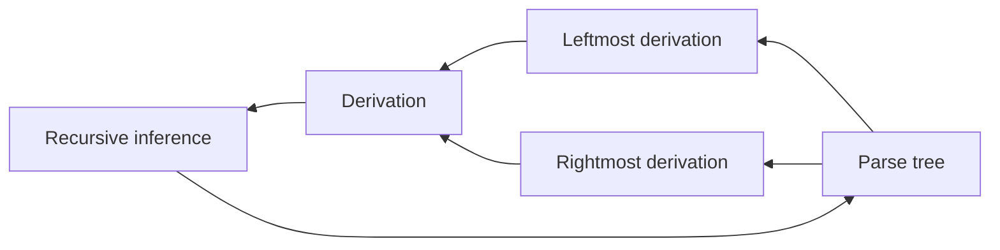

# Context-Free Grammars

## Context-Free Grammars

### Definition

A context-free grammar $G$ is defined by the 4-tuple

$G = (V, \Sigma. R, S)$ where

1. $V$ is a finite set, each element $v \in V$ is called a nonterminal character or a **variable**. Each variable defines a sub-language of the language defined by $G$
2. $\Sigma$ is a finite set of **terminals**, disjoint from $V$. The set of terminals is the alphabet of the language defined by the grammar $G$
3. $R$ is a finite relation from $V$ to $(V \cup \Sigma)^{*}$, where the asterisk represents the Kleene star operation. The members of $R$ are called the *(rewrite) rule*s or **productions** of the grammar.
4. $S$ is the start variable (or start symbol), used to present the whole sentence. It must be an element of $V$

A production has the form: variable (head) $\to$ strings of variables and terminals (body)

### Derivation

有两种应用 CFG 的产生式来推断某个特定 string 是否在某个特定 variable 定义的语言之中的方法

* Body to head: 选择 body 中各个 variable 的 language 中的串，将其与 body 中的 terminals 以正确的顺序连接，其结果在 head 中的 variable 定义的语言中。称为 **recursive inference**
* Head to body: 将开始符号用某个产生式展开，再将结果中的 variable 用其产生式展开，重复上述过程直至得到一个全部由 terminal 组成的串，所有这样的串组成了 CFG 定义的语言。这样的过程称为 **derivation**

为了定义 derivation，定义一个新的符号 $\Rightarrow$ 。设 $G = (V, T, P, S)$ 是 CFG，令 $\alpha A \beta$ 为一个由 terminal 与 variable 组成的串，其中 $A$ 为 variable， $\alpha, \beta \in (V \cup T)^{*}$ 。令 $A \to \gamma$ 为一个产生式，则
$$
\alpha A \beta \Rightarrow \alpha \gamma \beta
$$
可以递归定义零次或多次 derivation $\overset{*}{\Rightarrow}$

Basis. $\alpha \overset{*}{\Rightarrow} \alpha$ for any string $\alpha \in (V \cup T)^{*}$

Induction. If $\alpha \overset{*}{\Rightarrow} \beta$ and $\beta \Rightarrow \gamma$, then $\alpha \overset{*}{\Rightarrow} \gamma$

为了限制 derivation 时的选择，引入 leftmost derivation 与 rightmost derivation

* leftmost derivation: at each step we replace the **leftmost variable** by one
  of its production bodies, $\underset{\text{lm}}{\Rightarrow}$
* rightmost derivation: at each step we replace the **rightmost variable** by one
  of its production bodies, $\underset{\text{rm}}{\Rightarrow}$

### The Language of a Grammar

If $G = (V,T,P,S)$ , the language of $G$, denoted $L(G)$ is
$$
L(G) = \{w \in T^{*} :S \overset{*}{\Rightarrow} w\}
$$
$L(G)$ is a context-free language (CFL)

For a CFG $G = (V, T, P, S)$ 

sentential form: $\alpha \in (V \cup T), S \overset{*}{\Rightarrow} \alpha$

left-sentential form: $\alpha \in (V \cup T), S \overset{*}{\underset{\text{lm}} {\Rightarrow}} \alpha$

CFG 定义的语言集合比 RE 定义的语言集合要广

### BNF Notation

BNF (Backus-Naur Form) is a notation technique for CFG

* Variables are words in $<>$
* Terminals are multicharacter strings indecated by boldface or underline
* $::=$ is used for $\to$
* $\mid$ is used for "or"
* $\dots$ is used for one or more. e. g. BNF: $\alpha \dots$ CFG: $A \to A\alpha \mid \alpha$
* Symbols surrounded by $[]$ is optional. e. g. BNF: $[\alpha]$ CFG: $A \to \alpha \mid \epsilon$
* Grouping: $\{\}$

## Parse Trees

### Definition

Given a grammar $G = (V, T, P, S)$ , the parse trees for $G$ are trees with the following conditions

* Each interior node is labeled by a **variable** in $V$
* Each leaf is labeled by either a  **variable**, a **terminal**, or $\epsilon$ . However, if the leaf is labeled $\epsilon$ , then it must be the **only child** of its parent
* If an interior node is labeled $A$, and its children are labeled $X_{1}, X_{2}, \dots , X_{k}$, then $A \to X_{1}X_{2}\dots X_{k}$ is a production in $P$

将 parse tree 叶节点的 labels 从左向右连接起来，得到的串称为这颗树的 yield

yield 是从 root variable 推导得到的。

有一种特殊的 parse tree 满足

* The yield is a terminal string
* The root is labeled by start symbol

这样的 parse tree，其 yield 是属于该文法的串

### Inference, Derivations, and Parse trees

Given a grammar $G = (V, T, P, S)$ , the following are equivalent

* The recursive infererence procedure determines that terminal string $w$ is in the language of $A$
* $A \overset{*}{\Rightarrow} w$
* $A \underset{\text{lm}}{\overset{*}{\Rightarrow}}  w$
* $A \underset{\text{rm}}{\overset{*}{\Rightarrow}}  w$
* There is a parse tree with root $A$ and yield $w$

等价性的证明将按照下图的箭头

#### From Inferences to Trees

Let $G = (V, T, P, S)$ be a CFG. If the recursive inference procedure tells us that terminal string $w$ is in the language of variable $A$, then there is a parse tree with root $A$ and yield $w$

> Proof. Induction on the number of step used to infer that $w$ is in the language of $A$
>
> Basis. 只用一步推断，故有生成式 $A \to w$ ，则必有一颗 parse tree 以 $A$ 为根且所有 $A$ 的子节点都为叶节点且组成 $w$ 。特殊情况下 $w = \epsilon$ ，则 $A$ 的唯一子节点为 $\epsilon$ ，仍为合法 parse tree
>
> Induction. 假设经过 $n+1$ 步推断得出 $w$ 属于 $A$ 的语言。考虑推断最后一步，使用的产生式为 $A \to X_{1}X_{2}\dots X_{k}$ ，其中每个 $X_{i}$ 或是 variable 或是 terminal
>
> 令 $w = w_{1}w_{2}\dots w_{k}$ 满足
>
> 1. 如果 $X_{i}$ 是 terminal，$w_{i} = X_{i}$
> 2. 如果 $X_{i}$ 是 variable，则 $w_{i}$ 是经过推断得出在 $X_{i}$ 的语言中的一个 string。在 $n+1$ 步推断出 $w$ 在 $A$ 的过程中这次推断最多有 $n$ 步。故根据 I. H. ，存在一颗 parse tree 根为 $X_{i}$ ，yield 为 $w_{i}$
>
> 故可以构造出一颗 parse tree 根为 $A$ 且子节点为 $X_{1}, X_{2}, \dots ,X_{k}$ ，对于每个子树 $X_{i}$ ，若为 terminal，则只有其本身一个节点，若为 variable，则其为一颗 parse tree，根为 $X_{i}$ ，yield 为 $w_{i}$
>
> 如此构造出的 parse tree 根为 $A$ ，其 yield 为子树的 yields 从左到右连接，即 $w_{1}w_{2}\dots w_{k} = w$
>

#### From Trees to Derivations

Let $G = (V, T, P, S)$ be a CFG, and suppose there is a parse tree with root labeled by variable $A$ and with yield $w$, where $w$ is in $T^{*}$ . Then there is a leftmost derivation $A \underset{\text{lm}}{\overset{*}{\Rightarrow}}  w$ in grammar $G$

> Proof. perform an induction on  the height of tree.
>
> Basis. 考虑高度为 1 的情况，则这棵树以 $A$ 为根且所有 $A$ 的子节点都为叶节点且组成 $w$ 。根据 parse tree 的定义，存在产生式 $A \to w$ ，则最左推导为 $A \underset{\text{lm}}{\Rightarrow} w$
>
> Induction. 考虑高度为 $n$ 时，则 $A$ 必有子节点 $X_{1}, X_{2}, \dots X_{k}$ ，其中每个 $X_{i}$ 或是 variable 或是 terminal
>
> 1. $X_{i}$ 为 terminal，定义 $w_{i}$ 为只有 $X_{i}$ 的 string
> 2. $X_{i}$ 为 variable，则其一定为某颗子树的根，且有 yield $w_{i}$ 。显然子树的高度小于 $n$ ，根据 I. H. 有 $X_{i} \underset{\text{lm}}{\overset{*}{\Rightarrow}} w_{i}$
>
> 显然有 $w = w_{1}w_{2}\dots w_{k}$
>
> 则可以构造出一个最左推导，第一步是 $A \underset{\text{lm}}{\Rightarrow} X_{1}X_{2}\dots X_{k}$
>
> 对 $i = 1, 2, \dots, k$ 有
> $$
> A \underset{\text{lm}}{\overset{*}{\Rightarrow}}  w_{1}w_{2}\dots w_{i}X_{i+1} \dots X_{k}
> $$
>
> > Proof. Induction on $i$
> >
> > Basis. $i = 0, A \underset{\text{lm}}{\Rightarrow} X_{1}X_{2}\dots X_{k}$
> >
> > I. H. $A \underset{\text{lm}}{\overset{*}{\Rightarrow}}  w_{1}w_{2}\dots w_{i-1}X_{i} \dots X_{k}$
> >
> > Induction. 
> >
> > 1. 如果 $X_{i}$ 是 terminal，则 $w_{i} = X_{i}$ ，显然有 $A \underset{\text{lm}}{\overset{*}{\Rightarrow}}  w_{1}w_{2}\dots w_{i}X_{i+1} \dots X_{k}$
> >
> > 2. 如果 $X_{i}$ 是 variable，根据之前的 I. H. 有 $X_{i} \underset{\text{lm}}{\overset{*}{\Rightarrow}} w_{i}$ ，令其为 $X_{i} \underset{lm}{\Rightarrow} \alpha_{1} \underset{lm}{\Rightarrow} \alpha_{2} \cdots \underset{lm}{\Rightarrow} w_{i}$，则有
> >    $$
> >    \begin{array}{l}{w_{1} w_{2} \cdots w_{i-1} X_{i} X_{i+1} \cdots X_{k} \underset{lm}{\Rightarrow}} \\ {w_{1} w_{2} \cdots w_{i-1} \alpha_{1} X_{i+1} \cdots X_{k} \underset{lm}{\Rightarrow}} \\ {w_{1} w_{2} \cdots w_{i-1} \alpha_{2} X_{i+1} \cdots X_{k} \underset{lm}{\Rightarrow}} \\ {\cdots} \\ {w_{1} w_{2} \cdots w_{i} X_{i+1} X_{i+2} \cdots X_{k}}\end{array}
> >    $$
> >    可得 $A \underset{\text{lm}}{\overset{*}{\Rightarrow}}  w_{1}w_{2}\dots w_{i}X_{i+1} \dots X_{k}$
> >
>
> 根据上述证明，在 $i = k$ 时有 $A \underset{\text{lm}}{\overset{*}{\Rightarrow}}  w$

Let $G = (V, T, P, S)$ be a CFG, and suppose there is a parse tree with root labeled by variable $A$ and with yield $w$, where $w$ is in $T^{*}$ . Then there is a rightmost derivation $A \underset{\text{rm}}{\overset{*}{\Rightarrow}}  w$ in grammar $G$

证明同 leftmost derivation，事实上对于一般的 derivation 也有上述结论

#### From Derivations to Recursive Inference

Let $G = (V, T, P, S)$ be a CFG, and suppose there is a derivation $A \overset{*}{\Rightarrow} w$ , where $w$ is in $T^{*}$. Then the recursive inference procedure applied to $G$ determines that $w$ is in the language of variable $A$

> Proof. Induction on the length of the derivation $A \overset{*}{\Rightarrow} w$
>
> Basis. 推导仅有一步时必有产生式 $A \to w$ ，则根据 recursive inference 的 basis 即可得出 $w$ 在 $A$ 的语言中
>
> Induction. 假设推导有 $n+1$ 步，则 $A \Rightarrow X_{1} X_{2} \cdots X_{k} \overset{*}{\Rightarrow} w$ ，可令 $w = w_{1}w_{2}\dots w_{k}$ ，其中 $X_{i} \overset{*}{\Rightarrow} w_{i}$ 
>
> 1. 如果 $X_{i}$ 是 terminal，$X_{i} = w_{i}$
> 2. 如果 $X_{i}$ 是 variable，则 $X_{i} \overset{*}{\Rightarrow} w_{i}$ 的推导肯定小于 $n+1$ 步，则根据 I. H. ，recursive inference 得出 $w_{i}$ 在 $X_{i}$ 的语言中
>
> 根据以上结论，易得根据 recursive inference 有 $w_{1}w_{2}\dots w_{k} = w$ 在 $A$ 的语言中

## Ambiguity in Grammars and Languages

### Ambiguous Grammars

对于同一个串可以得到一颗以上 parse tree 的文法就是 ambiguous 的，显然根据不同的 parse tree 可以得到不同的最左/最右推导

ambiguous 是 **grammar** 而非 **language** 的属性。有些 ambiguous 的文法在修改后可以得到定义同样语言但 unambiguous 的文法

LL(1) grammars are unambiguous

消歧：结合性/优先级/修改文法

### Inherent Ambiguity

Certain CFLs are **inherently ambiguous**, meaning that every grammar for the language is ambiguous

e. g. $L = \{0^{i}1^{j}2^{k}:i = j \text{ or } j = k \}$

## Normal Forms for CFGs

### Eliminating Useless Symbols

A symbol $X$ is **useful** for a grammar $G = (V, T, P, S)$ if there is some derivation of the form $S \overset{*}{\Rightarrow} \alpha X \beta \overset{*}{\Rightarrow} w$ , where $w$ is in $T^{*}$ 

从文法中删去 useless 的 symbol 并不会改变 CFG 定义的语言。一个 useful 的 symbol 具有以下两种属性

* generating: $X \overset{*}{\Rightarrow} w$ for some terminal string $w$. Every terminal is generating
* reachable: $S \overset{*}{\Rightarrow} \alpha X \beta$ for some $\alpha$ and $\beta$

先删去所有非 generating 的 symbol，再删去所有 unreachable 的 symbol 即可使其余的 symbol 均为 useful

Let $G = (V, T, P, S)$ be a CFG, and assume that $L(G) \neq \varnothing$ . Let $G_{1} = (V_{1}, T_{1}, P_{1}, S)$ be the grammar we obtain by the following steps:

1. First eliminate nongenerating symbols and all productions involving one
   or more of those symbols. Let $G_{2} = (V_{2}, T_{2}, P_{2}, S)$ be this new grammar. $S$ must be generating, since $L(G) \neq \varnothing$
2. Second, eliminate all symbols that are not reachable in the grammar $G_{2}$

Then $G_{1}$ has no useless symbols, and $L(G_{1}) = L(G)$

> Proof. 考虑 $X$ 是未被消除的 symbol，即 $X \in V_{1} \cup T_{1}$ ，显然 $X \underset{G}{\overset{*}{\Rightarrow}} w$ ，且在此推导过程中的所有 symbol 都是 generating 的，即 $X \underset{G_{2}}{\overset{*}{\Rightarrow}} w$ 
>
> 同样的，可以知道 $S \underset{G_{2}}{\overset{*}{\Rightarrow}} \alpha X \beta$ ，且在此推导过程中每个 symbol 都是 reachable 的，即 $S \underset{G_{1}}{\overset{*}{\Rightarrow}} \alpha X \beta$ 。易得 $\alpha X \beta$ 中的符号都是 reachable ，且在 $G_{2}$ 中都是 generating 。故 $\alpha X \beta \underset{G_{2}}{\overset{*}{\Rightarrow}} xwy$ ，显然这个过程中的 symbol 都是 reachable，因此
> $$
> S \underset{G_{1}}{\overset{*}{\Rightarrow}} \alpha X \beta \underset{G_{1}}{\overset{*}{\Rightarrow}} xwy
> $$
> 即任意取 $G_{1}$ 中的 symbol $X$ ，$X$ 是 useful
>
> 只需证明 $L(G_{1}) = L(G)$
>
> * $L(G_{1}) \subseteq L(G)$: trivial，我们通过消除产生式和符号得到 $G_{1}$
> * $L(G) \subseteq L(G_{1})$: 若 $w \in L(G)$ ，存在一个推导 $S \underset{G}{\overset{*}{\Rightarrow}} w$ ，显然这个推导路径上所有符号都是 generating 且 reachable。故 $S \underset{G_{1}}{\overset{*}{\Rightarrow}} w, w \in L(G_{1})$
>

### Computing the Generating and Reachable Symbols

Let $G =(V, T, P, S)$ be a grammar

#### Generating

找出所有的 generating symbol 是一个递归的过程

Basis. 所有 $T$ 中的 symbol 都是 generating

Induction. 考虑 $A \to \alpha$ ，若 $\alpha$ 中所有符号都是 generating，则 $A$ 也是 generating

上述算法可以找出 $G$ 中所有的 generating symbol，i. e. 没被找出的都是 nongenerating

> Proof. 显然可以得出所有算法找出的 symbol 都是 generating。只需证明所有 generating symbol 都会被算法找出。考虑 $X \underset{G}{\overset{*}{\Rightarrow}} w$ ，根据推导长度归纳
>
> Basis.  0 步的推导，则 $X$ 是 terminal，根据 basis，其是 generating
>
> Induction. 考虑推导 $n$ 步的情况，则 $X$ 是 variable，有 $X \Rightarrow \alpha \overset{*}{\Rightarrow} w$ ，其中 $\alpha$ 的每个 symbol 都经过少于 $n$ 步推导出 $w$ 的一部分，根据 I. H. ，$\alpha$ 中所有的 symbol 都是 generating，则根据算法的 induction 部分，$X$ 也是 generating

#### Reachable

找出 reachable symbol 的过程同样是一个递归的过程

Basis. $S$ is reachable

Induction. 若 $A$ 是 reachable，则 $A$ 的所有产生式体中的 symbol 都是 reachable

上述算法可以找出 $G$ 中所有 reachable symbol，证明类似。

### Eliminating $\epsilon$-Productions

$\epsilon$-production: $A \to \epsilon$

If language $L$ has a CFG, then $L - \{\epsilon\}$ has a CFG without $\epsilon$-production

Nullable: A variable $A$ is nullable if $A \overset{*}{\Rightarrow} \epsilon$

寻找 nullable symbol 的算法是一个递归的过程

Basis. If $A \to \epsilon$ is a production of $G$, $A$ is nullable

Induction. 考虑 $A \to \alpha$ ，若 $\alpha$ 中所有符号都是 nullable，则 $A$ 是 nullable，$\alpha$ 中所有 symbol 都是 variable，因为 nullable 是针对 variable 而言的

上述算法可以找到 $G$ 中所有 nullable symbol

> Proof. 根据算法的归纳过程易得所有算法找出的 variable 都是 nullable，只需证明所有 nullable variable 都会被算法找出。证明的过程是对 $A \overset{*}{\Rightarrow} \epsilon$ 的最短推导长度的归纳
>
> Basis. 仅有一步推导，则 $A \to \epsilon$ ，从算法的 basis 即可发现 $A$ 是 nullable
>
> Induction. 考虑推导 $n$ 步的情况，即 $A \Rightarrow C_{1}C_{2} \dots C_{k} \overset{*}{\Rightarrow} \epsilon$ ，其中每个 $C_{i}$ 都经过少于 $n$ 步推导得出 $\epsilon$ ，则根据 I. H. ，它们均为 nullable，则根据算法的 induction 部分，$A$ 也是 nullable

找出所有 nullable variable 后即可构造没有 $\epsilon$-production 的 CFG。考虑产生式 $A \to X_{1}X_{2}\dots X_{k}$ ，考虑其中有 $m$ 个 nullable symbol，则在新 CFG 中加入 $2^{m}$ 个产生式（每个 nullable symbol 都有可能出现/不出现），例外是当 $m = k$ 时，不加入所有 $X_{i}$ 都不出现的产生式（即不加入 $A \to \epsilon$）。若有产生式 $A \to \epsilon$ ，则新 CFG 不加入该产生式

设经过上述过程后生成的新文法为 $G_{1}$ ，则 $L(G_{1}) = L(G) - \{\epsilon\}$

> Proof. 只需证明对于任意 $G$ 中的 variable $A$ 有
> $$
> A \underset{G_{1}}{\overset{*}{\Rightarrow}} w \iff A \underset{G}{\overset{*}{\Rightarrow}} w \text{ and } w \neq \epsilon
> $$
> ($\Rightarrow$): 考虑 $A \underset{G_{1}}{\overset{*}{\Rightarrow}} w$ ，显然 $w \neq \epsilon$ ，因为 $G_{1}$ 中没有 $\epsilon$-production。对推导长度归纳以证明 $A \underset{G}{\overset{*}{\Rightarrow}} w$
>
> Basis. 一步推导，则 $A \to w$ 是 $G_{1}$ 中的产生式。根据 $G_{1}$ 的构造过程，$G$ 中存在产生式 $A \to \alpha$ 满足 $\alpha$ 为 $w$ 其中加上 0 个或多个 nullable variable，则 $A \Rightarrow \alpha \underset{G}{\overset{*}{\Rightarrow}} w$ ，其中 nullable 的产生式都推导出了 $\epsilon$
>
> Induction. 考虑 $n$ 步推导，则 $A \underset{G_{1}}{\Rightarrow} X_{1}X_{2} \dots X_{k} \underset{G_{1}}{\overset{*}{\Rightarrow}} w$ 。显然在 $G$ 中有产生式 $A \to \alpha$ ，满足 $\alpha$ 为 $X_{1}X_{2} \dots X_{k}$ 其中加上 0 个或多个 nullable variable。同样，可以将 $w$ 分为 $w_{1}w_{2}\dots w_{k}$ 其中 $X_{i} \underset{G_{1}}{\overset{*}{\Rightarrow}} w_{i}$ ，由于推导步数小于 $n$ ，根据 I. H. 可以得到 $X_{i} \underset{G}{\overset{*}{\Rightarrow}} w_{i}$ ，则存在推导
> $$
> A \underset{G}{\Rightarrow} \alpha \underset{G}{\overset{*}{\Rightarrow}} X_{1}X_{2} \dots X_{k} \underset{G}{\overset{*}{\Rightarrow}} w
> $$
> ($\Leftarrow$): 同样是根据推导长度归纳
>
> 一般情况的 variable 可证，令 $S = A$ 即可证明上述结论 

### Eliminating Unit Productions

Unit production: $A \to B$ , both $A, B$ are variables

Unit pair: $(A, B)$ such that $A \overset{*}{\Rightarrow} B$ using only unit productions

可以递归地构造 unit pair

Basis. $(A, A)$ is a unit pair

Induction. 若 $(A, B)$ 是 unit pair，$B \to C$ 是产生式且 $C$ 是 variable，则 $(A, C)$ 是 unit pair

上述算法可以找出所有 unit pair

> Proof. 只用证明文法中所有 unit pair 都被算法找到。根据 $A \overset{*}{\Rightarrow} B$ 推导长度归纳
>
> Basis. 0 步，则 $A = B$ ，显然在算法的 basis 阶段就找到
>
> Induction. 考虑 $n$ 步推导，则有 $A \overset{*}{\Rightarrow} C \Rightarrow B$ ，考虑 $A \overset{*}{\Rightarrow} C$ ，这个推导只用了 $n-1$ 步，根据 I. H. ，$(A, C)$ 被找到，则根据算法的 induction 部分，$(A, B)$ 被找到

找到所有 unit pair 之后，可以构造没有 unit pair 的文法

对于每个 $(A, B)$ ，若 $B \to \alpha$ 是个 nonunit production，则将 $A \to \alpha$ 加入新文法。

可以证明通过上述过程得到的新文法 $G_{1}$ ，有 $L(G_{1}) = L(G)$

> Proof. 只需证明
> $$
> w \in L(G_{1}) \iff w \in L(G)
> $$
> ($\Rightarrow$): 考虑 $S \underset{G_{1}}{\overset{*}{\Rightarrow}} w$ ，由于 $G_{1}$ 中每个产生式都等价于一个产生式序列，包含 0 个或多个 unit production 和一个 nonunit production，其中每个产生式都是 $G$ 的产生式，即 $\alpha \underset{G_{1}}{\Rightarrow} \beta$  可以得出 $\alpha \underset{G}{\overset{*}{\Rightarrow}} \beta$ ，则每一步 $G_{1}$ 中的推导都可以替换为多步 $G$ 中的推导，即 $S \underset{G}{\overset{*}{\Rightarrow}} w$
>
> ($\Leftarrow$): 考虑 $S \underset{G}{\overset{*}{\Rightarrow}} w$ ，则必有一个对应的最左推导，在最左推导中，每个 unit production 在被替换后其 body 成为最左的 variable，然后被替换，则推导的产生式应用的序列可以看作 0 个或多个 unit production 接着一个 nonunit production，这其中每一步（unit production\* + nonunit production）都是 $G_{1}$ 中的一个 production，则有 $S \underset{G_{1}}{\overset{*}{\Rightarrow}} w$

### Chomsky Normal Form

简化一个 CFG 只要按顺序

1. Eliminate $\epsilon$-production
2. Eliminate unit production
3. Eliminate useless symbols

即可得到没有 $\epsilon$-production, unit production, useless symbol 的等价的 CFG

可以证明任何没有 $\epsilon$ 的非空 CFL 都有一个文法 $G$ ，其中任意产生式都是以下两种形式之一

1. $A \to BC$，其中 $A, B, C$ 都是 variable
2. $A \to a$ ，其中 $A$ 是 variable，$a$ 是 terminal

且 $G$ 中没有 useless symbols，这样的文法称为 Chomsky Normal Form, CNF

将文法按照上述步骤简化后，产生式只有两种可能

1. $A \to a$ ，已经满足 CNF
2. $A \to \alpha$ ，其中 $|\alpha| \geqslant 2$  

对于第二种情况，可以按照以下步骤处理

* 将 body 转变为只含 variable
* 将长度大于 2 的 body 拆成一个链

对于第一步，考虑一个长度大于等于 2 的 body 其中的 terminal $a_{i}$ ，为每个 $a_{i}$ 引入一个 variable $A_{i}$ 以及产生式 $A_{i} \to a_{i}$ ，然后将 body 中所有 $a_{i}$ 替换为 $A_{i}$ 即可

对于第二步，考虑产生式 $A \to B_{1}B_{2} \dots B_{k}$ ，引入 $k-2$ 个 variable $C_{1}, C_{2} , \dots ,C_{k-2}$ ，将产生式替换为
$$
A \to B_{1}C_{1}, C_{1} \to B_{2}C_{2}, \dots, C_{k-3} \to B_{k-2}C_{k-2}, C_{k-2} \to B_{k-1}B_{k}
$$
若 $G$ 是 CFG 且其中除 $\epsilon$ 外至少有一个 string，则有一个 CNF 文法 $G_{1}$ 满足 $L(G_{1}) = L(G) - \{\epsilon\}$

证明见课本 P.245